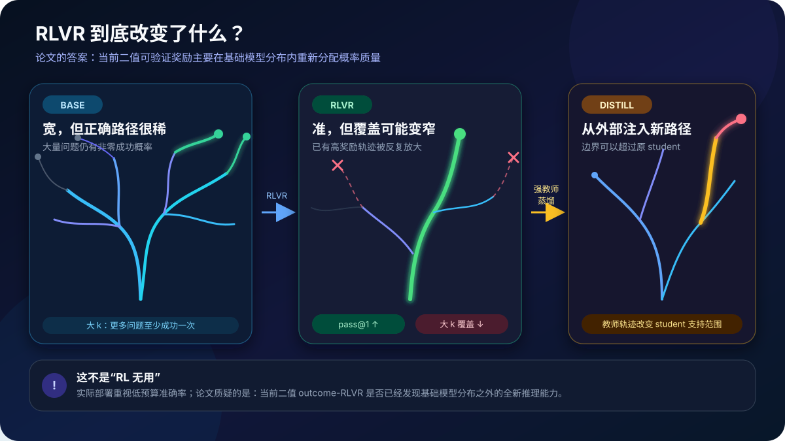
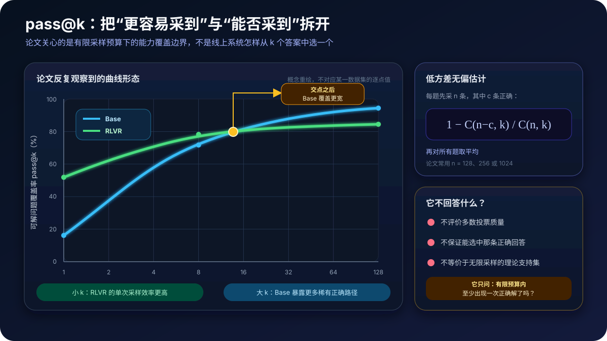
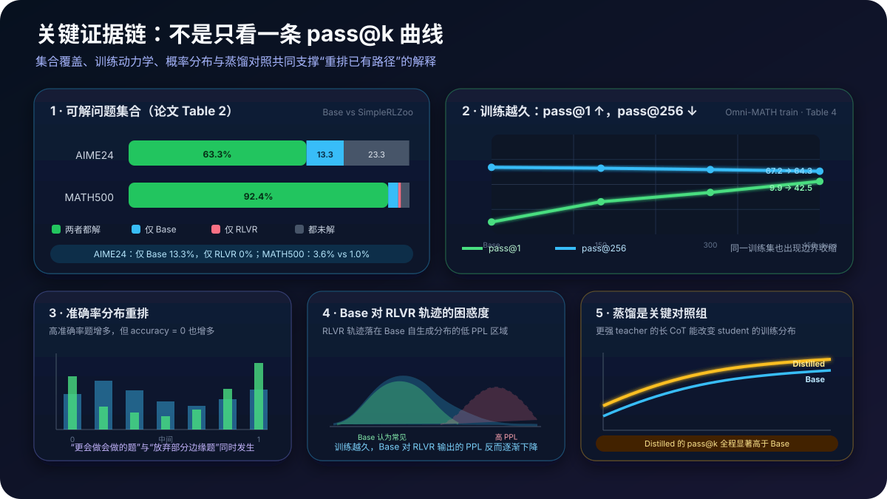

# Limits of RLVR 原理详解：强化学习让模型更会采样，还是获得了基础模型之外的新推理能力？


> **论文**：[Does Reinforcement Learning Really Incentivize Reasoning Capacity in LLMs Beyond the Base Model?](https://arxiv.org/abs/2504.13837)<br>
> **常用简称**：Limits of RLVR / Limit of RLVR<br>
> **作者**：Yang Yue、Zhiqi Chen、Rui Lu、Andrew Zhao、Zhaokai Wang、Yang Yue、Shiji Song、Gao Huang；清华大学 LeapLab、上海交通大学<br>
> **时间**：arXiv v1 于 2025 年 4 月 18 日提交；本文按 2025 年 11 月 24 日的 v5 解读；NeurIPS 2025 Oral<br>
> **关键词**：RLVR、Reasoning Boundary、pass@k、Sampling Efficiency、Coverage、Perplexity、Distillation、GRPO、PPO、Exploration<br>
> **配套代码**：[limits_rlvr_minimal.py](./code/limits_rlvr_minimal.py)（零依赖；实现无偏 pass@k、可解问题集合划分、困惑度和 sampling-efficiency shortfall；不是 LLM 训练或大规模 rollout 代码）<br>
> **前置阅读**：[PPO](https://arxiv.org/abs/1707.06347) · [Codex / HumanEval](52_Codex_HumanEval_2021_原理.md) · [Training Verifiers](53_Training_Verifiers_2021_原理.md) · [DeepSeekMath / GRPO](57_DeepSeekMath_2024_原理.md) · [DeepSeek-R1](30_DeepSeek_R1_2025_原理.md) · [DAPO](86_DAPO_2025_原理.md)<br>
> **一手资料**：[arXiv HTML](https://arxiv.org/html/2504.13837) · [论文 PDF](https://arxiv.org/pdf/2504.13837) · [项目主页](https://limit-of-rlvr.github.io/) · [官方代码仓库](https://github.com/LeapLabTHU/limit-of-RLVR) · [NeurIPS 2025 论文](https://papers.neurips.cc/paper_files/paper/2025/file/537d5aa768c2d534016a4d06f87bc8fb-Paper-Conference.pdf)

> [!IMPORTANT]
> 论文批评的不是所有强化学习，也不是“RLVR 没有用”。它研究的是一批以**当前模型 on-policy 采样、二值 outcome reward、单轮生成**为主的 2025 年 RLVR 系统。结论是：这些系统明显提高低采样预算下的正确率，却很少显示出稳定超越基础模型有限采样覆盖边界的新推理路径。

> [!NOTE]
> “基础模型能在 $k=1024$ 时偶尔采到某条正确解”不等于“这条解在基础模型中以可解释、可调用的模块形式存储”，也不等于线上用户有资源找到它。论文测量的是**有限预算下的经验可解覆盖率**，不是数学意义上精确识别神经网络分布的 support。

---

## 0. 先说结论

RLVR 的常见叙事是：模型通过尝试、验证和强化，像 AlphaGo 一样发现过去不会的新策略。Limits of RLVR 把这个叙事拆成了两个完全不同的问题：

```text
问题 A：一条正确路径有多容易被采到？
        → sampling efficiency，最直接看 pass@1

问题 B：给模型很多次机会，它能覆盖多少不同的可解问题？
        → reasoning coverage，观察大 k 的 pass@k
```

论文的核心观察是：

```text
RLVR 之后
  pass@1 通常显著上升       ← 正确路径概率变大
  大 k 的 pass@k 常被 Base 反超 ← 一些稀有路径消失或更难采到
```

因此作者给出的解释不是“模型凭空学会了新推理”，而是：

> 当前 RLVR 主要把基础模型分布里已经存在的高奖励轨迹变得更常见；这种概率质量重排改善了单次采样，却可能牺牲边缘问题和稀有策略的覆盖。



读完本文，至少应记住下面二十四点：

1. **论文区分“性能”与“能力边界”。**低 $k$ 的平均正确率更接近常规体验，大 $k$ 的 pass@k 用来探测模型能否至少产生一次正确解。
2. **pass@1 提升是真的，而且很有实用价值。**作者没有否认 RLVR 让模型在数学、代码和视觉推理上更好用。
3. **争议点是增益来自哪里。**是发现了 Base 完全没有的新推理，还是把 Base 中极低概率的好路径拉高？
4. **论文在大 $k$ 看到 Base 反超。**数学实验常采 128 或 1024 次；代码与视觉任务也出现相同形态。
5. **大 $k$ 测的是问题覆盖，不是候选选择。**pass@k 只要 $k$ 条中有一条正确就记为成功，不需要知道如何在部署时选中它。
6. **作者使用无偏、低方差估计。**每题先生成 $n\ge k$ 条，数出正确数 $c$，再计算 $1-\binom{n-c}{k}/\binom{n}{k}$。
7. **“推理边界”是有限预算经验边界。**语言模型 softmax 通常给大量序列非零概率，无法用有限样本证明某条路径绝对不存在。
8. **数学任务有幸运猜答案风险。**作者通过人工检查困难题 CoT、过滤可直接猜中的 AIME 题，并加入代码任务交叉验证。
9. **代码是更干净的验证场。**随机猜到一段能通过全部单元测试的程序远难于猜中一个整数答案，而代码实验仍出现大 $k$ 反超。
10. **视觉推理也复现趋势。**Qwen2.5-VL-7B 在 MathVista / MathVision 的 RLVR 前后呈现相同覆盖变化。
11. **覆盖集合近似子集关系。**AIME24 中 13.3% 的题只有 Base 在预算内解出，而只有 RLVR 解出的比例是 0%；MATH500 对应 3.6% 与 1.0%。
12. **MATH500 那 1% 不是最终反例。**把 Base 的采样扩到 1024 后，Base 也解出了这约 5 道题。
13. **准确率直方图揭示“头部变好、尾部消失”。**RLVR 增加接近 1.0 的题，也增加 accuracy=0 的题。
14. **困惑度分析支持“轨迹已经在 Base 分布中”。**RLVR 输出在 Base 下的 PPL 接近 Base 自身输出的低 PPL 区域。
15. **随 RL 训练推进，Base 对 RL 输出的 PPL 下降。**这更像从 Base 先验中挑出越来越熟悉的轨迹，而不是越走越出分布。
16. **蒸馏给出了关键对照。**更强 teacher 的长 CoT 可以让 student 的 pass@k 曲线整体超过原 Base，说明边界并非原则上不能扩展。
17. **六种 RL 算法差异不根本。**PPO、GRPO、Reinforce++、RLOO、ReMax、DAPO 的 pass@1 有差别，但离 Base 的大 $k$ 潜力仍有很大距离。
18. **训练越久不一定越“有能力”。**Omni-MATH train 上 pass@1 从 9.9 升到 42.5，pass@256 却从 67.2 降到 64.3。
19. **增加 rollout 数有帮助但没逆转结论。**把每题训练 rollout 从 8 提到 32，可改善高 $k$，仍会被 Base 反超。
20. **KL 不是覆盖保护的充分条件。**加入系数 0.001 的 KL 后 pass@1 相近，但 pass@128 更低。
21. **熵下降只解释一部分。**把 RLVR 推理温度调高到与 Base 输出熵近似匹配，覆盖有所恢复，但仍低于 Base。
22. **近前沿规模仍有类似迹象。**Magistral-Medium 相对起点在 AIME24/25 的 pass@1 多解约 7/8 题，但随 $k$ 增大优势持续缩小。
23. **根因假说是巨大动作空间加预训练先验。**二值 reward 只有采到完整正确轨迹才给信号；偏离先验的随机 token 组合几乎总是无效。
24. **未来方向不是简单加训练步数。**作者强调高层抽象探索、课程式数据扩展、过程奖励与信用分配，以及多轮 agent—环境交互。

一句话记忆：

> 当前 RLVR 更像“把 Base 的 pass@k 压缩成更高的 pass@1”，而不是已经证明能稳定创造 Base 在现实采样预算内从未出现过的新推理能力。

---

## 1. 为什么这个问题比“榜单涨了多少”更重要

### 1.1 同一个分数提升可以有两种机制

假设一道题有三条可能的推理路径：

```text
路径 A：正确，Base 概率 1%
路径 B：错误，Base 概率 49%
路径 C：错误，Base 概率 50%
```

RLVR 后变成：

```text
路径 A：正确，RLVR 概率 60%
路径 B：错误，RLVR 概率 20%
路径 C：错误，RLVR 概率 20%
```

pass@1 从 1% 变成 60%，这是巨大进步；但路径 A 在训练前已经存在。RLVR 做的是**elicitation / probability amplification**。

另一种真正扩边界的情况是：

```text
训练前：某类必要策略在现实采样预算内从未出现
训练后：模型稳定生成该策略，并解出一批 Base 反复采样仍失败的问题
```

只看一次采样准确率，无法区分这两种机制。

### 1.2 为什么“像 AlphaGo 一样自我进化”不是自动成立

棋类强化学习的环境可以在每一步提供合法动作、状态转移和终局输赢；搜索还能显式回到中间状态继续探索。LLM 的 outcome-RLVR 常是：

```text
输入一道题
  → 一次性生成几千 token
  → 只检查最终答案 / 单元测试
  → 整条轨迹得到 0 或 1
```

中间哪一步正确、哪一步值得分叉、失败轨迹差一点还是完全胡说，都没有直接反馈。把围棋中的“探索新策略”类比到这种训练设置，需要实验证据，而不能只靠术语相同。

### 1.3 论文真正要证伪的命题

作者并不要求证明神经网络内部完全没有某个抽象算法。可操作的实验命题是：

> 如果 RLVR 扩展了可观察的推理范围，那么在相同 prompt、相同采样协议和足够大的有限 $k$ 下，RLVR 应能覆盖一批 Base 无法覆盖的问题。

如果结果反而是：

$$
\mathcal S_{\text{RLVR}}^{(k)}
\subseteq
\mathcal S_{\text{Base}}^{(k)},
$$

其中 $\mathcal S_m^{(k)}$ 表示模型 $m$ 在每题 $k$ 次采样内至少答对一次的问题集合，那么“当前 RLVR 已经广泛扩边界”的说法就缺少支持。

---

## 2. RLVR 基础：模型到底优化什么

### 2.1 可验证二值奖励

给定问题 $x$，策略 $\pi_\theta$ 生成完整响应：

$$
\mathbf y=(y_1,\ldots,y_T)\sim\pi_\theta(\cdot\mid x).
$$

验证器返回：

$$
r=\mathcal V(x,\mathbf y)\in\{0,1\}.
$$

数学任务检查最终答案等价性，代码任务运行编译器和单元测试。训练目标是最大化期望奖励：

$$
J(\theta)=
\mathbb E_{x\sim\mathcal D}
\mathbb E_{\mathbf y\sim\pi_\theta(\cdot\mid x)}
[r].
$$

有些系统另加格式奖励，但论文要讨论的核心仍是可自动验证的 outcome reward。

### 2.2 为什么 on-policy 数据决定了可学内容

PPO、GRPO、RLOO 等 policy-gradient 方法主要从**当前策略自己采出的轨迹**学习。简化地看：

- 采到正确轨迹，就提高它的 token 概率；
- 采到错误轨迹，就降低它的 token 概率；
- 从未采到的完整策略，没有直接正奖励轨迹可以强化。

PPO 的 clipped surrogate 写为：

$$
\mathcal L_{\text{clip}}
=
\mathbb E_t
\left[
\min\left(
\rho_t(\theta)A_t,
\operatorname{clip}(\rho_t(\theta),1-\epsilon,1+\epsilon)A_t
\right)
\right],
$$

$$
\rho_t(\theta)
=
\frac{\pi_\theta(y_t\mid x,y_{<t})}
{\pi_{\theta_{old}}(y_t\mid x,y_{<t})}.
$$

GRPO 不训练独立 value network，而用同题一组响应的奖励相对值估计优势。无论 baseline 如何变化，正信号仍依赖“先采到有奖励的轨迹”。

### 2.3 Zero-RL 与 instruction 起点

为了隔离 RLVR 效果，数学实验尽量采用 Zero-RL：直接从 Qwen2.5 / LLaMA Base checkpoint 开始，不先做长 CoT SFT。

代码和视觉任务则遵循当时公开实践，从 instruction-tuned checkpoint 开始，因为纯 Base 的训练稳定性和输出格式较差：

```text
数学：Base → RLVR
代码：Instruct → RLVR
视觉：VLM Instruct → RLVR
```

因此全文的 “Base” 有时指 pretrained Base，有时更准确地说是“对应 RLVR 之前的起始模型”。比较必须成对进行，不能把不同模型家族混在一起。

---

## 3. pass@k：论文最关键、也最容易被误读的测量



### 3.1 单题定义

对一道题独立采样 $k$ 个响应：

$$
\mathbf y^{(1)},\ldots,\mathbf y^{(k)}.
$$

只要其中至少一个通过 verifier，该题的 pass@k 就是 1：

$$
\operatorname{pass@}k(x)
=
\mathbb 1\left[
\exists j\le k:\mathcal V(x,\mathbf y^{(j)})=1
\right].
$$

数据集分数是所有题的平均。

如果单次成功概率为 $p$，并用理想化独立采样近似，则：

$$
P(\text{至少一次成功})
=1-(1-p)^k.
$$

这解释了为什么极低概率能力只有在 $k$ 足够大时才显现。

### 3.2 为什么不能每个 k 都重新只采 k 条

若每题只采恰好 $k$ 条，估计方差会很大。论文先固定采样 $n$ 条，观察其中 $c$ 条正确，然后对从这 $n$ 条中不放回选 $k$ 条的成功概率做无偏估计：

$$
\widehat{\operatorname{pass@}k}
=
1-
\frac{\binom{n-c}{k}}
{\binom{n}{k}}.
$$

直觉是：

```text
总组合数                 = C(n, k)
k 条里全部选到错误样本的组合数 = C(n-c, k)
至少一个正确              = 1 - 全错概率
```

论文常用：

- MATH500、Minerva、GSM8K：$n=128$；
- AMC23、AIME24：$n=1024$；
- Olympiad：Qwen 常用 128，LLaMA-3.1-8B 因能力较低用 1024。

### 3.3 零依赖实现

配套代码没有直接构造巨大组合数，而用对数乘积计算失败概率：

```python
def pass_at_k_from_count(total: int, correct: int, k: int) -> float:
    if correct == 0:
        return 0.0
    if total - correct < k:
        return 1.0

    log_failure = 0.0
    for offset in range(k):
        log_failure += math.log(total - correct - offset)
        log_failure -= math.log(total - offset)
    return -math.expm1(log_failure)
```

运行：

```bash
python3 papers/to-2026/code/limits_rlvr_minimal.py
python3 papers/to-2026/code/limits_rlvr_minimal.py --test
```

### 3.4 pass@k 不等于 Best-of-N、majority vote 或 avg@N

| 指标 | 问题 | 需要选择器吗 | 主要用途 |
|---|---|---:|---|
| pass@k | $k$ 条里是否至少一条正确 | 否 | 探测有限预算覆盖 |
| avg@N / pass@1 | 单条样本平均正确率 | 否 | 采样效率 / 常规性能 |
| majority@N | 多数答案是否正确 | 是，投票 | 自一致性推理 |
| best-of-N | 能否挑出最好的候选 | 是，verifier / RM | 实际推理时扩展 |

一个模型可能 pass@128 很高，却没有可靠方法从 128 条里识别那一条正确解；这不影响它作为“潜在覆盖探针”的意义，但会限制部署价值。

### 3.5 为什么不是“无限猴子打字”

理论上，只要每个 token 都有非零概率，无限采样最终可能碰巧生成任意有限字符串。但论文使用的不是天文级 $k$：128、256、1024 都是昂贵但现实可执行的预算。

作者还做了三层防护：

1. 人工检查数学 CoT 是否真的推导正确；
2. 过滤一部分可直接猜最终答案的 AIME 题；
3. 使用必须通过单元测试的代码任务。

所以结论应写成：

> Base 在现实有限预算中已经能产生许多正确推理轨迹。

不应夸张成：

> Base 在数学上包含所有未来可能的推理。

---

## 4. 实验地图：模型、算法和任务覆盖了什么

论文 v5 的主实验矩阵如下：

| 领域 | 起始模型 | RL 系统 / 模型 | 主要算法 | Benchmark |
|---|---|---|---|---|
| 数学 | LLaMA-3.1-8B；Qwen2.5-7B/14B/32B-Base；Qwen2.5-Math-7B | SimpleRLZoo、Oat-Zero、DAPO | GRPO | GSM8K、MATH500、Minerva、Olympiad、AIME24、AMC23 |
| 代码 | Qwen2.5-7B-Instruct；DeepSeek-R1-Distill-Qwen-14B | Code-R1、DeepCoder | GRPO | LiveCodeBench、HumanEval+、MBPP+ |
| 视觉推理 | Qwen2.5-VL-7B | EasyR1 | GRPO | MathVista、MathVision |
| 控制分析 | Qwen2.5-7B Base / Instruct；R1-Distill-Qwen-7B | VeRL 重实现 | PPO、GRPO、Reinforce++、RLOO、ReMax、DAPO | Omni-MATH-Rule、MATH500 |

主评测协议：

```text
temperature = 0.6
top-p       = 0.95
max tokens  = 16,384
prompt      = Base 与 RLVR 使用相同 zero-shot / benchmark 默认模板
few-shot    = 不给 Base 额外 few-shot
```

代码中的 DeepCoder 对照使用 32K 响应长度。近前沿 Magistral 实验按原工作采用 40K 最大上下文。

统一 prompt 很重要：给 Base few-shot CoT、不给 RLVR，可能人为扩大 Base；只给 RLVR 特殊格式提示，也可能反向偏置。论文选择同模板来隔离 checkpoint 差异。

---

## 5. 核心结果：小 k 赢，大 k 被反超

### 5.1 数学任务

在 Qwen2.5 不同尺寸、LLaMA-3.1-8B、SimpleRLZoo、Oat-Zero 和 DAPO 上，作者反复看到：

```text
k = 1 或很小：RLVR > Base
k 增大：Base 曲线继续陡升
k = 数十 / 数百：Base 追平并反超 RLVR
```

一个论文给出的具体例子是 Minerva 32B：到 $k=128$ 时，Base 比 RLVR 高约 9 个百分点，即在验证集中多覆盖约 9% 的问题。

Oat-Zero 和 DAPO 在 AIME24 的低 $k$ 优势一度接近 30 个百分点，但随 $k$ 增大仍被各自起始模型追上。

这说明低 $k$ 曲线和高 $k$ 曲线回答的是两件事：

- RLVR 把一部分题从“偶尔做对”变成“经常做对”；
- Base 仍保留更多“偶尔能做对”的题。

### 5.2 代码生成

CodeR1-Zero-Qwen2.5-7B 在 12K LeetCode / TACO 样本上训练 832 步，论文比较其起点 Qwen2.5-7B-Instruct-1M，在 LiveCodeBench v5、HumanEval+ 和 MBPP+ 上也看到同样交叉。

DeepCoder-14B 与其 DeepSeek-R1-Distill-Qwen-14B 起点的 LiveCodeBench 比较也呈现相同趋势。

代码结果很重要，因为：

$$
P(\text{随机程序通过隐藏单测})
\ll
P(\text{随机猜中有限范围整数答案}).
$$

它降低了“Base 只是在大 $k$ 幸运猜中 final answer”的解释力。

### 5.3 视觉推理

作者用 EasyR1 在 Geometry3K 上训练 Qwen2.5-VL-7B，并在去掉选择题的 MathVista-TestMini、MathVision-TestMini 上评测。

结果仍是：RLVR 低 $k$ 更高，原始模型在大 $k$ 覆盖更广。对最困难问题的人工检查中，两类模型各有 7/8 个问题出现至少一条有效正确 CoT。

三种领域的一致性让结论不太像某一个数学答案解析器的偶然 bug。

---

## 6. 第一条证据：可解集合近似是 Base 的子集



把每道题按“预算内是否至少答对一次”分为四类：

| Base | RLVR | 含义 | AIME24，$k=1024$ | MATH500，$k=128$ |
|---:|---:|---|---:|---:|
| ✓ | ✓ | 两者都能解 | 63.3% | 92.4% |
| ✓ | ✗ | 只有 Base 能解 | 13.3% | 3.6% |
| ✗ | ✓ | 只有 RLVR 能解 | 0.0% | 1.0% |
| ✗ | ✗ | 两者都未解 | 23.3% | 3.0% |

最醒目的是方向不对称：Base-only 明显多于 RLVR-only。

MATH500 中仅 RLVR 解出的 1% 约为 5 道题。作者把 Base 的预算继续增到 1024 后，这些题也全部被 Base 解出。因此在更大但仍有限的预算下：

$$
\mathcal S_{\text{RLVR}}
\approx
\text{Base 可解集合的子集}.
$$

代码实验的 51 题局部索引也呈现类似关系：Coder-R1 有一个起点模型未覆盖的题号 430，但起点模型同时保留多个 Coder-R1 未覆盖的题。

### 6.1 配套代码如何做集合划分

```python
def coverage_partition(base, rlvr):
    counts = {"both": 0, "base_only": 0,
              "rlvr_only": 0, "neither": 0}
    for b, r in zip(base.correct_per_problem,
                    rlvr.correct_per_problem):
        if b > 0 and r > 0:
            counts["both"] += 1
        elif b > 0:
            counts["base_only"] += 1
        elif r > 0:
            counts["rlvr_only"] += 1
        else:
            counts["neither"] += 1
```

这里的 `> 0` 必须始终附带采样预算。若 Base 采 1024 次、RLVR 只采 128 次，集合比较没有意义。

---

## 7. 第二条证据：准确率分布不是整体右移

### 7.1 每道题的 empirical accuracy

对题 $i$ 采 $n$ 次，定义：

$$
a_i=\frac{c_i}{n}.
$$

如果 RLVR 普遍提升每道题的能力，直方图应近似整体向右移动。但论文在 Minerva 等数据上看到的是：

- 接近 $a_i=1$ 的题增加；
- 0.1、0.2 一类低但非零准确率题减少；
- 恰好 $a_i=0$ 的题反而增加。

这正是概率质量集中会产生的形状：

```text
一部分原来 10%～30% 的题 → 被强化成 80%～100%
另一部分原来 1%～5% 的题 → 概率被挤到采样不到
```

平均准确率可以显著上升，同时“至少有一点希望”的问题数量下降。

### 7.2 一个四题思想实验

配套代码构造如下有限样本：

```text
n = 256

Base 正确次数： [64, 8, 2, 0]
RLVR 正确次数： [154, 26, 0, 0]
```

RLVR 前两题大幅变准，所以 pass@1 更高；但第三题从偶尔成功变成 256 次都失败，所以大 $k$ 覆盖只有两题，Base 有三题。

这不是论文数据，而是精确展示“平均变好与覆盖变窄可以同时发生”的最小反例。

---

## 8. 第三条证据：Base 如何看待 RLVR 的轨迹

### 8.1 困惑度定义

给定问题 $x$ 和完整响应 $\mathbf Y=(y_1,\ldots,y_T)$，模型 $m$ 的困惑度为：

$$
\operatorname{PPL}_m(\mathbf Y\mid x)
=
\exp\left[
-\frac{1}{T}
\sum_{t=1}^{T}
\log P_m(y_t\mid x,y_{<t})
\right].
$$

PPL 越低，说明该模型越不意外、越容易赋予这条序列较高概率。

### 8.2 交叉打分设计

论文让 Base 与 RLVR 分别生成响应：

$$
\mathbf Y_{Base},\qquad \mathbf Y_{RL}.
$$

然后比较：

$$
\operatorname{PPL}_{Base}(\mathbf Y_{RL}\mid x)
$$

与 Base 对自身响应的 PPL 分布。如果 RLVR 产生了 Base 极不熟悉的新轨迹，前者应落到明显高 PPL 区域。

实际观察是：RLVR 响应落在 Base 自身响应分布的低 PPL 部分。这支持：RLVR 偏向了 Base 本来就较容易生成的那些轨迹。

### 8.3 随训练推进的方向更关键

作者取 early / middle / final 三个 RL checkpoint，每题采 32 条，先取中位 PPL，再对前 10 道题平均。结果：

$$
\operatorname{PPL}_{Base}(\mathbf Y_{RL})
\quad\text{随 RL 训练逐渐下降}.
$$

也就是说，RL 越久，它生成的路径对 Base 越“熟悉”。这与从 Base prior 中锐化高奖励区域一致。

配套代码对应的最小算子只有一行核心：

```python
def perplexity(token_log_probabilities):
    return math.exp(-statistics.fmean(token_log_probabilities))
```

### 8.4 这条证据不能证明什么

主文分布图只随机选了两道 AIME24 题，每题 Base / RLVR 各 16 条、o1 8 条；checkpoint 趋势也只汇总前 10 题。它是机制证据，不是足以证明“所有 RLVR 轨迹都在 Base 中”的全集枚举。

此外，低 PPL 只说明 Base 对 token 序列不意外，不保证 Base 内部以同样的因果算法计算答案。论文把覆盖集合、人工 CoT 和跨任务曲线与 PPL 联合使用，才形成较完整的论证。

---

## 9. 蒸馏为什么能越过 student 的边界

### 9.1 数据来源不同

RLVR 的正样本来自当前 student：

$$
\mathbf Y^+\sim\pi_{student}.
$$

蒸馏的训练轨迹来自更强 teacher：

$$
\mathbf Y_{teacher}\sim\pi_{teacher},
\qquad
\pi_{teacher}\ne\pi_{student}.
$$

若 teacher 能稳定产生 student 在现实预算内采不到的长 CoT，监督学习就获得了外部轨迹，student 的分布可以被直接拉向新区域。

### 9.2 论文中的对照

作者比较：

- Qwen2.5-Math-7B Base；
- Qwen2.5-Math-7B-Instruct；
- Qwen2.5-Math-7B-Oat-Zero（RLVR）；
- DeepSeek-R1-Distill-Qwen-7B（从更强 R1 蒸馏）。

蒸馏模型的 pass@k 曲线在整个 $k$ 范围都显著高于 Base。这是一个很重要的“阳性对照”：pass@k 方法不是天然只会得出“谁都没有新能力”，它能测出外部 teacher 带来的覆盖扩展。

### 9.3 但这不是严格同算力算法对决

蒸馏引入更强模型和离线长 CoT，RLVR 使用 student 自采样与 verifier。两者的信息预算不同。因此正确结论是：

> 外部 teacher 轨迹在该实验中能扩展 student 的经验边界。

而不是：

> 同等数据、算力和训练条件下，蒸馏必然优于所有 RL。

---

## 10. 六种 RL 算法：差异存在，但不是根本差异

### 10.1 公平控制设置

作者在 VeRL 中统一重实现：

```text
PPO / GRPO / Reinforce++ / RLOO / ReMax / DAPO
learning rate     = 1e-6, constant
prompt batch      = 256
responses/prompt  = 8
max rollout       = 8,192 tokens
rollout temp      = 1.0
PPO mini-batch    = 256
reference KL      = off
```

Omni-MATH-Rule 被拆为 2,000 条训练、821 条 in-domain 测试，MATH500 作为 out-of-domain。

### 10.2 附录 Table 3 的 in-domain 数据

| 模型 | Omni-MATH Test pass@1 | pass@256 |
|---|---:|---:|
| Qwen2.5-7B Base | 10.2 | 69.1 |
| GRPO | 25.1 | 68.3 |
| PPO | 26.8 | 69.2 |
| ReMax | 23.8 | 67.5 |
| RLOO | 28.1 | 69.2 |
| Reinforce++ | 28.0 | 69.7 |
| DAPO | 26.5 | 67.0 |

算法之间的 pass@1 有数个百分点差异，但它们都只利用了 Base 大 $k$ 潜力的一部分。

论文将这种差距称为 sampling efficiency gap。为了避免正负号含混，可以把“正向 shortfall”写成：

$$
\Delta_{SE}
=
\operatorname{pass@}256(\text{Base})
-
\operatorname{pass@}1(\text{RLVR}),
$$

越小越好。

> [!CAUTION]
> v5 正文给出 in-domain $\Delta_{SE}$ 约 42.6–43.9 的窄范围，但按附录 Table 3 显示的一位小数和上述自然定义逐项复算，不能完全得到同一组数值。它可能来自未舍入结果、不同曲线读数或版本同步差异。复现时应报告原始 pass@1 / pass@256 和明确公式，不要只复制一个 gap。

### 10.3 DAPO 的特殊成本

DAPO 在三个数据集的 pass@1 略高或具有竞争力，但 dynamic sampling 为凑够有组内方差的 prompt，论文称每 batch 需要约 3–6 倍样本；其 pass@256 还明显下降。

RLOO 与 Reinforce++ 在 $k=1\ldots256$ 的平衡较好，ReMax 较弱。作者猜测 ReMax 使用 greedy response 的二值奖励作 baseline，方差过大。

这说明“低 k 最强”与“训练样本效率高”“大 k 保持多样性”是三个不同维度。

---

## 11. 训练动力学：平均分持续涨，边界持续缩

附录 Table 4 在 Omni-MATH train 上报告：

| checkpoint | pass@1 | pass@256 |
|---|---:|---:|
| Qwen2.5-7B Base | 9.9 | 67.2 |
| GRPO step 150 | 26.1 | 66.3 |
| GRPO step 300 | 33.6 | 65.3 |
| GRPO step 450 | 42.5 | 64.3 |

两条曲线几乎单调朝相反方向走：

$$
\frac{d\,\operatorname{pass@}1}{d\,\text{step}}>0,
\qquad
\frac{d\,\operatorname{pass@}256}{d\,\text{step}}<0.
$$

这不是简单的 out-of-domain forgetting，因为连训练集本身也出现覆盖下降。更像是 policy 把质量集中到奖励密集的题和路径。

### 11.1 rollout 从 8 增到 32

更多训练 rollout 提高了遇到稀有成功路径的概率：

$$
P(\text{至少一条正奖励})=1-(1-p)^n.
$$

$n$ 从 8 到 32 后高 $k$ 表现略有改善，但没有超过 Base。该实验因成本只训练 220 步，pass@1 尚未收敛，不能把绝对分数直接和完整 run 比。

### 11.2 加 KL 为什么没有保住边界

作者加入系数 0.001 的 KL penalty。结果 pass@1 与无 KL GRPO 接近，pass@128 却更低。

KL 约束的是整个新旧 token 分布的平均偏移，不保证保留每个稀有问题的正确路径；它也可能阻止某些必要的正向变化。因此：

```text
低 KL ≠ 覆盖一定宽
有 KL  ≠ 不会模式收缩
```

### 11.3 熵匹配只恢复一部分

RL 训练常使输出熵下降。作者提高 RLVR 推理温度，使其 token entropy 接近 Base 在 $T=0.6$ 的值。例如 AMC23 上，RLVR 从 $T=0.6$、熵约 0.22，提高到 $T=0.9$、熵约 0.47。

高温 RLVR 的 pass@k 有改善，却仍低于 Base。这说明：

- 熵下降确实造成部分覆盖损失；
- 仅把采样温度调高，不能恢复训练中已被重排的条件分布和问题级路径。

---

## 12. 模型规模扩大后还成立吗

### 12.1 为什么难以回答

最强推理模型通常缺少可比起点：

- OpenAI o1 的 Base 不公开；
- Qwen3-235B 混合 RLVR、长 CoT SFT 等多阶段训练，无法隔离纯 RL；
- DeepSeek-R1-Zero 自托管吞吐约 50 token/s、32K 序列，做大 $k$ 成本极高。

缺少起始 checkpoint 时，不能只拿“训练后模型 vs 另一个公开 Base”推断 RL 的净效果。

### 12.2 Magistral-Medium 的初步证据

v5 新增 Magistral-Medium-2506 与 Mistral-Medium-3-2505 起点对照。模型规模未披露，但能力接近当时前沿，且被描述为纯 RL 路线。

在 AIME24 / AIME25：

- $k=1$ 时，RL 模型分别多解约 7、8 道题；
- 随 $k$ 增大，差距持续缩小；
- 高 $k$ 时几乎没有覆盖增益。

它扩展了论文的外部有效性，但仍不是“任意规模 RLVR 永远不能越界”的定理。作者明确把 10–1000 倍 RL compute 后会怎样留作开放问题。

---

## 13. 为什么传统 RL 能发现策略，当前 LLM RLVR 却困难

### 13.1 动作空间是指数级的

词表大小 $V$、响应长度 $T$ 时，粗略序列空间为：

$$
|\mathcal Y|\approx V^T.
$$

即使每步只偏离一点，长轨迹的联合概率也会指数下降。大多数远离语言先验的 token 组合不是新颖证明，而是语法破碎、格式错误或无意义文本。

### 13.2 预训练先验既是梯子也是围栏

没有预训练，几乎采不到可验证成功，RL 没有梯度；有预训练，成功轨迹变得可达，但探索又被 prior 引导到熟悉区域：

```text
Base prior
  → 生成看起来合理的 CoT
  → 少量轨迹得到 reward
  → policy gradient 放大这些轨迹
  → 下一轮更常采同类轨迹
```

先验让训练启动，也限制了 naive token-level exploration 的范围。

### 13.3 二值终局奖励让信用分配极难

若一条 8,000-token 证明只差最后一步，reward 仍可能是 0；另一条中间全错但猜中答案，reward 可能是 1。

$$
r_{outcome}(\mathbf y)
\not\Rightarrow
\text{每个推理步骤的局部质量}.
$$

这会让模型倾向重复已知完整成功模板，而不是沿着“差一点成功”的轨迹继续探索。

---

## 14. 论文没有证明什么：七个边界条件

### 14.1 没有证明 RLVR 永远不能产生新能力

论文只覆盖当时可公开成对比较的算法、模型和训练预算。更大 rollout、更长训练、自动课程、环境反馈或模型级搜索可能改变结论。

### 14.2 没有证明 Base 的数学 support 更大

有限采样中 count=0 只意味着“这次没看到”。严格写法应是：

$$
\widehat{\mathcal S}^{(k)}_{Base}
\supseteq
\widehat{\mathcal S}^{(k)}_{RLVR},
$$

即观测到的有限预算集合，而不是理论 support 包含关系。

### 14.3 大 k 不是免费能力

若一题每次生成 8K token，$k=1024$ 可能消耗数百万 token。RLVR 把稀有成功变成 pass@1，仍然是极有价值的压缩和推理成本优化。

### 14.4 pass@k 依赖采样协议

温度、top-p、最大长度、prompt、随机种子和 verifier 都会改变曲线。论文做了温度和熵分析，但不存在脱离 decoding 的唯一“真实 pass@k”。

### 14.5 PPL 证据规模有限

主 PPL 分布只覆盖两道题，checkpoint 汇总覆盖 10 道题。它支持机制解释，却不能单独承载“所有 reasoning paths 已存在”的强字面命题。

### 14.6 蒸馏带来了外部信息

蒸馏模型越界不说明同预算 SFT 一定胜 RL；它说明更强 teacher 的数据是改变 student prior 的有效方法。

### 14.7 当前结果主要针对 outcome-RLVR

过程奖励、可回退搜索、工具执行、自动实验、多轮环境交互都能在轨迹中间注入新信息，不能直接套用单轮二值 verifier 的结论。

---

## 15. 这篇论文对训练实践意味着什么

### 15.1 不要只监控 reward 和 pass@1

一个更完整的 RLVR dashboard 至少应同时记录：

```text
采样效率
  pass@1 / avg@N

覆盖边界
  pass@8 / 32 / 128 / 256
  unique solved problem count
  Base-only / RL-only 集合

分布健康度
  token entropy
  response diversity
  problem-level accuracy histogram
  PPL_base(Y_RL)

系统成本
  rollout tokens
  samples per effective batch
  verifier cost
  wall-clock / GPU-hours
```

若只看 pass@1，可能把“头部更强、尾部归零”误判为普遍能力增长。

### 15.2 数据课程要让零概率成功变成非零

全错 group 在 GRPO 中通常没有相对优势信号。课程学习可以先训练子技能和较简单问题，使难题的成功概率从近零提升到可探索区：

$$
p_{success}\approx0
\xrightarrow{\text{curriculum / subproblems}}
p_{success}>0
\xrightarrow{\text{RLVR}}
\text{amplify}.
$$

这不是简单重复同一批难题更多 epoch，而是持续扩展环境和技能覆盖。

### 15.3 过程奖励与高层探索

潜在改进包括：

- 对中间定理、代码测试子集、工具反馈给分；
- 用 value / process model 做更细信用分配；
- 在程序、证明草图、子目标等高层抽象空间探索；
- 允许回退、修改、搜索和实验，而不是一次性吐完答案。

高层动作把 $V^T$ 的 token 搜索压缩为更结构化的策略空间。

### 15.4 Agentic RL 能引入新经验

单轮模型只能重组参数中的 prior；多轮 agent 可以：

```text
提出假设
  → 调用搜索 / 编译器 / 仿真器
  → 读取新反馈
  → 修正中间状态
  → 再行动
```

环境观测本身成为新信息源，这与只用最终二值答案训练有根本差异。它也把论文与 [Search-R1](85_Search-R1_2025_原理.md) 的工具交互路线连接起来。

---

## 16. 如何严谨复现这类“能力边界”实验

### 16.1 固定成对 checkpoint

必须确认：

- RLVR 的确从声明的 Base / Instruct checkpoint 开始；
- 中间没有未披露 SFT、蒸馏或 tokenizer 改动；
- Base 与 RL 使用完全相同的 prompt、context limit 和 verifier。

### 16.2 固定生成协议

至少保存：

```yaml
temperature: 0.6
top_p: 0.95
max_new_tokens: 16384
n_samples: 128  # 或 256 / 1024
seeds: [...]
stop_tokens: [...]
chat_template_revision: ...
model_revision: ...
```

官方仓库还特别说明了 vLLM 的 engine seed 和单次调用 `n` 如何共同产生跨 run 与 run 内多样性。

### 16.3 保存逐题正确次数

不要只保存一条聚合曲线。逐题 $c_i$ 才能计算：

- 任意 $k\le n$ 的无偏 pass@k；
- accuracy histogram；
- Base-only / RL-only 集合；
- 对反常题做人工 CoT 检查。

建议最小结果格式：

```json
{
  "problem_id": "...",
  "model": "...",
  "n": 128,
  "correct": 3,
  "response_ids": ["..."],
  "verifier_revision": "..."
}
```

### 16.4 给覆盖估计加不确定性

论文使用无偏估计降低方差，但复现报告还应给 bootstrap confidence interval，尤其是 AIME24 只有 30 道题，一个问题就是 3.33 个百分点。

### 16.5 人工审核边缘成功

重点抽查：

- accuracy 低于 5% 但非零的数学题；
- Base-only 和 RL-only 题；
- 只对 final answer、CoT 明显错误的样本；
- 代码是否利用弱测试或超时漏洞；
- 视觉题是否从选项格式猜答案。

---

## 17. 最小代码能说明什么

[limits_rlvr_minimal.py](./code/limits_rlvr_minimal.py) 包含四组可单测算子：

```text
pass_at_k_from_count
  → 论文式无偏估计

dataset_pass_at_k
  → 跨题平均曲线

coverage_partition
  → both / base_only / rlvr_only / neither

perplexity
  → exp(-mean token log-probability)

sampling_efficiency_shortfall
  → Base 大 k 潜力减去 RLVR pass@1
```

默认 demo 的预期形态是：

```text
RLVR 在 pass@1 更高
Base 在大 k 反超
Distilled 覆盖 Base 原来未解的问题
```

代码还硬编码了论文 v5 Table 4 的训练动力学，用测试保证 `pass@1` 单调上升、`pass@256` 单调下降。

它没有做：

- 调用真实 Qwen / LLaMA 权重；
- 运行 verifier；
- 训练 PPO / GRPO；
- 模拟 token 相关性或真实 decoding；
- 复现论文任何 benchmark 分数。

教学代码的价值是把指标语义变成可执行断言，不是把四个玩具问题冒充大模型实验。

---

## 18. 常见误读

### Q1：论文是不是证明“RL 不能让模型更聪明”？

没有。它证明的是：在所测的当前二值 outcome-RLVR 配方中，低 $k$ 增益主要可由 Base 内已有路径的概率放大解释，且大 $k$ 覆盖常缩小。

### Q2：既然 Base pass@1024 更高，为什么还要训练 RLVR？

因为 1024 次长 CoT 极其昂贵。把 1/1000 的正确路径提高到 1/2，能把推理成本降低几个数量级。sampling efficiency 本身就是核心能力。

### Q3：pass@k 高是否说明模型“知道答案”？

只说明在给定 prompt、温度和预算下至少生成过一次 verifier 接受的答案。是否真正理解，需要 CoT 审核、反事实测试和泛化实验。

### Q4：RLVR-only 题是否直接反驳论文？

有限采样会漏掉低概率事件。应增加 Base 预算并做置信区间。论文中 MATH500 的约 5 道 RLVR-only 题在 Base 采到 1024 次后也被解出。

### Q5：把 RLVR 温度调高，能恢复 Base 的覆盖吗？

只能部分恢复。论文匹配输出熵后，RLVR 仍低于 Base，说明训练改变的不只是一个全局温度。

### Q6：蒸馏为什么算“新能力”，它不也是模仿已有路径吗？

对 teacher 来说路径不是新路径，对 student 来说是外部引入的训练信息。论文讨论的是是否超越 student 的原始边界，而不是知识是否凭空创造。

### Q7：DAPO 在上一篇里达到很高 AIME 分数，和本文矛盾吗？

不矛盾。DAPO 优化低预算平均表现和训练稳定性；Limits of RLVR 问的是 DAPO 后的可解集合是否超过其 Base。在 AIME24 上低 $k$ 可大幅提高，同时大 $k$ 仍被 Base 追上。

### Q8：正确轨迹在 Base 下低 PPL，就一定是 Base 自己能发现的同一算法吗？

不一定。PPL 是序列概率证据，不是内部因果机制证明。因此论文还依赖实际 Base 采样、集合覆盖和人工 CoT 检查。

---

## 19. 阅读这篇论文最值得带走的方法论

### 19.1 把一个总分拆成机制指标

```text
总分上涨
  ├─ 每道已会题更稳定了吗？
  ├─ 新增了可解题吗？
  ├─ 丢失了稀有能力吗？
  └─ 只是 decoding 分布变尖了吗？
```

同样的方法也适用于指令微调、蒸馏、量化和安全对齐。

### 19.2 给强因果故事设置阳性对照

如果指标声称能测“边界扩展”，就要展示一种已知会引入外部能力的方法能让指标响应。蒸馏对照正承担了这个角色。

### 19.3 区分经验结论与理论命题

论文数据最稳妥的表述是：

> 在测试的模型、算法、任务、温度与有限采样预算下，当前 RLVR 很少扩大 Base 的观测可解集合，并经常缩小它。

比下面的绝对命题更严谨：

> RL 永远不能创造新推理。

---

## 20. 总结

Limits of RLVR 最重要的贡献不是又提出一个 RL loss，而是改变了“怎样判断 RL 真的带来新推理”的实验标准：

```text
只看 pass@1
  → 看到 RLVR 大幅进步

再看大 k 的 pass@k
  → 发现 Base 覆盖更多边缘问题

再看逐题集合
  → RLVR 可解题近似是 Base 子集

再看 accuracy histogram
  → 头部更强，同时零成功题增加

再看 PPL
  → RLVR 轨迹对 Base 并不陌生

再看蒸馏
  → 外部 teacher 确实能把 student 边界向外推
```

论文没有否定 RLVR 的工程价值。相反，它更准确地说明了当前价值是什么：**把基础模型稀有、昂贵、难以触发的正确路径压缩成更高概率、更低推理成本的行为。**

真正未解决的问题是下一步：如何让模型不仅在已有分布内变得更尖锐，还能通过结构化探索、过程反馈、课程数据和 agent—环境交互获得此前不可达的新经验。

---

## 参考资料

1. Yue et al. [Does Reinforcement Learning Really Incentivize Reasoning Capacity in LLMs Beyond the Base Model?](https://arxiv.org/abs/2504.13837), arXiv v5 / NeurIPS 2025.
2. Limit of RLVR Team. [Official Project Page](https://limit-of-rlvr.github.io/).
3. LeapLabTHU. [Official Evaluation Repository](https://github.com/LeapLabTHU/limit-of-RLVR).
4. NeurIPS. [Conference Paper PDF](https://papers.neurips.cc/paper_files/paper/2025/file/537d5aa768c2d534016a4d06f87bc8fb-Paper-Conference.pdf), 2025.
5. Chen et al. [Evaluating Large Language Models Trained on Code](https://arxiv.org/abs/2107.03374), 2021 — pass@k 无偏估计来源。
6. Schulman et al. [Proximal Policy Optimization Algorithms](https://arxiv.org/abs/1707.06347), 2017.
7. Shao et al. [DeepSeekMath: Pushing the Limits of Mathematical Reasoning in Open Language Models](https://arxiv.org/abs/2402.03300), 2024.
8. Guo et al. [DeepSeek-R1](https://arxiv.org/abs/2501.12948), 2025.
9. Yu et al. [DAPO](https://arxiv.org/abs/2503.14476), 2025.
