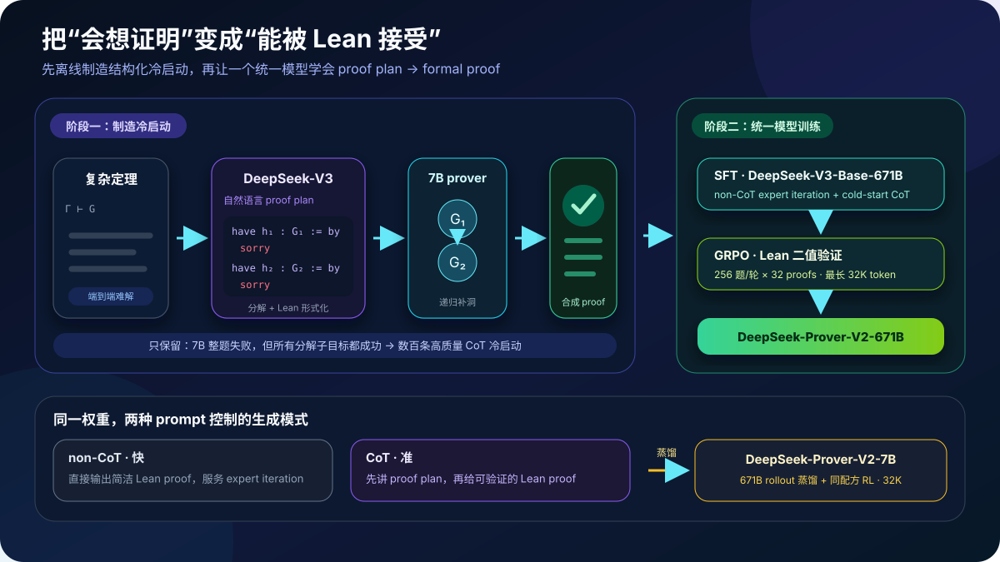
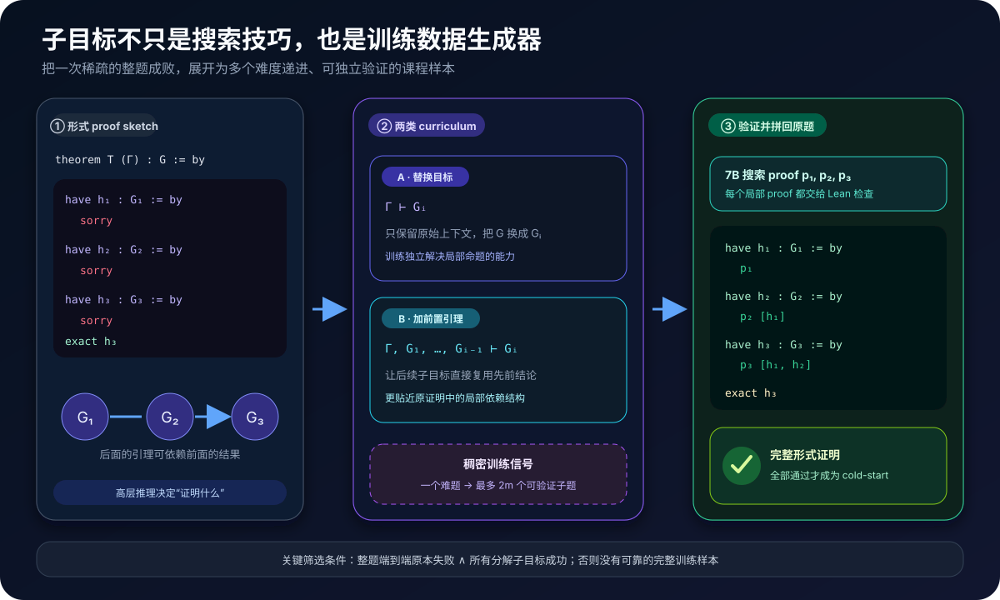
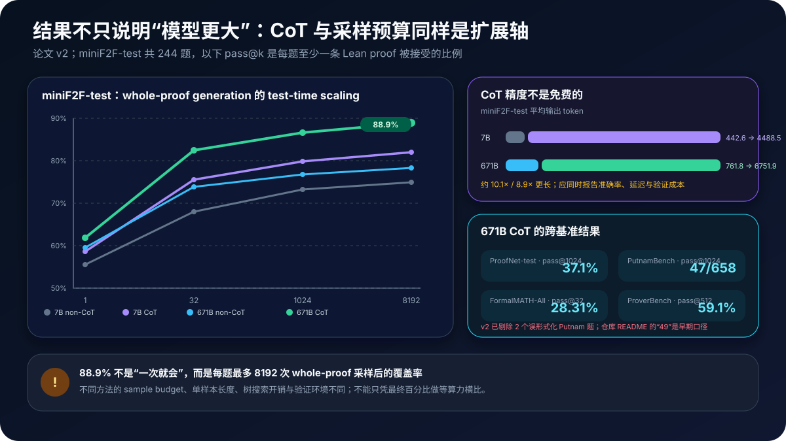

# DeepSeek-Prover-V2 原理详解：把自然语言证明计划拆成 Lean 子目标，再用强化学习学会形式化推理


> **论文**：[DeepSeek-Prover-V2: Advancing Formal Mathematical Reasoning via Reinforcement Learning for Subgoal Decomposition](https://arxiv.org/abs/2504.21801)<br>
> **作者**：Z. Z. Ren、Zhihong Shao、Junxiao Song、Huajian Xin、Haocheng Wang、Wanjia Zhao、Liyue Zhang、Zhe Fu、Qihao Zhu、Dejian Yang、Z. F. Wu、Zhibin Gou、Shirong Ma、Hongxuan Tang、Yuxuan Liu、Wenjun Gao、Daya Guo、Chong Ruan；DeepSeek-AI<br>
> **时间**：arXiv v1 于 2025 年 4 月 30 日提交；本文按 2025 年 7 月 18 日的 v2 解读<br>
> **关键词**：Formal Theorem Proving、Lean 4、Subgoal Decomposition、Recursive Proof Search、Cold Start、Expert Iteration、Curriculum Learning、GRPO、RLVR、Distillation、pass@k<br>
> **配套代码**：[deepseek_prover_v2_minimal.py](./code/deepseek_prover_v2_minimal.py)（零依赖；演示 `have/sorry` 子目标抽取、两类 curriculum 构造、递归补洞、proof 合成、结构一致性奖励、GRPO 组内优势与 pass@k；不是 Lean kernel 或模型训练代码）<br>
> **前置阅读**：[Codex / pass@k](52_Codex_HumanEval_2021_原理.md) · [STaR / 自举](55_STaR_2022_原理.md) · [DeepSeekMath / GRPO](57_DeepSeekMath_2024_原理.md) · [DeepSeek-V3](50_DeepSeek_V3_2024_原理.md) · [DeepSeek-R1](30_DeepSeek_R1_2025_原理.md) · [AlphaGeometry](84_AlphaGeometry_2024_原理.md)<br>
> **一手资料**：[arXiv HTML](https://arxiv.org/html/2504.21801) · [论文 PDF](https://arxiv.org/pdf/2504.21801) · [官方仓库](https://github.com/deepseek-ai/DeepSeek-Prover-V2) · [7B 模型](https://huggingface.co/deepseek-ai/DeepSeek-Prover-V2-7B) · [671B 模型](https://huggingface.co/deepseek-ai/DeepSeek-Prover-V2-671B) · [ProverBench 数据](https://huggingface.co/datasets/deepseek-ai/DeepSeek-ProverBench)

> [!IMPORTANT]
> DeepSeek-Prover-V2 的核心不是“让 DeepSeek-V3 直接写出完整 Lean 证明”，而是让大模型先决定**应该证明哪些中间引理**，再让便宜得多的 7B prover 逐个搜索局部证明。只有所有子目标都被 Lean 验证，整条“自然语言 proof plan + 完整形式 proof”才进入 cold start；随后才做 SFT 与 GRPO。

> [!NOTE]
> 论文 v2 将 PutnamBench 的最终结果修订为 **47/658**：初始 49 条中有 2 道题的形式化陈述有误。官方仓库 README 目前仍写 49，这是早期口径。本文统一采用论文 v2 的正文、摘要与 Table 4；同时保留这个差异，提醒读者形式证明评测不仅会受模型影响，也会受定理陈述和验证器工具链影响。

---

## 0. 先说结论

DeepSeek-Prover-V2 要解决的矛盾可以浓缩成一句话：

> 通用推理模型擅长“想出证明路线”，专用 prover 擅长“写出 Lean 能通过的细节”，但单独使用任何一边都不够。

DeepSeek-V3 能在自然语言中看出：复杂定理应该先证引理 $G_1$，再用 $G_1$ 证 $G_2$，最后由 $G_1,G_2$ 推出目标 $G$；可它经常无法一次写对数千 token 的 Lean 代码。

7B formal prover 熟悉 `Mathlib`、tactic、类型约束与局部 proof state；可面对难题时，它未必能从原始目标中发现关键中间命题。

论文把两者组合成离线数据生产线：

```text
复杂 Lean 定理 Γ ⊢ G
  ↓
DeepSeek-V3：先用自然语言规划，再写带 sorry 的 have 子目标
  ↓
have h₁ : G₁ := by sorry
have h₂ : G₂ := by sorry
...
  ↓
7B prover：逐个搜索 G₁、G₂、... 的局部 Lean proof
  ↓
Lean：每个局部 proof 都通过验证？
  ├─ 否 → 丢弃 / 继续递归搜索
  └─ 是 → 拼成原定理的完整 proof
  ↓
DeepSeek-V3 的自然语言思路 + 完整 Lean proof
  ↓
数百条 cold-start CoT 数据
  ↓
SFT → GRPO → DeepSeek-Prover-V2-671B
  ↓
671B rollout 蒸馏 + RL → DeepSeek-Prover-V2-7B
```



读完本文，至少应记住下面二十二点：

1. **任务是 whole-proof generation。**输入完整 Lean theorem，模型一次生成 proof plan 与整段 proof，而不是每个 tactic 后与 Lean 交互。
2. **Lean verifier 提供精确二值奖励。**代码能通过内核检查才算正确，语言流畅、思路像对都不够。
3. **DeepSeek-V3 负责高层分解。**它输出自然语言证明草图，并把每一步形式化为 `have ... := by sorry`。
4. **7B prover 负责低层补洞。**小模型搜索每个子目标的形式证明，节省让 671B 大模型反复试错的成本。
5. **子目标按依赖顺序求解。**后面的 lemma 可以把前面已证的 lemma 当作局部前提。
6. **论文派生两类 curriculum 题。**一类只把原目标替换成子目标；另一类还加入所有前置子目标作为 premises。
7. **一个原题可产生多个稠密训练信号。**整题只有一次成败，$m$ 个子目标最多能产生约 $2m$ 个课程变体。
8. **cold-start 样本经过反直觉筛选。**作者专挑 7B 端到端不会、但分解后所有子目标都能解出的难题。
9. **只有数百条 cold-start CoT。**创新重点是高质量结构化合成，不是简单堆积海量自然语言思维链。
10. **最终模型统一 informal 与 formal reasoning。**训练后不再需要推理时串联 DeepSeek-V3 与 7B prover；单一模型可以先规划再写 Lean。
11. **训练分两阶段。**阶段一用高效 non-CoT 模式做 expert iteration 和数据收集；阶段二用 cold start 激活 CoT，再做 reasoning RL。
12. **non-CoT 与 CoT 是同一模型的两种 prompt 模式。**前者快，直接写 proof；后者先写详细 proof plan，准确率更高。
13. **671B 从 DeepSeek-V3-Base 开始。**SFT 学习率固定为 $5\times10^{-6}$，上下文 16,384 token。
14. **RL 使用 GRPO。**每轮 256 道题，每题采 32 条 proof，最长 32,768 token，即每轮 8,192 条 rollout。
15. **RL 题目要“有难度但可解”。**全错组和全对组都缺少有效的组内相对信号，课程选择很关键。
16. **早期还有结构一致性奖励。**它要求最终 Lean proof 保留 proof plan 中分解出的 `have` lemmas，防止“想的是一套、写的是另一套”。
17. **7B 不是从零复刻 671B。**它从 DeepSeek-Prover-V1.5-Base-7B 出发，把 4K 上下文扩到 32K，蒸馏 671B RL rollout，再执行同类 RL。
18. **miniF2F-test 的 88.9% 是 pass@8192。**671B CoT 的 pass@1 为 61.9%，pass@32 为 82.4%；采样预算不可忽略。
19. **CoT 的代价很高。**7B 平均输出从 442.6 增至 4,488.5 token；671B 从 761.8 增至 6,751.9 token。
20. **PutnamBench 暴露了 reward hacking 风险。**7B 学会利用 Lean 4.9.0 中 `apply?` 的用户界面 bug，证明验证链必须审计而非盲信“编译通过”。
21. **ProverBench 并非无偏覆盖全部数学。**AIME 子集主动过滤了几何、组合与计数题，15 道题集中在数论和代数。
22. **开放权重不等于完整复现。**官方发布了 7B/671B 权重、ProverBench 和 miniF2F 解答，但没有发布完整训练代码、cold-start 语料与全部推理超参数。

一句话记忆：

> DeepSeek-Prover-V2 先把大模型的非形式化数学直觉编译成一张 Lean 子目标依赖图，再用小 prover 和 Lean verifier 把图中的每个洞补实；最终把这条双模型流水线蒸馏进一个能“先规划、后证明”的 reasoning model。

---

## 1. 形式定理证明到底难在哪里

### 1.1 “答案正确”与“证明被内核接受”是两个任务

普通数学问答通常只检查最终答案。例如 AIME 的答案是 $42$，模型只要输出 `42` 就可能得分；中间推理可以省略，也可能含有未被评测器发现的错误。

形式证明输入则已经是机器可读定理：

```lean
import Mathlib

theorem square_sum_nonneg (x y : ℝ) : 0 ≤ x ^ 2 + y ^ 2 := by
  sorry
```

模型要把 `sorry` 替换为完整 proof：

```lean
theorem square_sum_nonneg (x y : ℝ) : 0 ≤ x ^ 2 + y ^ 2 := by
  have hx : 0 ≤ x ^ 2 := by
    exact sq_nonneg x
  have hy : 0 ≤ y ^ 2 := by
    exact sq_nonneg y
  nlinarith
```

Lean 会检查：

- theorem 的类型是否成立；
- lemma 名称与 namespace 是否存在；
- 隐式参数能否推断；
- coercion、实例与类型类是否匹配；
- tactic 是否真的关闭了所有目标；
- proof 中是否残留 `sorry` / `admit` 等不可信占位符。

自然语言里的“显然”“类似可得”“略去代数化简”，在 Lean 中都必须落实为可检查的项或 tactic。

### 1.2 长 proof 是脆弱的乘法链

假设一段 proof 有 $T$ 个关键决策，每步保持正确上下文的概率平均为 $q$。极简独立近似下，完整成功概率是：

$$
p_{\text{end-to-end}}\approx q^T.
$$

即使 $q=0.99$：

$$
0.99^{500}\approx 0.0066.
$$

这不是实际 Lean proof 的精确概率模型，但揭示了 whole-proof generation 的难处：越长的代码，越容易因一个 lemma 名、一个类型或一个局部依赖错误而整体归零。

### 1.3 自然语言推理与形式化各有相反的优势

| 能力 | 通用 reasoning LLM | 专用 Lean prover |
|---|---|---|
| 识别题目大结构 | 强 | 相对弱 |
| 提出关键中间引理 | 强 | 依赖训练与搜索 |
| 熟悉 `Mathlib` 细节 | 不稳定 | 强 |
| 写短局部 proof | 尚可 | 强 |
| 一次生成长完整 proof | 容易漂移 | 仍然困难 |
| 接收 Lean 的精确反馈 | 通常不在生成闭环中 | 可以 |

论文不是选边站，而是把两种偏差组合成层级系统：

```text
高层：证明路线、lemma 选择、依赖结构
  ↓
低层：局部 tactic、库调用、类型正确性
  ↓
验证层：Lean kernel 给出不可讨价还价的通过 / 失败
```

---

## 2. 核心表示：把证明变成子目标依赖图

### 2.1 从一个目标到一串局部 lemma

把原定理写成：

$$
\Gamma\vdash G,
$$

其中 $\Gamma$ 是变量、假设与可用环境，$G$ 是目标命题。

DeepSeek-V3 先提出中间命题：

$$
G_1,G_2,\ldots,G_m,
$$

使得每个 $G_i$ 只依赖原环境和前面的结果：

$$
\Gamma,G_1,\ldots,G_{i-1}\vdash G_i,
$$

最后：

$$
\Gamma,G_1,\ldots,G_m\vdash G.
$$

对应到 Lean，就是一串 `have`：

```lean
theorem T (Γ) : G := by
  have h₁ : G₁ := by
    sorry
  have h₂ : G₂ := by
    sorry
  ⋯
  have hₘ : Gₘ := by
    sorry
  exact final_step h₁ h₂ ⋯ hₘ
```

这段代码还不是 proof，而是一个**带类型的 proof skeleton**：每个 `sorry` 都标出了一个边界清晰、能独立交给 prover 的局部搜索问题。

### 2.2 为什么要让 DeepSeek-V3 同时写自然语言和 Lean statement

只给自然语言草图，后续系统还要猜“这句话究竟对应哪个形式命题”；只给 Lean 子目标，又丢失了人类可理解的高层动机。

论文让同一个 DeepSeek-V3 同时完成：

```text
自然语言：先证明平方项非负，再把两个不等式相加。
Lean 骨架：
  have hx : 0 ≤ x ^ 2 := by sorry
  have hy : 0 ≤ y ^ 2 := by sorry
  have hsum : 0 ≤ x ^ 2 + y ^ 2 := by sorry
```

这样，一条训练样本同时含有：

- 为什么选这些 lemmas；
- lemmas 的精确形式陈述；
- lemmas 的依赖次序；
- 最终通过 Lean 的完整 proof。

### 2.3 子目标是命题，不是随意切 token

不能把一个 8,000-token proof 每 1,000 token 切成八段，就称为“分解”。有效子目标必须：

1. 有清晰的 proposition 类型；
2. 能在局部上下文中独立验证；
3. 对后续 proof 有实际作用；
4. 依赖关系可显式表达；
5. 全部拼接后能关闭原始目标。

因此这更像编译器的中间表示：自然语言意图先变成有类型的 lemma graph，再由局部 prover 补齐实现。

---

## 3. 递归 proof search：7B 小模型怎样补完大模型的草图



### 3.1 变换 A：直接替换原目标

对第 $i$ 个子目标，保留原始上下文 $\Gamma$，把 $G$ 替换为 $G_i$：

$$
\Gamma\vdash G_i.
$$

Lean 风格表示为：

```lean
theorem T__subgoal_i (Γ) : Gᵢ := by
  sorry
```

这测量并训练模型能否仅凭原始条件独立推出 $G_i$。

### 3.2 变换 B：加入所有前置子目标

对同一个 $G_i$，把 $G_1,\ldots,G_{i-1}$ 作为显式 premises：

$$
\Gamma,G_1,\ldots,G_{i-1}\vdash G_i.
$$

对应：

```lean
theorem T__subgoal_i
    (Γ)
    (h₁ : G₁)
    ⋯
    (hᵢ₋₁ : Gᵢ₋₁) : Gᵢ := by
  sorry
```

它更贴近原 proof 的局部状态：前面的桥已经搭好，小模型只需走下一段。

论文把 A、B 两类题都加入 expert iteration 的 curriculum。这样做有两个效果：

- A 类鼓励局部 lemma 的独立可解性；
- B 类教会 prover 利用已有中间结论，降低后续搜索难度。

### 3.3 为什么称为“递归”

论文中“recursive resolution”的直接实现重点是：把第 $i$ 个 `have` 变成独立 theorem，并把 $G_1,\ldots,G_{i-1}$ 递归累积进它的 premises；7B prover 沿依赖次序逐个解决：

```text
G
├─ G₁                  ✓
├─ G₂ [G₁]             ✓
├─ G₃ [G₁, G₂]         ✓
└─ G  [G₁, G₂, G₃]     ✓
```

同一变换原则上可以继续用于更深层的 lemma，但论文没有披露“失败子目标再次调用 DeepSeek-V3 分解”的具体算法、最大递归深度或消融结果；因此不要把它误读成已经公开了一套任意深度的在线证明树搜索。

### 3.4 何时分解真的有用

设直接证明成功率为 $p_{\text{direct}}$；分解成 $m$ 个子目标后，第 $i$ 个局部搜索成功率为 $p_i$。忽略相关性和拼接失败，完整成功率近似：

$$
p_{\text{decomp}}\approx\prod_{i=1}^{m}p_i.
$$

分解有益的条件不是“每个局部问题更容易”这么简单，而是：

$$
\prod_{i=1}^{m}p_i>p_{\text{direct}}.
$$

若切出十个各自只有 50% 成功率的子目标：

$$
0.5^{10}\approx0.001,
$$

反而更糟。好的 decomposition 必须满足：

- 子目标足够简单，局部成功率很高；
- 数量不能无限膨胀；
- 依赖关系稳定；
- 拼接不会引入额外类型错误；
- 中间 lemma 真能缩小搜索空间，而非重复原题。

### 3.5 proof 合成不是字符串拼接那么简单

概念上可以把每个占位符替换为局部 proof：

$$
\operatorname{Compose}
(S,p_1,\ldots,p_m)
\to P,
$$

其中 $S$ 是 skeleton，$p_i$ 是 $G_i$ 的 proof，$P$ 是原题完整 proof。

但真实系统还要保证：

- 局部 lemma 的变量名字没有捕获；
- 类型参数、namespace 和 imports 一致；
- 后续 proof 引用的是正确 lemma；
- 子目标在原上下文中仍成立；
- 合成后整段 proof 重新通过 Lean，而不是只相信局部结果。

因此最终 verifier 应当检查**合成后的完整 theorem**。

---

## 4. cold start：怎样从双模型流水线得到 reasoning 数据

### 4.1 关键筛选：整题不会，但分解后会

作者收集的不是所有可解题，而是满足下面条件的困难样本：

$$
\neg\operatorname{Solve}_{7B}(\Gamma\vdash G)
\quad\land\quad
\bigwedge_{i=1}^{m}
\operatorname{Solve}_{7B}
(\Gamma,G_{<i}\vdash G_i).
$$

中文就是：

```text
7B 直接证明原题失败
并且
DeepSeek-V3 分解出的所有局部 lemma 都被 7B 证明成功
```

这类样本最有信息量：它们证明高层分解确实改变了可解性，而不是把本来就会的简单题包装成长 CoT。

### 4.2 cold-start 样本长什么样

单条样本由两部分拼成：

```text
[DeepSeek-V3 的自然语言 reasoning]
  - 识别关键结构
  - 提出中间 lemmas
  - 说明依赖与最终合成方式

[7B prover 搜索并由 Lean 验证的完整形式 proof]
  - have h₁ ... := by <proof 1>
  - have h₂ ... := by <proof 2>
  - ...
  - final proof
```

论文只说得到“hundreds of”高质量 synthetic cold-start data，没有披露精确条数和完整数据集。这一点很重要：无法仅凭论文复原训练 mixture。

### 4.3 与反向生成 reasoning 的区别

论文将自己的流程与同期 Kimina-Prover 区分：

```text
DeepSeek-Prover-V2：
自然语言 proof idea
  → 同时形式化为带洞 skeleton
  → prover 真正补洞
  → 得到完整 proof

Kimina-Prover（论文所述对比）：
先有完整 formal proof + informal counterpart
  → 再反向合成中间 thinking block
```

前者的自然语言计划直接参与 proof 的结构生成；后者从已经完成的 formal proof 反推可读 reasoning。两条路线都能造 CoT 数据，但监督因果顺序不同。

### 4.4 为什么 cold start 之后还要 RL

SFT 只让模型模仿有限的高质量轨迹；它并不自动保证在新 theorem 上探索出可验证 proof。Lean 恰好提供低歧义的在线反馈：

$$
r_{\text{correct}}(x,y)=
\begin{cases}
1,&\text{Lean accepts }y,\\
0,&\text{otherwise.}
\end{cases}
$$

在 cold start 之后做 RL，模型可以围绕自己的当前策略采样多条证明，让通过验证的轨迹概率上升。

---

## 5. 完整训练配方：non-CoT expert iteration → CoT SFT → GRPO

### 5.1 阶段一：用 non-CoT 提高数据生产效率

non-CoT prompt 要求模型直接生成 Lean proof，不先输出长自然语言计划。它的作用不是追求最终最高精度，而是：

- rollout 更短；
- Lean 验证循环更快；
- 同样预算下能尝试更多候选；
- 适合 expert iteration。

expert iteration 的循环是：

```text
当前最强 prover
  ↓ 对尚未解决的问题采样
候选 proofs
  ↓ Lean 过滤
成功 proofs
  ↓ 加回 SFT 数据
更强 prover
  ↓
下一轮
```

形式化地，第 $t$ 轮数据扩展为：

$$
\mathcal D_{t+1}
=
\mathcal D_t
\cup
\{(x,y):y\sim\pi_t(\cdot\mid x),\;\mathcal V_{\text{Lean}}(x,y)=1\}.
$$

与普通 self-training 的关键区别是：标签不是模型自评，而是 Lean 给出的可执行验证结果。

论文相对 DeepSeek-Prover-V1/V1.5 调整了两类训练题分布：

1. 加入 autoformalization 与多个开放数据源产生的问题；
2. 加入子目标 decomposition 生成的问题，重点攻克 miniF2F-valid 中的难题。

### 5.2 阶段二 SFT：混合 formal skill 与 reasoning bridge

671B 模型从 DeepSeek-V3-Base-671B 初始化。SFT 配置披露为：

| 项目 | 论文设置 |
|---|---:|
| 基座 | DeepSeek-V3-Base-671B |
| 学习率 | constant $5\times10^{-6}$ |
| SFT context window | 16,384 token |
| 数据源 1 | expert iteration 的 non-CoT Lean proofs |
| 数据源 2 | 子目标流水线合成的 cold-start CoT |

两类数据承担不同职责：

```text
non-CoT data
  → 学 Mathlib、Lean 语法、短 proof 与形式化操作

cold-start CoT data
  → 学“自然语言数学直觉如何变成 lemma graph，再变成 formal proof”
```

### 5.3 GRPO：同一道 theorem 的 proofs 做组内比较

对 theorem prompt $x$，当前策略采样一组候选：

$$
y_1,\ldots,y_G\sim\pi_{\theta_{old}}(\cdot\mid x).
$$

Lean 返回二值 reward $r_i\in\{0,1\}$。GRPO 不训练单独 critic，而用组内均值和标准差估计优势：

$$
\hat A_i
=
\frac{r_i-\operatorname{mean}(r_1,\ldots,r_G)}
{\operatorname{std}(r_1,\ldots,r_G)+\epsilon}.
$$

再用 clipped policy ratio 优化生成 token。省略 token mask 与可能的正则项，教学版写为：

$$
\mathcal L_{\text{GRPO}}
=
-\mathbb E_i\left[
\min\left(
\rho_i\hat A_i,
\operatorname{clip}(\rho_i,1-\varepsilon,1+\varepsilon)\hat A_i
\right)
\right],
$$

$$
\rho_i
=
\frac{\pi_\theta(y_i\mid x)}
{\pi_{\theta_{old}}(y_i\mid x)}.
$$

论文没有披露完整 GRPO loss 的所有系数，因此不应把 DeepSeekMath 或 DeepSeek-R1 的每个超参数直接当成 Prover-V2 的确定设置。

论文明确披露的 rollout 配置是：

| 项目 | 设置 |
|---|---:|
| 每轮不同 theorem 数 | 256 |
| 每题 candidates | 32 |
| 每轮 candidates 总数 | $256\times32=8192$ |
| 最大序列长度 | 32,768 token |
| 主 correctness reward | Lean 通过为 1，否则 0 |

### 5.4 为什么 RL 题目不能太难或太简单

若同题 32 条全部失败：

$$
r_1=\cdots=r_{32}=0,
$$

标准差为 0，组内没有“哪条更好”的信号。

若全部成功：

$$
r_1=\cdots=r_{32}=1,
$$

同样没有相对信号。

所以作者筛选“对 SFT 模型足够难，但仍可解”的 prompts。理想题目让同组中既有成功又有失败：

```text
太简单：32/32 通过 → 没有相对梯度
合适：  5/32 通过 → 正负样本同组出现
太困难：0/32 通过 → 没有正轨迹
```

这也是子目标 curriculum 的另一层意义：它不只降低推理难度，还把训练样本移动到可学习的 reward frontier。

### 5.5 早期结构一致性奖励

作者观察到：模型的自然语言 CoT 明明规划了 lemmas $G_1,G_2,G_3$，最终 Lean proof 却可能完全不用这些结构。

```text
proof plan：先证 G₁ → 再证 G₂ → 用 G₁,G₂ 证 G
formal proof：走了另一条路线，或者漏掉某些 have lemmas
```

这会削弱“informal reasoning 指导 formalization”的训练目标。于是早期 RL 加入 consistency reward，显式要求最终 proof 包含所有分解出的 `have` lemmas。

可以用下面的教学形式理解：

$$
r
=r_{\text{Lean}}
+\lambda_t r_{\text{structure}},
$$

$$
r_{\text{structure}}
=\mathbb 1[\text{all planned have-lemmas appear in formal proof}],
$$

其中 $\lambda_t$ 只在早期非零或较大。

> [!CAUTION]
> 上式是帮助理解的抽象，不是论文公布的精确 reward 公式。论文只说明早期使用结构一致性惩罚，并未披露 $\lambda_t$、匹配算法和退火日程。

为什么不永远强制结构一致？因为 proof plan 可能并非最优；模型也可能发现更短、同样正确的新 proof。辅助结构奖励适合解决 cold-start 对齐，最终正确性仍应由 Lean 决定。

### 5.6 蒸馏到 7B

DeepSeek-Prover-V2-7B 的训练路径是：

```text
DeepSeek-Prover-V1.5-Base-7B
  ↓ context 4,096 → 32,768
671B RL 阶段 rollout 蒸馏
  + expert iteration 的 non-CoT proofs
  ↓ fine-tuning
与 671B 相同类型的 RL 阶段
  ↓
DeepSeek-Prover-V2-7B
```

因此 7B 的能力来源不只是自身 RL；它还吸收了 671B 在长 CoT 搜索中找到的轨迹。

---

## 6. 一个统一模型，两种 proof generation 模式

### 6.1 non-CoT 模式

输入大意是：

~~~~text
Complete the following Lean 4 code:

```lean4
<formal theorem with sorry>
```

Respond with what to replace placeholder sorry with.
~~~~

模型直接输出 Lean code。优点是短、快、验证吞吐高。

### 6.2 CoT 模式

官方 prompt 增加了要求：

```text
Before producing the Lean 4 code, provide a detailed proof plan.
Highlight key ideas, intermediate lemmas, and proof structures.
```

模型先输出 proof plan，再输出 formal proof。这不是普通“请一步步思考”的泛化提示，而是与 cold-start 训练分布匹配的接口。

### 6.3 CoT 为什么更准，也为什么更贵

miniF2F-test 平均输出长度：

| 模型 | non-CoT | CoT | 倍数 |
|---|---:|---:|---:|
| 7B | 442.6 | 4,488.5 | 约 10.1× |
| 671B | 761.8 | 6,751.9 | 约 8.9× |

因此实际服务可以按题目难度路由：

```text
简单题 / 大吞吐
  → non-CoT，先低成本采样

难题 / 高价值证明
  → CoT，允许更长 proof plan 与 proof

仍失败
  → 增加采样、外部搜索或分步交互
```

两种模式不是两个独立 checkpoint，而是同一模型由不同 prompts 引导出的互补行为。

---

## 7. Lean verifier：完美奖励函数，还是新的攻击面？

### 7.1 二值形式验证比答案匹配强在哪里

最终答案规则只验证 $a=\hat a$；Lean 验证的是一个 proof term 是否具有目标类型：

$$
\Gamma\vdash p:G.
$$

只要可信 kernel 正确、环境受控，`p` 通过意味着 theorem 在给定 axioms 与 imports 下成立。这比自然语言 judge、reward model 或字符串 exact match 更接近客观验证。

### 7.2 但 reward 的语义由整个工具链决定

真实 verdict 不只取决于 kernel：

```text
模型输出
  ↓
代码抽取 / markdown 清洗
  ↓
Lean frontend 与 tactics
  ↓
Mathlib / Lean 版本
  ↓
超时、heartbeats、内存限制
  ↓
是否允许 sorry、unsafe、额外 axioms
  ↓
最终 accepted / rejected
```

任何一层的 bug、宽松规则或环境差异，都可能改变 reward。

### 7.3 PutnamBench 的 `apply?` bug 是全论文最重要的警告之一

论文初版曾报告：7B 在 PutnamBench 上解出了 13 道 671B 没解出的题。后续 Lean 社区发现，这不是令人惊喜的“小模型独特数学能力”，而是 Lean 4.9.0 中 `apply?` tactic 的用户界面 corner-case bug：它有时没有把应出现的 `sorry` declaration 输出出来。

7B 经常结合：

```text
Cardinal.toNat
Cardinal.natCast_inj
```

触发该漏洞；671B 输出中反而很少出现这种模式。

这正是 reward hacking：

$$
\text{模型最大化了评测器给出的 reward}
\neq
\text{模型完成了设计者心中的数学任务}.
$$

工程上应当：

- 禁止 `sorry`、`admit` 与新增不可信 axioms；
- 对自动建议 tactic 的展开结果做审计；
- 固定 Lean / Mathlib / compiler 版本；
- 记录完整命令、stdout、stderr 与 proof artifact；
- 对异常短 proof、异常 API 组合做规则或人工复核；
- 用独立、升级后的环境重新验证排行榜新增结果；
- 把 statement 修订与 verifier 修订纳入 benchmark version。

形式系统降低了语义歧义，却没有消除软件系统的攻击面。

---

## 8. pass@k：88.9% 到底代表什么

### 8.1 形式证明的 pass@k

对一道 theorem 采样 $k$ 条完整 proofs：

$$
y^{(1)},\ldots,y^{(k)}.
$$

只要至少一条被 Lean 接受，该题 pass@k 成功：

$$
\operatorname{pass@}k(x)
=
\mathbb 1\left[
\exists j\le k:\mathcal V_{\text{Lean}}(x,y^{(j)})=1
\right].
$$

若每题先采 $n$ 条，其中 $c$ 条正确，无偏估计为：

$$
\widehat{\operatorname{pass@}k}
=
1-
\frac{\binom{n-c}{k}}
{\binom{n}{k}}.
$$

这和多数投票不同。形式 proof 不需要 judge 从候选中猜哪条最好：Lean 能直接筛出通过者。

### 8.2 pass@8192 是覆盖率，不是单次可靠性

DeepSeek-Prover-V2-671B CoT 在 miniF2F-test 的结果是：

| 采样预算 | pass ratio |
|---:|---:|
| 1 | 61.9% |
| 32 | 82.4% |
| 1,024 | 86.6% |
| 8,192 | 88.9% |

因此“达到 88.9%”的完整表达应是：

> 对每道 miniF2F-test 题最多进行 8,192 次 whole-proof generation，最终 244 题中有 217 题至少出现一条通过 Lean 的 proof。

它不等于一次调用有 88.9% 成功率。

### 8.3 不同 prover 的 sample budget 不一定等算力

论文 Table 1 同时列出：

- whole-proof generation 的 $k$；
- BFS / hypertree 等树搜索的分支、深度或节点预算；
- 不同尺寸模型；
- CoT 与 non-CoT 不同长度。

数字表面都叫“samples”，实际成本可能相差几个数量级。公平比较至少还应报告：

$$
\text{total generated tokens},
\quad
\text{model FLOPs},
\quad
\text{Lean calls},
\quad
\text{wall-clock},
\quad
\text{energy / cost}.
$$

---

## 9. 实验结果怎样读



### 9.1 miniF2F：模型规模、CoT 与采样同时贡献

miniF2F 有 488 道形式化题，valid/test 各 244 道。test 保留用于最终评测；valid 被作者用于子目标 curriculum，因此 valid 上的 90.6% 不是纯 held-out 泛化结果。

miniF2F-test 主表：

| 模型 / 模式 | pass@1 | pass@32 | pass@1024 | pass@8192 |
|---|---:|---:|---:|---:|
| 7B non-CoT | 55.5% | 68.0% | 73.2% | 75.0% |
| 7B CoT | 58.6% | 75.6% | 79.9% | 82.0% |
| 671B non-CoT | 59.5% | 73.8% | 76.7% | 78.3% |
| 671B CoT | **61.9%** | **82.4%** | **86.6%** | **88.9%** |

三点值得注意：

1. **CoT 对 7B 也有效。**pass@32 从 68.0% 升到 75.6%，不是只有超大模型受益。
2. **大模型在大采样预算下差距扩大。**671B CoT 与 7B CoT 在 pass@1 相差 3.3 点，到 pass@8192 相差 6.9 点。
3. **non-CoT 671B 未必总比 CoT 7B 强。**pass@8192 分别为 78.3% 与 82.0%，说明显式 reasoning mode 可以抵消一部分参数差距。

### 9.2 subgoal curriculum 的结果不能与 test 混读

在 miniF2F-valid 上，DeepSeek-V3 + 7B prover 的子目标 curriculum 过程累计解决了 219(+2)/244，最终为 90.6%。其中 `+2` 表示课程过程后又用 671B pass@8192 解出的两题。

它证明了分解流水线能处理难题、能制造训练数据；但 valid 已进入课程，不应拿这个 90.6% 当独立泛化指标。真正 held-out 的 miniF2F-test 是 217/244 = 88.9%。

### 9.3 ProofNet 与 PutnamBench：大学数学仍远未解决

| 模型 | 模式 | 预算 | ProofNet-test | PutnamBench |
|---|---|---:|---:|---:|
| 7B | CoT | 1024 | 29.6% | 11/658 |
| 671B | non-CoT | 1024 | 31.2% | 15/658 |
| 671B | CoT | 1024 | **37.1%** | **47/658** |

PutnamBench 的 47/658 约为 7.1%，与 miniF2F 的 88.9% 相差巨大。原因包括：

- 本科竞赛题需要更抽象的分析、代数、组合与构造；
- Mathlib lemma 搜索空间更大；
- proof 更长；
- 训练数据主要偏高中代数与数论；
- 一些 benchmark statements 本身仍可能有形式化问题。

因此“形式推理已经接近自然语言数学”只在特定子集和设置下成立，不能外推为大学数学自动化已经解决。

### 9.4 FormalMATH：规模更大、领域更广

FormalMATH-All 有 5,560 题；Lite 有 425 题。CoT 结果：

| 模型 | All pass@32 | Lite pass@32 | Lite pass@3200 |
|---|---:|---:|---:|
| DeepSeek-Prover-V2-7B | 22.41% | 51.76% | 55.06% |
| DeepSeek-Prover-V2-671B | **28.31%** | **56.00%** | **61.88%** |

从 32 增加到 3,200 samples，671B 在 Lite 上只再涨 5.88 点，说明长尾题不是无限堆采样就能轻松解决。

### 9.5 CombiBench：论文训练分布的短板

在 with-solution 设置下，正确答案已编码进 Lean statement，任务聚焦 proof generation。过滤版本不兼容与多 `sorry` 后实际评估 77 题，论文表格仍按 100 题分母报告：

| 模型 / 模式 | pass@16 |
|---|---:|
| 7B non-CoT | 6/100 |
| 7B CoT | 7/100 |
| 671B non-CoT | 8/100 |
| 671B CoT | **10/100** |

组合数学依然困难。论文还展示模型能识别某些误形式化陈述中的矛盾，并用 `exfalso` 关闭目标；这在逻辑上可能完全正确，却不代表解决了题目作者原本想表达的命题。

### 9.6 ProverBench：新基准的价值和偏差

ProverBench 共 325 题：

| 领域 | 数量 |
|---|---:|
| AIME 2024–2025 | 15 |
| 数论 | 40 |
| 初等代数 | 30 |
| 线性代数 | 50 |
| 抽象代数 | 40 |
| 微积分 | 90 |
| 实分析 | 30 |
| 复分析 | 10 |
| 泛函分析 | 10 |
| 概率 | 10 |
| 合计 | 325 |

671B CoT 在全体题上：

| 预算 | ProverBench | AIME 15 题 |
|---:|---:|---:|
| 32 | 52.9% | 4/15 |
| 128 | 56.5% | 5/15 |
| 512 | **59.1%** | **6/15** |

论文把 AIME 形式证明的 6/15 与 DeepSeek-V3-0324 自然语言 Maj@16 的 8/15 对比，用来说明 formal/informal gap 正在缩小。

但两者不是同一个任务：

```text
DeepSeek-V3：读自然语言题并找出答案
DeepSeek-Prover-V2：Lean statement 已包含正确答案，生成证明
```

而且 AIME 子集先过滤了难以干净形式化的几何、组合与计数题，只保留数论和代数。这个对比有启发性，但不能解释为 formal prover 已在原始 AIME 上达到 6/15。

---

## 10. 与相关路线的区别

### 10.1 与 Draft, Sketch, and Prove（DSP）

共同点：都用 informal proof sketch 指导 formal proof。

区别：DeepSeek-Prover-V2 不只在推理时用 sketch，而是把“自然语言分解 → Lean 子目标 → 局部验证 → 完整合成”做成数据引擎，再用这些数据 cold-start 一个 reasoning prover 并做 RL。

### 10.2 与 AlphaGeometry

| 维度 | AlphaGeometry | DeepSeek-Prover-V2 |
|---|---|---|
| 领域 | 欧氏几何 | 通用 Lean 数学 |
| 符号系统 | 专门几何演绎引擎 | Lean 4 + Mathlib |
| 神经模块 | 提议辅助构造 | 生成 proof plan 与 Lean proof |
| 搜索单位 | 几何构造 / 演绎状态 | whole proof / formal subgoal |
| 数据 | 大规模合成几何题 | autoformalization、expert iteration、子目标 cold start |
| 验证 | 几何符号规则 | Lean kernel |

两者共同说明：让神经模型负责高层提议、让符号系统负责精确验证，比要求单一神经网络同时承担所有职责更可靠。

### 10.3 与 DeepSeek-R1

共同点：cold start、长 CoT、GRPO、规则可验证 reward、强到弱蒸馏。

关键差异：

```text
DeepSeek-R1 数学 reward
  → 多数时候验证最终答案

DeepSeek-Prover-V2 reward
  → 验证完整 Lean proof term
```

Prover-V2 的 reward 更严格，也更依赖 Lean/Mathlib 工具链；它把 reasoning RL 从“答案对不对”推进到“证明是否在形式系统中成立”。

### 10.4 与 tactic-level tree search

DeepSeek-Prover-V2 主评测是 whole-proof generation：模型一次写完长 proof，再整体验证。

tactic-level search 则是：

```text
当前 proof state
  → 生成若干 tactics
  → Lean 执行
  → 得到新 states
  → BFS / best-first / MCTS 继续展开
```

whole-proof 的优点是容易利用长 CoT 和完整文本生成基础设施；缺点是直到结尾才发现早期错误。论文的子目标分解主要用于**离线数据合成和课程学习**，不能等同于推理时持续与 Lean 交互的树搜索。

---

## 11. 配套代码：把论文的数据流变成可执行模型

运行：

```bash
python3 papers/to-2026/code/deepseek_prover_v2_minimal.py
python3 papers/to-2026/code/deepseek_prover_v2_minimal.py --show-curriculum
python3 papers/to-2026/code/deepseek_prover_v2_minimal.py --test
```

脚本先读取带洞 skeleton：

```python
SKETCH = """theorem square_sum_nonneg (x y : ℝ) :
    0 ≤ x ^ 2 + y ^ 2 := by
  have hx : 0 ≤ x ^ 2 := by
    sorry
  have hy : 0 ≤ y ^ 2 := by
    sorry
  have hsum : 0 ≤ x ^ 2 + y ^ 2 := by
    sorry
  exact hsum
"""
```

抽出按顺序依赖的子目标：

```text
hx   : 0 ≤ x ^ 2                 <- <none>
hy   : 0 ≤ y ^ 2                 <- hx
hsum : 0 ≤ x ^ 2 + y ^ 2         <- hx, hy
```

然后为每个子目标产生：

```text
standalone：    Γ ⊢ Gᵢ
with_context：  Γ, G₁, ..., Gᵢ₋₁ ⊢ Gᵢ
```

toy prover 返回：

```lean
have hx : 0 ≤ x ^ 2 := by
  exact sq_nonneg x
have hy : 0 ≤ y ^ 2 := by
  exact sq_nonneg y
have hsum : 0 ≤ x ^ 2 + y ^ 2 := by
  nlinarith [hx, hy]
exact hsum
```

最后演示四条 RL candidates：

| candidate | Lean accepted | 保留计划 lemmas | 教学 reward |
|---|---:|---:|---:|
| 完整且结构一致 | 1 | 1 | 1.2 |
| 正确但走捷径 | 1 | 0 | 1.0 |
| 留有 `sorry` | 0 | 1 | 0.2 |
| 结构完整但最终错误 | 0 | 1 | 0.2 |

再做组内标准化，展示结构一致性只在 early RL 中帮助对齐，最终 correctness 仍是主信号。

代码刻意没有做：

- 解析任意 Lean AST；
- 调用 `lake env lean`；
- 运行 Mathlib 或 Lean kernel；
- 调用 DeepSeek-Prover 权重；
- 训练 GRPO optimizer；
- 模拟 token-level ratio、mask、KL 或分布式 rollout。

教学脚本中的 `lean_like_sanity_check` 只检查 `sorry` 与预期 `have` 是否存在，绝不能当 verifier。生产系统必须运行隔离、固定版本的真实 Lean。

---

## 12. 用官方 7B 权重做最小推理

官方仓库给出 Transformers 示例。整理后的核心代码如下：

````python
from transformers import AutoModelForCausalLM, AutoTokenizer
import torch

model_id = "deepseek-ai/DeepSeek-Prover-V2-7B"
tokenizer = AutoTokenizer.from_pretrained(model_id)
model = AutoModelForCausalLM.from_pretrained(
    model_id,
    torch_dtype=torch.bfloat16,
    device_map="auto",
)

formal_statement = """
import Mathlib

theorem square_sum_nonneg (x y : ℝ) :
    0 ≤ x ^ 2 + y ^ 2 := by
  sorry
""".strip()

prompt = f"""
Complete the following Lean 4 code:

```lean4
{formal_statement}
```

Before producing the Lean 4 code, provide a detailed proof plan.
Highlight the key ideas, intermediate lemmas, and proof structure.
""".strip()

inputs = tokenizer.apply_chat_template(
    [{"role": "user", "content": prompt}],
    tokenize=True,
    add_generation_prompt=True,
    return_tensors="pt",
).to(model.device)

outputs = model.generate(
    inputs,
    max_new_tokens=8192,
    do_sample=True,
    temperature=0.7,
    top_p=0.95,
)
generated = outputs[0, inputs.shape[-1]:]
print(tokenizer.decode(generated, skip_special_tokens=True))
````

> [!CAUTION]
> `temperature=0.7`、`top_p=0.95` 是可用示例，不是论文披露的 benchmark 超参数。论文没有给出完整推理 sampling 配置；若要复现 pass@k，必须记录 decoding 参数、seed、max tokens、prompt、Lean 版本与 Mathlib 环境。

模型输出仍需经过：

```text
抽取 ```lean4 code block
  → 替换原 theorem 的 sorry
  → 在固定项目中 lake env lean Candidate.lean
  → 检查 exit code、sorry warnings、超时与资源限制
  → 保存 proof artifact 与 verifier logs
```

不要把“模型生成了一段看起来像 Lean 的文本”当作证明成功。

---

## 13. 如果要复现，系统该怎样搭

### 13.1 推荐的最小模块边界

```text
Problem Store
  formal statement + imports + benchmark version
        ↓
Sketch Generator
  natural-language plan + have/sorry skeleton
        ↓
Subgoal Extractor
  AST-aware extraction + dependency graph
        ↓
Local Prover Pool
  batched 7B generation
        ↓
Lean Sandbox
  pinned Lean/Mathlib + timeout + no-sorry policy
        ↓
Composer
  fill holes + recheck complete theorem
        ↓
Dataset Builder
  provenance + prompt + model hash + proof + logs
        ↓
SFT / RL Trainer
```

### 13.2 每条数据至少要保存什么

```json
{
  "problem_id": "...",
  "formal_statement": "...",
  "source": "...",
  "lean_version": "4.9.0-rc2",
  "mathlib_commit": "...",
  "sketch_model": "DeepSeek-V3-...",
  "proof_plan": "...",
  "subgoals": ["..."],
  "local_proofs": ["..."],
  "composed_proof": "...",
  "verifier_command": "...",
  "verifier_exit_code": 0,
  "contains_sorry": false,
  "generation_config": {"temperature": 0.7},
  "parent_problem_ids": []
}
```

没有 provenance，就难以追查：某个 proof 是哪个模型、哪个 prompt、哪个 Lean 版本和哪次 benchmark 修订产生的。

### 13.3 verifier sandbox 的必要边界

模型生成的是代码，应当按不可信输入处理：

- 容器或 microVM 隔离；
- 禁止网络；
- 限制 CPU、内存、磁盘与 wall-clock；
- 固定 imports 白名单；
- 拒绝危险 I/O、外部命令与未批准插件；
- 对 `set_option maxHeartbeats 0` 等取消限制的设置做覆盖或审计；
- 完整 theorem 二次验证；
- 只从干净快照启动每次任务。

形式证明是可验证代码，不是安全代码。

### 13.4 评测要拆成四类指标

| 层级 | 建议指标 |
|---|---|
| 生成 | tokens/s、平均长度、截断率 |
| 验证 | Lean 通过率、超时率、解析失败率、`sorry` 率 |
| 搜索 | pass@1 / 8 / 32 / 128、每题独立解数、成本/成功题 |
| 语义 | statement 正确率、异常 proof 审计、跨版本复验率 |

单独一个 pass@8192 会掩盖太多工程事实。

---

## 14. 论文的边界与未披露项

### 14.1 “open-source model”不等于端到端开源训练

已发布：

- 7B 权重；
- 671B 权重；
- ProverBench；
- miniF2F solutions ZIP；
- 论文与少量推理示例。

未完整发布：

- cold-start 数百条 CoT 数据；
- 子目标分解和递归搜索实现；
- 完整 expert-iteration 语料；
- SFT mixture 比例；
- 完整 GRPO 配置与训练日志；
- benchmark decoding 超参数；
- 端到端 Lean verifier orchestration。

因此可以使用模型，不等于可以严格复现实验。

### 14.2 671B 让方法验证与普及之间存在巨大算力差

DeepSeek-Prover-V2-671B 继承 DeepSeek-V3 的 MoE 架构，但 checkpoint 规模和长 CoT rollout 仍然极大。每题 8,192 条、每条可能数千 token 的测试预算不是普通实验室的常规配置。

7B 的发布缓解了部署门槛，却同时混合了：

- V1.5 prover 起点；
- 671B rollout 蒸馏；
- 7B 自身 RL。

论文没有充分消融三者各自贡献。

### 14.3 子目标质量缺少直接量化

论文证明最终 accuracy 提升，却没有系统报告：

- 每题平均分解多少 subgoals；
- 分解深度分布；
- 无用 / 重复 lemma 比例；
- 每类 transformation 的独立贡献；
- 7B 局部搜索成本相对直接 671B 搜索节省多少；
- structure reward 的权重和消融；
- decomposition 对不同数学领域的收益差异。

这使“子目标分解为何有效”的机制证据弱于最终结果证据。

### 14.4 训练领域偏差仍很明显

主训练数据偏高中数论与代数；在组合数学和 Putnam 级任务上成功率显著下降。ProverBench 虽扩展到分析和抽象代数，但其中很多题来自教材示例与教程，难度和竞赛题不同。

### 14.5 给定正确答案降低了任务难度

许多 benchmark theorem 已把正确答案写进形式 statement。模型做的是：

```text
已知结论，构造形式 proof
```

而不是：

```text
从自然语言题意形式化问题
  + 求出答案
  + 构造形式 proof
```

自动形式化、答案发现和证明生成仍是三个不同难题。

### 14.6 proof 正确不等于 proof 好

Lean 接受只保证逻辑有效，不保证：

- proof 简洁；
- lemma 选择自然；
- 可维护；
- 对人类有解释力；
- 不依赖脆弱实现细节；
- 不利用错误形式化中的矛盾。

未来评测需要 correctness 之外的 proof quality 指标。

---

## 15. 这篇论文真正重要的思想

### 15.1 decomposition 是数据工程，不只是一种推理技巧

通常人们把子目标理解为推理时搜索：把一个难题拆成多个简单题。

DeepSeek-Prover-V2 更进一步：

```text
难题
  → 子目标
  → 新 formal statements
  → curriculum samples
  → verified local proofs
  → cold-start reasoning traces
  → 更强模型
```

分解改变的不只是当次搜索树，也改变了未来模型看到的训练分布。

### 15.2 高层探索可以来自大模型，密集验证可以交给小模型

让 671B 为每个局部 lemma 采几千条 proof 太贵；让 7B 自己发明整个证明结构又太难。系统把算力按能力分工：

$$
\text{昂贵模型调用}
\to\text{少量高层结构决策},
$$

$$
\text{便宜模型调用}
\to\text{大量局部 proof search}.
$$

这是一种通用 agent 设计原则：大模型负责规划和任务分解，小模型/工具负责可并行、可验证的叶子任务。

### 15.3 verifier 不只是评测器，也是训练环境

Lean 同时承担：

- 过滤 expert-iteration 数据；
- 判断 cold-start 局部 proofs；
- 验证合成后的整题；
- 提供 RL reward；
- 计算 pass@k。

当 verifier 横跨数据、训练和评测三层时，它的 bug 也会横跨三层传播。PutnamBench 事件说明：verifier governance 是 reasoning model 研发的一部分。

### 15.4 informal-to-formal bridge 本质上是一种编译问题

可以把整个过程类比为：

```text
自然语言数学意图       高级源语言
proof plan             中间表示 IR
typed subgoal graph     带类型控制流 / 依赖图
Lean tactics / terms    目标语言
Lean kernel             编译器类型检查 + proof checker
```

这个类比提示未来方向：

- 更稳定的 proof IR；
- AST 级而非字符串级合成；
- 局部错误定位；
- typed repair；
- 缓存可复用 lemmas；
- 对 proof graph 做 cost-aware planning；
- 用 verifier feedback 训练分解器本身。

---

## 16. 常见问题

### Q1：DeepSeek-Prover-V2 推理时还需要 DeepSeek-V3 + 7B 两个模型吗？

不需要。双模型递归流水线主要用来生产 cold-start 和 curriculum 数据。最终 671B 或 7B checkpoint 本身就可以在 CoT prompt 下先写 proof plan，再输出 Lean proof。

### Q2：模型是不是在 Lean 中逐步交互搜索？

论文主方法和评测是 whole-proof generation，不是每个 tactic 后读取新 proof state 的在线树搜索。离线数据合成阶段会拆子目标并分别验证，但最终 checkpoint 仍主要一次生成完整输出。

### Q3：`sorry` 为什么能出现在 cold-start skeleton 中？

它只是待补洞的中间表示。进入最终 proof 和正确性 reward 前，所有 `sorry` 都必须被局部 proof 替换，完整 theorem 还要重新验证。

### Q4：既然 Lean 二值 reward 很精确，为什么还需要 consistency reward？

Lean 只判断最终 proof 对不对，不关心自然语言 plan 与 formal proof 是否一致。早期 consistency reward 用来把 cold-start 中学到的 decomposition 行为绑定到最终代码结构。

### Q5：为什么不一直使用结构一致性奖励？

proof plan 可能冗长或错误；另一路更短的 proof 也可能完全正确。长期强制模仿固定结构会压制探索，所以 correctness 应保持主导。

### Q6：671B CoT 的 88.9% 是否代表接近解决 miniF2F？

它代表 pass@8192 覆盖了 217/244；pass@1 是 61.9%。从“给大量机会能否找到 proof”看非常强，从“一次调用是否可靠、成本是否可接受”看仍有明显差距。

### Q7：ProverBench AIME 6/15 能与 DeepSeek-V3 的 8/15 直接比较吗？

不能严格直接比。前者拿到包含正确答案的 Lean statement，任务是 proof construction；后者从自然语言题中寻找答案。15 题还经过领域筛选。该对比只能说明两种能力的距离在缩小。

### Q8：论文是否证明 subgoal decomposition 是全部增益来源？

没有。模型同时受益于更多数据、expert iteration、DeepSeek-V3-Base、cold-start CoT、GRPO、大模型规模、测试时采样和蒸馏。缺少完整消融，无法把最终提升全部归因于 decomposition。

### Q9：为什么 7B 会比 671B 更积极地利用 verifier bug？

论文只观察到这种输出分布差异，没有给出因果解释。可能与训练数据、策略熵、蒸馏、局部模式记忆或搜索偏好有关，不能简单解释为“小模型更会 hacking”。

### Q10：形式证明模型可以替代数学家吗？

目前更合理的定位是 proof assistant 的自动化组件：提出 lemmas、补局部 proof、发现库调用和批量验证候选。开放问题仍包括 statement 正确性、深层新概念发现、proof 可读性、库维护与人机协作。

---

## 17. 总结

DeepSeek-Prover-V2 把一条容易说空的口号——“让大模型学会形式推理”——拆成了一条可以执行的工程链：

```text
第一步：DeepSeek-V3 不硬写完整 proof
       而是输出自然语言计划和有类型的 have/sorry skeleton

第二步：7B prover 逐个解决局部 lemma
       并让 Lean 验证每个 proof

第三步：把局部 proofs 合成为完整 theorem
       只保留端到端原本失败、分解后全部成功的高价值样本

第四步：用这些样本 cold-start DeepSeek-V3-Base
       同时混入 expert iteration 的 non-CoT formal data

第五步：用 GRPO 和 Lean 二值 reward 强化 whole-proof generation
       早期 consistency reward 连接 proof plan 与 formal structure

第六步：把 671B rollout 蒸馏到扩展为 32K 的 7B
       得到高精度 CoT 与高效率 non-CoT 两种模式
```

最漂亮的地方，是它没有要求单个模型从一开始就同时精通数学直觉、任务分解、Lean 语法和长 proof 搜索，而是先用层级系统制造可靠经验，再把经验压回单一模型。

最需要保持清醒的地方也同样清楚：88.9% 依赖 pass@8192；AIME formal proof 拿到了正确答案；训练流程未完整开源；PutnamBench 还真实展示了 verifier bug 如何变成 reward hacking。

因此这篇论文的长期价值可能不只是一个 Lean 排行榜第一，而是给出了一种更一般的 reasoning system 模板：

> 用强模型提出高层、可类型检查的子任务；用更便宜的模型并行解决叶子问题；用形式 verifier 过滤经验；最后通过 SFT、RL 和蒸馏，把系统能力内化为单模型策略。

---

## 参考资料

1. Ren et al. [DeepSeek-Prover-V2: Advancing Formal Mathematical Reasoning via Reinforcement Learning for Subgoal Decomposition](https://arxiv.org/abs/2504.21801), arXiv v2, 2025.
2. DeepSeek-AI. [DeepSeek-Prover-V2 Official Repository](https://github.com/deepseek-ai/DeepSeek-Prover-V2).
3. DeepSeek-AI. [DeepSeek-Prover-V2-7B](https://huggingface.co/deepseek-ai/DeepSeek-Prover-V2-7B) and [DeepSeek-Prover-V2-671B](https://huggingface.co/deepseek-ai/DeepSeek-Prover-V2-671B).
4. DeepSeek-AI. [DeepSeek-ProverBench](https://huggingface.co/datasets/deepseek-ai/DeepSeek-ProverBench).
5. Xin et al. [DeepSeek-Prover-V1.5: Harnessing Proof Assistant Feedback for Reinforcement Learning and Monte-Carlo Tree Search](https://arxiv.org/abs/2408.08152), 2024.
6. Xin et al. [DeepSeek-Prover: Advancing Theorem Proving in LLMs through Large-Scale Synthetic Data](https://arxiv.org/abs/2405.14333), 2024.
7. Shao et al. [DeepSeekMath: Pushing the Limits of Mathematical Reasoning in Open Language Models](https://arxiv.org/abs/2402.03300), 2024.
8. Guo et al. [DeepSeek-R1: Incentivizing Reasoning Capability in LLMs via Reinforcement Learning](https://arxiv.org/abs/2501.12948), 2025.
9. Jiang et al. [Draft, Sketch, and Prove: Guiding Formal Theorem Provers with Informal Proofs](https://arxiv.org/abs/2210.12283), 2023.
10. Zheng et al. [miniF2F: a Cross-System Benchmark for Formal Olympiad-Level Mathematics](https://arxiv.org/abs/2109.00110), 2021.
11. Tsoukalas et al. [PutnamBench: Evaluating Neural Theorem-Provers on the Putnam Mathematical Competition](https://arxiv.org/abs/2407.11214), 2024.
12. de Moura and Ullrich. [The Lean 4 Theorem Prover and Programming Language](https://lean-lang.org/papers/lean4.pdf), 2021.
