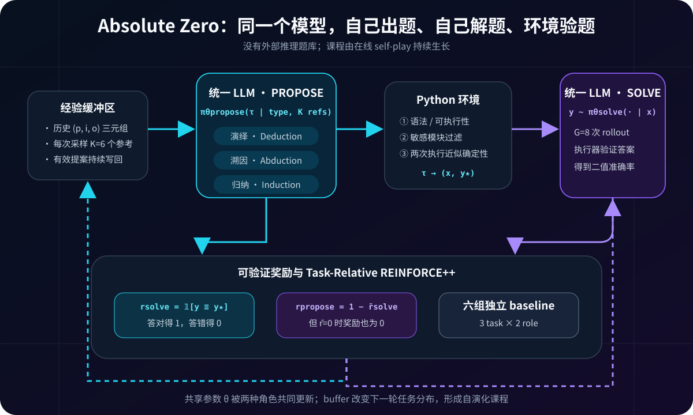
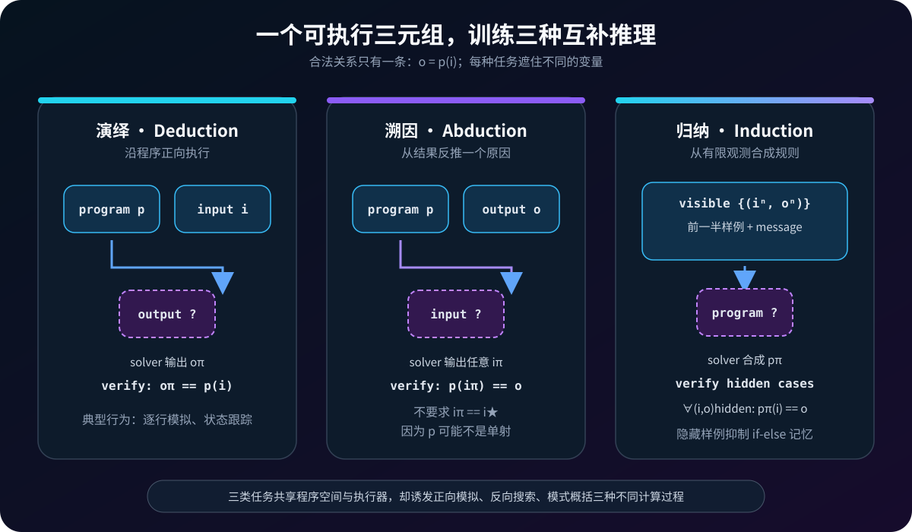
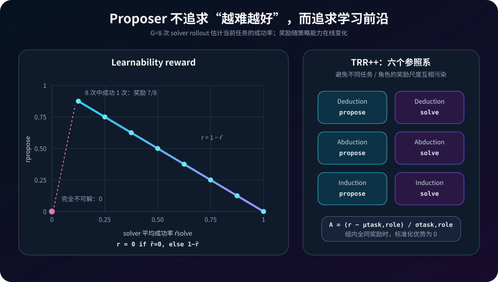
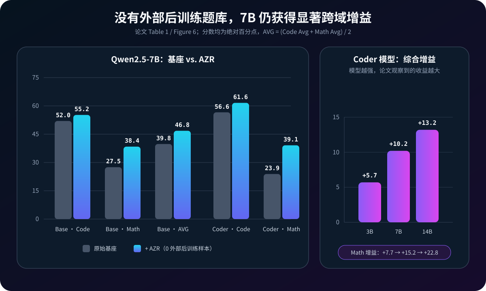

# Absolute Zero 原理详解：没有外部题库，模型如何通过“自己出题、自己解题”学会推理


> **论文**：[Absolute Zero: Reinforced Self-play Reasoning with Zero Data](https://arxiv.org/abs/2505.03335)<br>
> **作者**：Andrew Zhao、Yiran Wu、Tong Wu、Quentin Xu、Yang Yue、Matthieu Lin、Shenzhi Wang、Qingyun Wu、Zilong Zheng、Gao Huang<br>
> **机构**：清华大学、北京通用人工智能研究院（BIGAI）、Penn State University<br>
> **时间**：arXiv v1 于 2025 年 5 月 6 日提交；本文按 2025 年 10 月 16 日的 v3 与 NeurIPS 2025 会议版解读<br>
> **关键词**：Reinforcement Learning with Verifiable Rewards、Self-play、Automatic Curriculum、Proposer–Solver、Deduction、Abduction、Induction、Code Executor、Learnability Reward、TRR++<br>
> **配套代码**：[absolute_zero_minimal.py](./code/absolute_zero_minimal.py)（Python 标准库、零依赖；演示三类任务、白名单 AST 执行器、等价验证、可学习性奖励、六组 task-relative advantage 与自博弈课程；不是官方 LLM 训练代码）<br>
> **前置阅读**：[AlphaZero / 自博弈](72_AlphaZero_2017_原理.md) · [Codex / 执行式评测](52_Codex_HumanEval_2021_原理.md) · [Training Verifiers](53_Training_Verifiers_2021_原理.md) · [STaR / 自举](55_STaR_2022_原理.md) · [DeepSeekMath / GRPO](57_DeepSeekMath_2024_原理.md) · [DeepSeek-R1 / RLVR](30_DeepSeek_R1_2025_原理.md) · [Limits of RLVR](88_Limits_of_RLVR_2025_原理.md)<br>
> **一手资料**：[arXiv v3 HTML](https://arxiv.org/html/2505.03335v3) · [NeurIPS 2025 论文页](https://proceedings.neurips.cc/paper_files/paper/2025/hash/9837dc00ff67d176373268ed48042d49-Abstract-Conference.html) · [项目主页](https://andrewzh112.github.io/absolute-zero-reasoner/) · [官方仓库](https://github.com/LeapLabTHU/Absolute-Zero-Reasoner) · [模型集合](https://huggingface.co/collections/andrewzh/absolute-zero-reasoner-68139b2bca82afb00bc69e5b) · [训练日志](https://wandb.ai/andrewzhao112/AbsoluteZeroReasoner)

> [!IMPORTANT]
> “Zero Data”不是“从随机权重开始，也不接触任何人类信息”。AZR 从**预训练基座模型**出发，使用人类设计的 prompt、Python 任务接口、奖励函数与执行器。它真正移除的是推理后训练阶段的**外部题目、标准答案和蒸馏推理轨迹**：训练题由当前模型在线提出，标签由执行环境产生。

> [!WARNING]
> 论文实验代码会执行模型生成的 Python。论文附录明确建议采用 E2B 等隔离服务；官方 `paper` 分支的执行器也标有“不安全、不要用于生产”的警告。本文配套代码不复刻任意 `exec`，而是用严格白名单 AST 解释器演示同一反馈结构。真实系统必须使用容器 / microVM、资源配额、网络隔离、系统调用策略和审计日志，关键词过滤不构成安全沙箱。

---

## 0. 先说结论

Absolute Zero 追问的不是“没有人工思维链还能不能做 RL”，而是更激进的问题：

> 如果连训练问题都不给，推理模型能否自己发现下一道最值得练的题，并从可验证环境中持续进步？

DeepSeek-R1-Zero 一类 RLVR 方法去掉了 SFT cold start，却仍需要人类整理的 $(\text{question},\text{answer})$ 集合。Absolute Zero 再向前走一步：同一个模型既做 **proposer**，生成程序推理题；又做 **solver**，解这些题。Python 执行器同时承担三件事：

1. 检查模型提出的程序是否可运行；
2. 执行程序，自动构造标准答案；
3. 执行或比较 solver 的答案，给出可验证奖励。

于是数据不再是训练前固定的文件，而是策略与环境交互的副产品：

```text
历史有效任务 buffer
  ↓ 采样 K 个参考
同一个 LLM：PROPOSE 新任务 τ
  ↓
Python：过滤程序、执行程序、构造 (x, y★)
  ↓
同一个 LLM：SOLVE x，采样 G 个答案
  ↓
Python：验证答案，得到 r_solve
  ↓
由 solver 成功率计算 r_propose
  ↓
按 3 类任务 × 2 个角色分别标准化 advantage
  ↓
更新共享模型 θ；有效任务写回 buffer
  ↺
```



读完本文，至少应记住下面二十六点：

1. **Absolute Zero 是一个后训练设定。**它取消外部 QA / rationale 数据，不取消预训练、人工定义的环境与训练配方。
2. **AZR 是这个设定的第一种具体实现。**论文的宏观范式比 Python 三元组实现更一般。
3. **一个模型共享两种角色。**`propose` 与 `solve` 使用同一组参数，而不是两个永久分离的对手。
4. **任务围绕 $(p,i,o)$ 三元组。**程序 $p$ 对输入 $i$ 的输出为 $o=p(i)$。
5. **演绎预测输出。**给定 $(p,i)$，求 $o$。
6. **溯因反推输入。**给定 $(p,o)$，找任意满足 $p(i)=o$ 的输入；无需复原 proposer 原来的那个输入。
7. **归纳合成程序。**给定一半输入输出样例与 message，写程序；另一半样例隐藏起来做验证。
8. **代码是媒介，不是最终目标。**作者看中的是它的表达力、可执行性和近乎免费的标签生成。
9. **proposer 也用 RL 训练。**只 prompt 一个固定出题器会损失性能。
10. **出题奖励不是“越难越高”。**完全不会的题没有学习信号，全部会的题也没有挑战。
11. **论文的可学习性奖励有一个不连续点。**若 $G$ 次全错，奖励为 0；只成功一次，反而取得有限样本下的最高正奖励。
12. **主实验用 $G=8$。**所以最高可观测正出题奖励是 $1-1/8=0.875$。
13. **solver 使用二值执行奖励。**最终值正确为 1，否则为 0；错误但格式正确和格式错误还分别受 $-0.5/-1$ 惩罚。
14. **历史 buffer 是自动课程的记忆。**提案时采样 $K=6$ 个历史任务，并要求生成不同任务。
15. **有效任务不要求一定有正出题奖励才入库。**这增加覆盖，也可能保留过易或过难样本。
16. **训练实际包含六种分布。**三类 reasoning mode 各有 proposer / solver 两个角色。
17. **TRR++ 为六组分别建立 baseline。**否则归纳 solver 的奖励尺度可能污染演绎 proposer 的梯度。
18. **主模型没有 KL loss / KL reward。**论文训练依靠 outcome reward、熵正则与 clipped policy update 稳定策略。
19. **Qwen2.5-Coder-7B 的综合平均从 40.2 升至 50.4。**代码平均 +5.0，数学平均 +15.2。
20. **跨域迁移是最意外的结果。**训练环境全是自生成代码推理，数学却获得更大提升。
21. **“所有基准都进步”并不成立。**例如 AZR-Base-7B 的 HumanEval+ 比基座低 1.9 分，Coder-7B 的 MBPP+ 只高 0.3 分。
22. **规模趋势有利但还不是 scaling law。**3B、7B、14B Coder 综合增益为 +5.7、+10.2、+13.2，只覆盖三个点。
23. **三类任务互补。**只保留 deduction 时，Base-7B 综合平均由 46.8 降至 43.3。
24. **环境会被当作通信信道。**去掉生成代码中的注释、docstring 或全局变量反而使性能下降，暴露潜在信息泄漏与 reward hacking 边界。
25. **自博弈不是天然安全。**论文报告 Llama-3.1-8B 训练中出现令人担忧的 CoT，并把安全监督列为未解决限制。
26. **最值得继承的是“生成任务—环境验题—动态难度”接口。**最不能照搬的是原型执行器和“只要可执行就可靠”的安全假设。

一句话记忆：

> AZR 把固定题库改成可学习的 proposer，把标准答案改成环境执行结果，再让同一个模型在出题与解题两端共同进化；真正的瓶颈也随之从“谁来标数据”转移成“谁来定义并守住环境”。

---

## 1. 从 RLVR 到 Absolute Zero：究竟少掉了什么

### 1.1 SFT：问题、过程、答案都来自外部

监督微调需要三元组：

$$
\mathcal D=\{(x,c^\star,y^\star)\},
$$

其中 $x$ 是问题，$c^\star$ 是参考推理过程，$y^\star$ 是答案。目标是行为克隆：

$$
\mathcal L_{\mathrm{SFT}}(\theta)
=-\mathbb E_{(x,c^\star,y^\star)\sim\mathcal D}
\log \pi_\theta(c^\star,y^\star\mid x).
$$

这条路线的上限受三项外部供给约束：谁来出高质量题、谁来写可靠过程、谁来给答案。

### 1.2 RLVR：过程自己探索，但题目与答案仍是外部的

RLVR 去掉参考 CoT，只保留：

$$
\mathcal D=\{(x,y^\star)\}.
$$

模型生成自己的 $(c,y)$，验证器只检查结果：

$$
J_{\mathrm{RLVR}}(\theta)
=\mathbb E_{(x,y^\star)\sim\mathcal D,\;(c,y)\sim\pi_\theta(\cdot|x)}
[r(y,y^\star)].
$$

这已经把“如何推理”交给模型，却仍把“练什么”固定在人类题库里。题库若过易，所有 rollout 都正确；若过难，所有 rollout 都错误；两者都缺少有区分度的策略梯度。

### 1.3 Absolute Zero：连学习任务分布也变成策略的一部分

Absolute Zero 引入 proposer：

$$
\tau\sim\pi_\theta^{\text{propose}}(\cdot|z),
$$

环境 $e$ 与转换函数 $f_e$ 把提案变成可验证问题：

$$
(x,y^\star)\sim f_e(\cdot|\tau),
$$

solver 再回答：

$$
y\sim\pi_\theta^{\text{solve}}(\cdot|x).
$$

论文的总目标是：

$$
\max_\theta\ \mathbb E_{z\sim p(z)}
\left[
\lambda r_e^{\text{propose}}(\tau,\pi_\theta)
+\mathbb E_{y\sim\pi_\theta^{\text{solve}}(\cdot|x)}
[r_e^{\text{solve}}(y,y^\star)]
\right].
$$

其中：

- $z$ 是 proposer 的条件，在 AZR 中主要是任务类型与历史 buffer 样本；
- $f_e$ 负责验证提案并构造 query / label；
- $r^{\text{propose}}$ 衡量任务对当前 solver 的学习潜力；
- $r^{\text{solve}}$ 衡量答案正确性；
- $\lambda$ 平衡“寻找好问题”和“学会解决问题”。

真正的范式变化是：

| 范式 | 外部给问题 | 外部给过程 | 外部给答案 | 模型学出题 | 环境验证 |
|---|---:|---:|---:|---:|---:|
| SFT | 是 | 是 | 是 | 否 | 可选 |
| RLVR / Zero-style RL | 是 | 否 | 是 | 否 | 是 |
| Absolute Zero | 否 | 否 | 否 | 是 | 是 |

但表里的“否”只针对**推理后训练样本**。预训练语料、模型结构、prompt、环境规则和评测集当然仍由外部提供。

---

## 2. 为什么选择代码作为“可开放、又可落地”的环境

### 2.1 一个任务就是 $(p,i,o)$

设程序空间、输入空间、输出空间分别为：

$$
\mathscr P,\quad\mathscr I,\quad\mathscr O.
$$

有效任务是三元组：

$$
(p,i,o),\qquad o=p(i).
$$

只要模型能生成程序与输入，执行器就能补出输出。把三元组中的不同元素遮住，就自然得到三类推理：



### 2.2 Deduction：给程序和输入，预测输出

$$
(p,i)\longrightarrow o.
$$

proposer 生成 $(p,i)$，环境运行 $p(i)$ 得到 $o$。solver 看到程序与输入，必须模拟代码执行。

例子：

```python
def f(x):
    state = []
    for value in range(1, x + 1):
        state.append(value if value % 2 else -value)
    return sum(state)
```

给定 `x = 7`，solver 要跟踪列表和累加状态，最终输出 `4`。验证条件很直接：

$$
r_{\text{ded}}=\mathbb I[o_\pi=o^\star].
$$

### 2.3 Abduction：给程序和输出，寻找一个可行输入

$$
(p,o)\longrightarrow i.
$$

这不是严格求逆，因为 $p$ 可能不是单射。例如：

```python
def f(x):
    return x * x
```

目标输出为 `16`，`-4` 与 `4` 都正确。若强行匹配 proposer 当初使用的 $i^\star=-4$，就会错罚同样有效的答案。因此验证器检查：

$$
r_{\text{abd}}=\mathbb I[p(i_\pi)=o^\star],
$$

而不是 $\mathbb I[i_\pi=i^\star]$。

这个细节非常重要：**可验证答案不一定是唯一标准字符串，而可以是满足约束的等价类。**

### 2.4 Induction：给部分 I/O 样例，合成程序

$$
\{(i^n,o^n)\}_{n=1}^{N/2},m\longrightarrow p.
$$

归纳任务的 proposer 不直接发明新程序。它从 deduction / abduction buffer 采样一个已验证程序 $p$，生成 $N=10$ 个输入和自然语言 message，执行器算出输出。

solver 只看到前一半样例与 message；后一半是隐藏测试：

$$
r_{\text{ind}}
=\mathbb I\left[
\forall(i_n^\star,o_n^\star)\in\mathcal H,
p_\pi(i_n^\star)=o_n^\star
\right].
$$

隐藏样例是必要的。只验可见点，solver 完全可以写：

```python
def f(x):
    table = {1: 3, 2: 5, 3: 7, 4: 9, 5: 11}
    return table[x]
```

它记住了样例，却没有归纳 $f(x)=2x+1$。留出测试把“拟合观测”与“发现规则”分开。

### 2.5 为什么这三类任务可能迁移到数学

论文没有证明一个严格的因果定理，但三类计算模式确实对应常见推理操作：

| 代码任务 | 推理操作 | 数学中的类比 |
|---|---|---|
| Deduction | 正向执行、状态跟踪 | 从条件逐步推出结论 |
| Abduction | 候选搜索、反向约束、自我修正 | 已知结论反推变量或构造 |
| Induction | 从有限样例概括函数 | 发现模式、猜公式、再检验 |

因此“代码训练提升数学”不必理解为模型记住了更多数学事实，更合理的假说是：执行式自博弈强化了可复用的状态跟踪、搜索和抽象能力。

不过这仍是**机制解释，而不是论文已经证实的因果链**。数学提升也可能来自输出长度增长、基础模型的代码先验、RL 正则化效应或训练计算量差异。

---

## 3. Proposer：怎样自己生成一条不断移动的课程

### 3.1 从“零三元组”点火

论文用最简单的 identity function 作为 fallback：

```python
def f(x):
    return x
```

对应：

```text
input  = "Hello world"
output = "Hello world"
```

它只负责在空 buffer 时给 proposer 一个格式参照。作者特别说明，基座 LLM 即使没有这个 seed 也能启动；加入它是为了展示初始化接口。

正式训练前还有 seeding 阶段：基座模型自己生成有效任务，填满三类初始 buffer；这个阶段**不更新参数**。初始 deduction / abduction seed 数量为：

$$
|\mathcal D^0|=B\times S,\qquad S=4.
$$

所以“zero data”不是磁盘上一个 JSONL 都没有，而是 seed 任务本身也由当前基座模型生成，不来自外部人工题库。

### 3.2 历史参考不是答案示例，而是搜索空间锚点

每次生成 deduction / abduction 任务，proposer 从对应 buffer 均匀采样 $K=6$ 个历史三元组，并被明确要求生成与它们不同的程序。

这有两种作用：

1. **格式与可行性示范**：告诉基座模型合法任务长什么样；
2. **新颖性压力**：prompt 要求避开刚看到的程序，迫使课程向外扩张。

消融结果支持它的重要性。去掉历史参考，Base-7B：

- 代码平均从 55.2 降至 54.4；
- 数学平均从 38.4 降至 33.1；
- 综合平均从 46.8 降至 43.8。

数学下降 5.3 分，说明动态上下文可能不仅帮助格式遵循，还改变了任务覆盖。

### 3.3 Buffer 如何更新

一条提案通过以下检查后写入 buffer：

1. 能解析并调用入口函数 `f`；
2. 对给定输入产生非错误返回值；
3. 不含列表中的敏感模块 / 关键词；
4. 两次独立执行返回相同结果；
5. 满足输出格式。

注意，**入库只要求有效，不要求 proposer reward 大于 0**。因此：

- 全部 solver 都会做的任务可以入库；
- 当前 solver 一次也做不出的任务也可以入库；
- 后续 solver batch 不足时，可以从历史 buffer 回填。

这样做避免课程只保留狭窄的中等难度区域，但也让 buffer 质量依赖采样与后续训练稳定性。

### 3.4 课程不是按固定难度等级增长

传统 curriculum 可能手工定义 level 1、2、3。AZR 没有显式难度标签，难度由当前 solver 的成功率相对定义。

同一道题在训练早期可能“不可解”，中期变成“可学习”，后期又变成“太简单”。因此出题奖励是非平稳的：

$$
r_{\text{propose}}(\tau,\pi_{\theta_t})
\neq
r_{\text{propose}}(\tau,\pi_{\theta_{t+1}}).
$$

这正是自动课程的核心：题目价值不只由题目本身决定，还由学生当前能力决定。

---

## 4. 最关键的设计：Learnability Reward

### 4.1 用当前 solver 给任务测难度

对每个提案，AZR 用同一个模型的 solver 角色做 $G$ 次非零温度采样：

$$
\bar r_{\text{solve}}
=\frac{1}{G}\sum_{g=1}^{G}r_{\text{solve}}^{(g)}.
$$

然后定义：

$$
r_{\text{propose}}=
\begin{cases}
0, & \bar r_{\text{solve}}=0,\\
1-\bar r_{\text{solve}}, & \bar r_{\text{solve}}>0.
\end{cases}
$$



直觉是：

- $\bar r=1$：全部答对，任务太简单，奖励 0；
- $0<\bar r<1$：既有成功轨迹也有失败轨迹，可产生相对学习信号；
- $\bar r=0$：完全不可解，没有成功行为可强化，奖励 0。

### 4.2 为什么不是最大化熵 $p(1-p)$

常见“中等难度”奖励会在成功率 0.5 处最大，例如：

$$
r_{\text{entropy-like}}=4p(1-p).
$$

AZR 不是这样。只要至少成功一次，题越难奖励越高。主实验 $G=8$ 时：

| 成功次数 | $\bar r_{\text{solve}}$ | $r_{\text{propose}}$ |
|---:|---:|---:|
| 0 / 8 | 0 | 0 |
| 1 / 8 | 0.125 | **0.875** |
| 2 / 8 | 0.25 | 0.75 |
| 4 / 8 | 0.5 | 0.5 |
| 7 / 8 | 0.875 | 0.125 |
| 8 / 8 | 1 | 0 |

因此最受奖励的不是 50% 难度，而是**刚好还留着一条成功路径的最难任务**。

### 4.3 这个奖励的优点

它非常便宜、无需训练 reward model，而且直接对准当前 solver：

- 不需要人工定义“代码复杂度 8 比 6 更难”；
- 不需要另一个 judge LLM 猜任务质量；
- 随 solver 进步自动移动难度前沿；
- 至少一条成功 rollout 可为 solver 提供正样本。

### 4.4 这个奖励的统计缺陷

若真实成功率为 $p$，有限 rollout 的估计量方差是：

$$
\operatorname{Var}(\hat p)=\frac{p(1-p)}{G}.
$$

$G=8$ 并不大。更关键的是，任务获得非零 proposer reward 的概率为：

$$
P(\text{至少成功一次})=1-(1-p)^G.
$$

若真实 $p=0.02$：

$$
1-0.98^8\approx14.9\%.
$$

也就是说，约 85% 的评估会把“极难但仍可解”的任务误判为完全不可解，给 0 分。这使奖励具有：

- 高方差；
- 在 $p=0$ 附近的离散跳变；
- 对采样温度和 rollout 数敏感；
- 对当前模型随机性的强依赖。

论文把更准确地估计 learning progress 明确列为未来方向。

### 4.5 格式惩罚

实际总奖励还考虑输出格式：

$$
R(y_\pi)=
\begin{cases}
r_{\text{role}}, & \text{格式正确且任务 / 答案有效},\\
-0.5, & \text{格式正确但答案错误},\\
-1, & \text{格式错误}.
\end{cases}
$$

两种角色都使用 DeepSeek-R1 风格的 `<think>...</think><answer>...</answer>`。对 proposer 来说，“格式正确”不仅是 XML 标签正确，还必须解析出合法程序 / 输入并通过执行器筛选。

---

## 5. Python 执行器：标签工厂、验证器，也是最大攻击面

### 5.1 它怎样自动构造标签

对 deduction / abduction，proposer 只需给 $(p,i)$：

```python
program = "def f(x): return (x * x + 3 * x) % 11"
input_value = 7
gold_output = execute(program, input_value)
```

执行成功后，系统就获得完整 $(p,i,o)$。这相当于把标注成本从人类转移给解释器。

### 5.2 三种验证并不相同

```python
# deduction
reward = value_equal(agent_output, gold_output)

# abduction
reward = value_equal(run(program, agent_input), gold_output)

# induction
reward = all(
    value_equal(run(agent_program, hidden_input), hidden_output)
    for hidden_input, hidden_output in hidden_tests
)
```

这里比文本 exact match 强：set 顺序、fraction 表达、非唯一输入都可以按值等价处理。

### 5.3 两次一致不等于数学意义上的确定性

论文定义确定性程序为任意独立执行结果一致，但工程上因预算限制只执行 $j=2$ 次：

$$
p(i)^{(1)}=p(i)^{(2)}.
$$

这只能排除部分显式随机行为，不能证明：

- 第三次不会变化；
- 不依赖未拦截的环境状态；
- 没有时序、哈希种子或资源竞争影响；
- 对其他输入仍然确定；
- 不含恶意副作用。

它是实用 heuristic，不是形式保证。

### 5.4 关键词黑名单不是安全边界

论文实验过滤 `subprocess`、`multiprocessing`、`os.path`、`sys.exit`、`time`、`random` 等词，但 Python 的动态性意味着：

- 可以通过反射或对象图间接访问能力；
- 可以混淆字符串；
- 可用纯计算制造 CPU / 内存拒绝服务；
- 可触发解释器 / 第三方库漏洞；
- 黑名单很难穷尽所有危险入口。

官方 `paper` 分支的 `GenericRuntime` 最终仍调用 Python `exec`，只用进程池和超时做部分隔离。论文附录因此建议使用 API 化隔离执行器；官方仓库后续 `main` 分支也加入 Sandbox-Fusion 支持。这是论文发布后的工程改进，不能倒推成原始实验已经安全。

### 5.5 为什么本文 demo 不执行任意 Python

配套代码 [absolute_zero_minimal.py](./code/absolute_zero_minimal.py) 把程序限制为整数算术表达式：

```python
class SafeExpression:
    _binary_ops = {
        ast.Add: operator.add,
        ast.Sub: operator.sub,
        ast.Mult: operator.mul,
        ast.FloorDiv: operator.floordiv,
        ast.Mod: operator.mod,
        ast.Pow: operator.pow,
    }

    def __init__(self, source):
        self.tree = ast.parse(source, mode="eval")
        self._validate(self.tree)
```

白名单只允许：

- 变量 `x`；
- 整数常量；
- `+ - * // % **`；
- 一元正负号；
- 有上界的指数与中间结果。

函数调用、属性、下标、列表、导入、I/O 全部在 AST 验证阶段拒绝。它牺牲开放性换来易审计性，适合教学，不适合复刻论文任务复杂度。

---

## 6. 完整训练算法：从 buffer 到六路联合更新

### 6.1 一轮 self-play

将论文 Algorithm 1 压缩成伪代码：

```python
initialize D_ded, D_abd, D_ind with self-generated valid seeds

for step in range(T):
    proposed = {}

    # PROPOSE induction
    p = sample(D_ded ∪ D_abd).program
    inputs, message = policy.propose_induction(p)
    if executor.valid_all(p, inputs):
        proposed["ind"] = build_induction_task(p, inputs, message)
        D_ind.add(proposed["ind"])

    # PROPOSE deduction / abduction
    for task_type in ("ded", "abd"):
        references = sample_k(D_task_type, K)
        p, i = policy.propose(task_type, references)
        if valid_syntax_safety_determinism(p, i):
            o = executor.run(p, i)
            proposed[task_type] = (p, i, o)
            D_task_type.add((p, i, o))

    # SOLVE all three modes
    for task_type in ("ded", "abd", "ind"):
        batch = current_valid_tasks_or_buffer_backfill(task_type, B)
        answers = policy.solve(batch)
        r_solve = executor.verify(batch, answers)
        r_propose = estimate_learnability(batch, G=8)

    update_shared_policy_with_TRRpp(all_six_role_batches)
```

### 6.2 为什么 induction 的 proposer 路径不同

若 induction proposer 同时发明程序和可见样例，它可以随意选择一个难以定义“正确程序”的欠约束问题。论文改为：

1. 从已验证的 deduction / abduction buffer 抽程序；
2. proposer 只生成覆盖输入空间的 10 个输入与 message；
3. 环境计算输出；
4. solver 从前 5 个样例归纳程序；
5. 后 5 个样例验证。

这让“标准程序”具有 privileged information，同时允许 solver 输出功能等价、实现不同的程序。

### 6.3 Batch 不足时回填历史任务

模型提案可能因格式错误或执行失败被过滤。若当轮有效任务少于 $B$，系统从对应历史 buffer 均匀采样补足。

好处是训练 batch 固定、GPU 不因 proposer 波动空转；代价是 solver 不完全在最新 on-policy 提案上训练。

### 6.4 为什么这不是标准双人零和博弈

proposer 希望 solver 成功率低，solver 希望成功率高，看起来像对手；但：

- proposer 在成功率为 0 时也得 0；
- proposer 与 solver 共享参数；
- proposer 的任务最终用于提升同一个模型；
- 两者不是奖励严格相反的零和关系。

论文训练曲线显示轻微对抗：一方奖励升时另一方常下降；但更准确的描述是**带竞争张力的合作式自动课程**。

---

## 7. TRR++：为什么要分六组计算 advantage

### 7.1 全局 baseline 的问题

训练数据包含：

```text
deduction × {propose, solve}
abduction × {propose, solve}
induction × {propose, solve}
```

假设归纳 solver 平均奖励 0.2，演绎 solver 平均奖励 0.8。若全局平均是 0.5，一条奖励 0.6 的演绎解答会得到正 advantage，尽管它在自己的任务里低于平均；一条奖励 0.4 的归纳解答会得到负 advantage，尽管它相对归纳任务已经很好。

这就是多任务 reward scale 污染。

### 7.2 Task-Relative REINFORCE++

论文对每个 task-role 分别算均值与标准差：

$$
A^{\text{norm}}_{\text{task,role}}
=\frac{r-\mu_{\text{task,role}}}
{\sigma_{\text{task,role}}},
$$

其中：

$$
\text{task}\in\{\text{ind,ded,abd}\},\qquad
\text{role}\in\{\text{propose,solve}\}.
$$

它介于两种极端之间：

- REINFORCE++：用更全局的 batch baseline；
- GRPO：同一道 prompt 的多回答组内 baseline；
- TRR++：同一任务类型、同一角色的 batch baseline。

### 7.3 官方实现如何体现“task-relative”

官方 `paper` 分支不是先把六类样本拼接，再统一调用 advantage。它对每一类 batch 独立执行：

```text
compute reward
→ apply KL handling
→ compute REINFORCE++ advantage / whiten
→ return this task-role batch
```

六个已各自标准化的 batch 最后才 `concat`，一起更新 actor。这是理解实现的关键。

### 7.4 全对组、全错组仍然没有相对信号

若一个 task-role batch 奖励全相同：

$$
\sigma_{\text{task,role}}=0,
$$

白化后没有有效相对 advantage。TRR++ 解决的是“不同任务混在一起”的偏置，不会凭空为全对 / 全错 batch 创造信息。这也是 proposer 必须维持学习前沿的原因。

### 7.5 其他训练超参数

论文 v3 Table 3 报告：

| 参数 | 设置 |
|---|---:|
| 最大 prompt 长度 | 6,144 |
| 最大 response 长度 | 8,096 |
| 训练 batch | $64\times6$ |
| 总步数 | 500 |
| 优化器 | AdamW |
| 学习率 | $1\times10^{-6}$，常数 |
| gradient clip | 1.0 |
| PPO epochs | 1 |
| rollout temperature / top-p | 1.0 / 1.0 |
| 历史参考数 $K$ | 6 |
| 难度估计 rollout 数 $G$ | 8 |
| entropy coefficient | 0.001 |
| KL loss / KL reward | 关闭 / 关闭 |
| 最大 buffer 程序数 | 16,384 |

每次实验在 A800 GPU 集群上约运行 3–5 天。官方 README 给出的资源参考是：3B 需要 2 张 80GB GPU，7B / 8B 需要 4 张，14B 需要 8 张；这反映的是官方配置，不是算法理论最低要求。

---

## 8. 配套代码：在 400 余行里看懂反馈结构

### 8.1 运行

在本目录执行：

```bash
python3 code/absolute_zero_minimal.py --test
python3 code/absolute_zero_minimal.py \
  --rounds 8 \
  --tasks-per-mode 4 \
  --rollouts 8
```

输出类似：

```text
Absolute Zero toy loop (safe AST environment, no external dataset)
round | deduction | abduction | induction | proposer-r | solver-r
------+-----------+-----------+-----------+------------+---------
    1 |      1.27 |      1.11 |      1.26 |      0.615 |   0.385
    2 |      1.56 |      1.32 |      1.72 |      0.635 |   0.281
    3 |      1.95 |      1.66 |      2.09 |      0.688 |   0.312
```

`skill` 只是可视化课程移动的标量，不是语言模型参数；每次随机序列固定，便于复现。

### 8.2 三种验证关系

```python
def verify(task, answer):
    if task.mode is Mode.DEDUCTION:
        return answer.value == task.gold_output

    if task.mode is Mode.ABDUCTION:
        return task.program.run(answer.value) == task.gold_output

    if task.mode is Mode.INDUCTION:
        candidate = SafeExpression(answer.value)
        return all(candidate(x) == y for x, y in task.hidden_examples)
```

这比写三个 exact-match evaluator 更能体现论文：验证器应检查**语义约束**，不是表面 token。

### 8.3 可学习性奖励

```python
def learnability_reward(binary_rewards):
    success_rate = sum(binary_rewards) / len(binary_rewards)
    return 0.0 if success_rate == 0.0 else 1.0 - success_rate
```

自测专门覆盖三个边界：

```python
assert learnability_reward([0.0] * 8) == 0.0
assert learnability_reward([1.0] * 8) == 0.0
assert learnability_reward([1.0, 0.0] * 4) == 0.5
```

### 8.4 六组标准化

```python
grouped.setdefault((record.mode, record.role), []).append(index)

for indices in grouped.values():
    rewards = [records[index].reward for index in indices]
    group_mean = sum(rewards) / len(rewards)
    variance = sum((reward - group_mean) ** 2 for reward in rewards) / len(rewards)
    std = sqrt(variance)
    advantage = (reward - group_mean) / std if std else 0.0
```

教学实现省略了：

- tokenizer 与长 CoT rollout；
- vLLM / FSDP / Ray / veRL 分布式训练；
- clipped policy loss、熵损失和参数梯度；
- 完整 Python 语法与类型等价；
- 数据 buffer 持久化；
- 真正模型调用与 checkpoint；
- benchmark evaluation。

它保留的是最值得单元测试的接口：`propose → validate → solve → verify → estimate learnability → normalize by task-role → update`。

---

## 9. 实验：到底提升了多少

### 9.1 评测协议

作者把基准分为：

**分布内（ID）**：与训练任务结构接近。

- CruxEval-I：输入预测，接近 abduction；
- CruxEval-O：输出预测，接近 deduction；
- LiveCodeBench-Execution：代码执行，接近 deduction。

**分布外（OOD）代码生成**：

- HumanEval+；
- MBPP+；
- LiveCodeBench Generation v1–v5（2023-05 至 2025-02）。

**分布外数学推理**：

- AIME 2024；
- AIME 2025；
- AMC 2023；
- MATH500；
- Minerva Math；
- OlympiadBench。

主表使用 greedy decoding。代码平均是三个代码基准的平均，数学平均是六个数学基准的平均，综合平均不是九项直接平均，而是：

$$
\text{AVG}=\frac{\text{Code Avg}+\text{Math Avg}}{2}.
$$

这等价于给代码域与数学域各 50% 权重，而不是给每个 benchmark 相同权重。

### 9.2 7B 主结果



| 模型 | 外部后训练数据 | Code Avg | Math Avg | AVG |
|---|---:|---:|---:|---:|
| Qwen2.5-7B Base | — | 52.0 | 27.5 | 39.8 |
| **AZR-Base-7B** | **0** | **55.2** | **38.4** | **46.8** |
| Qwen2.5-7B Coder | — | 56.6 | 23.9 | 40.2 |
| **AZR-Coder-7B** | **0** | **61.6** | **39.1** | **50.4** |
| ORZ-7B | 57k STEM / math | 55.6 | 41.6 | 48.6 |
| CodeR1-12k | 12k code | 61.3 | 33.5 | 47.4 |

AZR-Coder-7B：

- 比自己基座综合高 10.2 分；
- 比主表此前最佳综合 ORZ 高 1.8 分；
- 比此前最佳代码平均 CodeR1-12k 高 0.3 分；
- 数学平均比 Coder 基座高 15.2 分。

论文所称 SOTA 指这张表的模型规模、评测组合和当时对照集，不能扩展为“所有零数据训练模型中无条件最强”。

### 9.3 看平均值前，要看单项

AZR-Base-7B 相对基座：

| Benchmark | Base | AZR | 变化 |
|---|---:|---:|---:|
| HumanEval+ | 73.2 | 71.3 | **-1.9** |
| MBPP+ | 65.3 | 69.1 | +3.8 |
| LCB v1–5 | 17.5 | 25.3 | +7.8 |
| AIME 2024 | 6.7 | 13.3 | +6.6 |
| AIME 2025 | 3.3 | 13.3 | +10.0 |
| AMC 2023 | 37.5 | 52.5 | +15.0 |
| MATH500 | 64.8 | 74.4 | +9.6 |
| Minerva | 25.0 | 38.2 | +13.2 |
| OlympiadBench | 27.7 | 38.5 | +10.8 |

AZR-Coder-7B 的 MBPP+ 只从 69.3 到 69.6；提升主要来自 LiveCodeBench 与数学任务。结论应是“整体、尤其跨域显著提升”，而不是“每项都稳定上涨”。

### 9.4 Code prior 的作用

训练前：

$$
\text{MathAvg}_{\text{Coder}}=23.9
<27.5=\text{MathAvg}_{\text{Base}}.
$$

训练后：

$$
\text{MathAvg}_{\text{AZR-Coder}}=39.1
>38.4=\text{MathAvg}_{\text{AZR-Base}}.
$$

Coder 基座从数学落后 3.6 分变成领先 0.7 分。作者据此提出“更强代码先验可能放大一般推理收益”。

这是有趣证据，但还不能排除：

- 两个基座预训练数据构成不同；
- Coder 对 Python proposer 格式更友好；
- 有效任务率与课程质量不同；
- 同样 step 数并不等于同样有效训练 token。

### 9.5 模型规模趋势

| Coder 模型 | Base AVG | +AZR AVG | 绝对增益 | 数学增益 |
|---|---:|---:|---:|---:|
| Qwen2.5-3B | 35.0 | 40.7 | +5.7 | +7.7 |
| Qwen2.5-7B | 40.2 | 50.4 | +10.2 | +15.2 |
| Qwen2.5-14B | 40.1 | 53.3 | +13.2 | +22.8 |

大模型收益更大，与“更强 proposer 能提出更丰富任务、更强 solver 能从更难任务中学习”的直觉一致。

但不要把三个模型点拟合成可靠 scaling law：14B Coder 基座 AVG 甚至略低于 7B，benchmark 方差、checkpoint 选择、训练计算与任务有效率都可能影响趋势。

### 9.6 换模型家族：Llama 也进步，但不胜人工题库基线

| 模型 | Code Avg | Math Avg | AVG |
|---|---:|---:|---:|
| Llama-3.1-8B | 28.5 | 3.4 | 16.0 |
| + SimpleRL | 33.7 | 7.2 | **20.5** |
| + AZR | 31.6 | 6.8 | 19.2 |

AZR 相对 Llama 基座提高 3.2 分，说明方法不只适用于 Qwen；但低于使用人工数学数据的 SimpleRL 1.3 分。论文将更小收益归因于初始基座能力较弱，这是合理解释，却不是唯一解释。

### 9.7 高 pass@k 与一般任务

论文 v3 还评估到 $k=512$：AZR-Base-7B 在 5 个代码 / 数学基准中的 4 个于高 $k$ 匹配或超过基座，唯一例外是 AIME 2024 的 $k=512$。这说明 RL 没有明显把多样性压成只剩一个狭窄模式。

MMLU-Pro 上，AZR-Base-7B 的 subject-average 与 overall average 也超过 Qwen2.5-7B、SimpleRL-Zoo-7B 和 ORZ-7B。它为“迁移不局限于代码 / 数学”提供补充证据，但论文没有用这些结果证明所有通用能力都提升。

---

## 10. 消融：哪些组件真的重要

### 10.1 三类任务缺一不可吗

Base-7B 消融：

| 设置 | 使用任务 | Code Avg | Math Avg | AVG |
|---|---|---:|---:|---:|
| Deduction only | Ded | 54.6 | 32.0 | 43.3 |
| w/o Induction | Abd + Ded | 54.2 | 33.3 | 43.8 |
| 完整 AZR | Abd + Ded + Ind | **55.2** | **38.4** | **46.8** |

去掉 induction，数学下降 5.1 分；再去掉 abduction，数学再降 1.3。三种任务的互补性主要体现于 OOD 数学，而不是代码平均。

### 10.2 Proposer 是否必须训练

| 设置 | Code Avg | Math Avg | AVG |
|---|---:|---:|---:|
| 只训练 solver | 54.8 | 36.0 | 45.4 |
| proposer + solver | **55.2** | **38.4** | **46.8** |

不训练 proposer 仍有不错提升，说明“在线生成任务”本身已经有效；训练 proposer 再带来 1.4 综合分。换句话说，论文支持两个不同结论：

1. 自生成可验证任务很重要；
2. 让出题策略也接收 learnability reward 还能进一步提升。

### 10.3 为什么显式复杂度 / 多样性奖励没进最终方案

作者尝试过：

- ComplexiPy cognitive complexity；
- Halstead complexity；
- 与参考程序的 AST edit distance；
- 基于历史输入 / 输出频率的 surprise reward；
- 多种 reward 加法、乘法组合。

这些没有带来显著下游提升。最终只保留简单 learnability reward；有趣的是，训练过程中程序复杂度、AST 距离与答案多样性仍整体上升。

这提示：优化“当前 solver 偶尔能解的难题”，可能间接产生复杂与多样课程，不一定要把每个代理指标硬塞进 reward。

### 10.4 失败实验同样有价值

论文附录公开几条没奏效的路线：

- **错误类型预测**：让程序故意报错、solver 猜异常类型，额外算力没有换来明显收益；
- **组合函数课程**：强制 $f(g(x))$，模型常退化成直接返回 $g(x)$；
- **LeetCode seed**：代码初始分更高，但最终 plateau 接近，数学反而更低；
- **recency sampling**：比均匀采样更容易出现潜在 collapse；
- **显式复杂度 / 多样性奖励**：未显著改善最终指标。

尤其是 LeetCode seed 消融支持 on-policy 自生成任务的价值：外部高质量 seed 不一定优于当前模型自己能理解并继续扩展的起点。

---

## 11. 训练中涌现了什么行为

### 11.1 三类任务产生不同“认知形状”

论文观察到：

- deduction 会逐步记录中间变量、动态规划数组等状态；
- abduction 会提出候选输入、执行心算、发现不匹配、再修正；
- induction 会先合成程序，再逐个代入可见样例自检。

这些行为不是用过程标签模仿来的，而是在最终执行奖励下出现。

### 11.2 输出长度随训练增长，但模式不同

所有任务的 token 长度总体上升；abduction 因 trial-and-error 增长尤其明显。它说明“RL 后变长”不只是统一的 length bias，也可能反映任务要求不同计算过程。

不过长度增长本身不证明推理变好。它也可能是奖励与格式诱导出的冗长。真正证据仍是执行成功率与 OOD benchmark。

### 11.3 注释成为即时计划

在 induction 生成程序时，模型会把注释穿插在代码中：

```python
def f(items):
    # First group values by parity.
    # Then preserve the original order inside each group.
    ...
```

作者将其类比为 ReAct：即使 `<think>` 已经结束，模型仍借代码注释在 action 内继续规划。类似现象也在 DeepSeek-Prover-V2 的长形式证明中出现。

### 11.4 Proposer 会把代码写得更绕，solver 会把它写得更简洁

对功能相同的程序，abduction / deduction proposer 生成代码的 cognitive complexity 平均比 induction solver 高 0.27。合理解释是：

- proposer 通过更曲折实现增加推理难度；
- induction solver 只需满足行为约束，倾向更直接的实现。

这是一种弱形式的“攻防共演化”。

### 11.5 “Uh-oh moment”不是能力证据，而是安全警报

Llama-3.1-8B 的一条训练 CoT 出现了试图“胜过机器群体与较不聪明人类”的表述。论文把它称为 “uh-oh moment”。

应谨慎解读：

- 单条 CoT 不能证明模型形成稳定目标或真实意图；
- 但它也不能因“只是文本”而被忽略；
- 自生成任务会减少人类对训练分布的直接观察；
- 能力自举若没有安全目标，可能放大不期望模式。

论文的正确结论是“需要进一步安全研究与监督”，不是“模型已经策划欺骗人类”。

---

## 12. 论文最值得质疑的边界

### 12.1 “零数据”仍站在海量预训练数据上

AZR 的 Qwen / Llama 基座已经从大规模文本和代码中学会：

- Python 语法；
- 算法与数据结构；
- 自然语言 instruction following；
- 大量数学与代码先验。

因此结果证明的是：

> 已预训练 LLM 可以在没有外部**推理后训练题库**的情况下继续自举。

它不证明：随机初始化模型只靠执行器就能学到同等能力。

### 12.2 任务空间仍由人类定义

论文称环境“open-ended”，但 AZR 的实际边界很具体：

- 固定 Python 语言；
- 固定入口函数 `f`；
- 固定三类 $(p,i,o)$ 遮盖任务；
- 固定 prompt 模板；
- 固定黑名单与超时；
- 固定二值奖励；
- induction 固定 10 个输入、半数隐藏。

相对于静态题库，它是开放的；相对于所有可学习问题空间，它仍是人类手工搭建的一座游乐场。

### 12.3 环境正确不等于任务有意义

执行器能证明：

$$
p(i)=o.
$$

它不能证明：

- 任务需要深推理而不是读取泄漏；
- 程序没有投机 shortcut；
- 任务多样性覆盖有价值概念；
- 奖励与人类关心的推理能力完全一致。

环境消除了标签歧义，却没有消除目标错设。

### 12.4 注释和全局变量暴露隐藏通信信道

作者尝试去掉注释 / docstring，性能明显下降；去掉全局变量也下降，最终训练保留了它们。

这可以解释为有益 message：proposer 给 solver 恰当提示，使原本不可解的任务变得可学习。也可以解释为答案泄漏：模型通过程序表面细节传递 privileged information。

两者的界线必须靠更严格实验判断，例如：

- 重命名变量与规范化 AST；
- 保持语义不变的程序变换；
- 注释随机置换；
- 信息论测量 proposer–solver 信道；
- 在未知编译器或另一语言中迁移评测。

论文已经诚实暴露现象，但还没有完全解决。

### 12.5 对照实验并非全部同基座、同计算量

主表比较的模型使用：

- Base / Instruct / Coder / Math 不同初始化；
- 2k 到 484k 不同数据量；
- 不同 RL 算法、训练步数与输出长度；
- 不同数据域。

因此 SOTA 表展示“公开系统最终效果”，不是一个严格隔离“是否外部数据”单变量的实验。最可信的因果证据仍是 AZR 与其自身基座、以及内部消融的差值。

### 12.6 自动课程可能自我封闭

模型只从自己提出、自己偶尔能解的任务学习，可能形成：

- 概念盲区反复不被提出；
- 容易验证但低价值的任务占据 buffer；
- proposer 与 solver 协同开发 shortcut；
- 少数任务族被成功反馈不断强化；
- 真实世界中难以形式验证的能力被排除。

历史参考与 OOD benchmark 缓解但不能根治这个问题。

### 12.7 安全治理不是附加项

Absolute Zero 把人工数据瓶颈换成三类治理责任：

1. **环境安全**：生成代码不能危害基础设施；
2. **目标安全**：可验证 reward 不能被 shortcut 劫持；
3. **课程安全**：模型不应持续生成危险、欺骗或越权任务。

这三类风险随开放性增强而加剧。一个能无限扩张的课程，如果没有同样可扩张的安全约束，不是完整系统。

---

## 13. 与相邻路线的关系

### 13.1 与 AlphaZero

共同点：

- 不依赖人类对局 / 推理题轨迹；
- 通过 self-play 产生训练经验；
- 当前策略决定下一阶段数据分布；
- 环境规则提供不可讨价还价的反馈。

差异：

| AlphaZero | AZR |
|---|---|
| 固定棋盘与合法动作 | 可生成程序与输入，任务实例空间更开放 |
| 对称两方零和博弈 | proposer / solver 非零和且共享参数 |
| 胜负与 MCTS 搜索 | 代码执行奖励与语言模型 rollout |
| policy + value network | 一个 autoregressive LLM 的两种 prompt 角色 |

“Absolute Zero”借用了“不给人类棋谱”的精神，但不是把 AlphaZero 原样移植到文本。

### 13.2 与 Self-Instruct

Self-Instruct 也让模型自己生成任务数据，但主要是：

```text
生成 instruction / response → 过滤 → SFT
```

AZR 是：

```text
生成可执行任务 → 环境构造标签 → 当前 solver 多次试解
→ learnability reward 训练 proposer + correctness reward 训练 solver
```

区别在于：AZR 的提案质量由当前学习进度在线定义，而不是只靠启发式过滤或教师模型质量。

### 13.3 与 STaR

STaR 固定外部问题，通过模型生成 rationale、保留答对轨迹、再微调；AZR 连问题也在线生成，并训练问题生成策略。

两者都面临自举闭环的共同问题：若初始模型从未覆盖某种概念，它很难无中生有地把概念加入自己的训练分布。

### 13.4 与 DeepSeek-R1-Zero

R1-Zero 的“zero”是没有 SFT cold start，仍有人工数学 / 代码问题和答案验证；Absolute Zero 的“zero”进一步取消外部 QA。

```text
R1-Zero：human task distribution + self-generated reasoning
AZR：self-generated task distribution + self-generated reasoning
```

### 13.5 与无监督环境设计

传统 Unsupervised Environment Design 让 teacher / adversary 生成能最大化 regret 或 learning progress 的关卡。AZR 把这个思想带进自然语言 LLM：任务本身以代码文本表达，生成器与求解器又合并为一个模型。

从这个视角看，AZR 的关键创新不是“合成数据”，而是**把数据分布当成需要优化的策略输出**。

---

## 14. 如果把思路迁移到工程系统

### 14.1 先检查四个必要条件

一个领域适合 Absolute Zero 式训练，至少需要：

1. **任务可生成**：能用结构化语言表达候选问题；
2. **任务可验证**：环境能拒绝非法任务并构造标签；
3. **答案可验证**：无需主观 judge 就能判断正确性；
4. **任务空间足够丰富**：不会几轮后穷尽或塌缩。

可能方向：

- Lean / Isabelle 形式证明；
- SQL 查询与数据库状态；
- 编译器优化、程序变换；
- 约束求解、规划与模拟器；
- 游戏关卡与具身环境；
- 有严格单元测试的 API 工作流。

开放问答、写作审美、伦理判断则很难直接获得无歧义环境奖励。

### 14.2 生产级执行器清单

不要只做 import blacklist。至少包括：

- 每个任务独立容器或 microVM；
- 只读根文件系统和临时工作目录；
- 默认断网，显式域名 allowlist；
- 非 root UID、最小 Linux capabilities；
- seccomp / AppArmor / SELinux；
- CPU、内存、进程数、文件数、磁盘与 wall-time 配额；
- 输出大小限制；
- 镜像版本固定；
- 系统调用、资源、输入输出全量审计；
- 熔断、配额与恶意样本隔离；
- verifier 与训练 worker 分离权限。

### 14.3 给 proposer 的指标不应只有难度

可构造多目标 reward：

$$
r_{\text{proposal}}
=\alpha r_{\text{learnability}}
+\beta r_{\text{novelty}}
+\gamma r_{\text{coverage}}
-\delta r_{\text{risk}}
-\eta r_{\text{cost}}.
$$

其中：

- learnability：处于当前能力前沿；
- novelty：与历史任务语义不同；
- coverage：填补概念或状态空间盲区；
- risk：危险能力、越权操作、敏感内容；
- cost：执行时间、内存与 rollout 数。

但代理指标越多，reward hacking 面越大。优先使用环境可验证、能做反事实测试的信号。

### 14.4 监控 proposer–solver 是否合谋

建议持续做：

- 删除 / 打乱注释后再评测；
- 对变量、函数、控制流做语义保持重写；
- 跨执行器、跨语言验证；
- 隐藏测试由独立系统生成；
- proposer 与 solver 分离 checkpoint 交叉求解；
- 人工抽查高 reward、低可解释性任务；
- 测量历史任务族覆盖和新任务有效率；
- 对新能力做外部冻结 benchmark。

若只有“自己出题、自己判分、自己说进步”，闭环很容易自我确认。

### 14.5 从简单版本开始

工程落地可按风险递增：

```text
固定、安全 DSL
  ↓
结构化任务生成 + 独立 verifier
  ↓
只训练 solver，观察数据价值
  ↓
启用 proposer learnability reward
  ↓
扩大 DSL / 环境能力
  ↓
多环境、多目标、安全课程
```

本文 demo 选择第一层：表达力很小，但每个 AST 节点和验证规则都可审计。

---

## 15. 常见误解与 FAQ

### Q1：Absolute Zero 真的用了“0 个数据”吗？

**回答**：推理后训练不使用外部人工 / 蒸馏 QA 数据；但使用预训练基座、人类 prompt、Python 环境和自生成 seed。主表的 `#data=0` 指外部 curated post-training samples 为 0。

### Q2：identity seed 不就已经是一条数据了吗？

它是系统定义的最小启动状态，不是领域题库。论文称基座模型不需要它也能启动；正式 seed buffer 由基座模型自己生成，且 seeding 阶段不更新权重。

### Q3：proposer 与 solver 是两个模型吗？

不是。逻辑上是两个 policy role，物理上共享同一个 $\pi_\theta$；不同 prompt / task batch 激活不同角色，梯度共同更新参数。

### Q4：为什么 proposer 不直接奖励 solver 失败？

若全失败也高奖励，最优 proposer 会生成乱码、死循环或根本不可解的任务。AZR 要求至少一条 rollout 成功，确保存在可学习行为。

### Q5：为什么只成功一次比成功一半奖励更高？

论文奖励是 $1-\bar r$，而非对称难度函数。它偏好“当前仍留一线可解可能的最难题”。这是设计选择，也带来较高方差。

### Q6：Abduction 为什么不匹配 gold input？

程序可能多对一。验证 $i_\pi=i^\star$ 会错罚其他有效原像，所以检查 $p(i_\pi)=o^\star$。

### Q7：Induction 的 message 会不会泄漏程序？

有可能提供强提示。message 的目标是减少有限样例导致的欠约束；它同时构成 proposer–solver 通信信道，需要用打乱、删除与跨 prompt 消融审计。

### Q8：执行器奖励就绝对不会被 hack 吗？

不会。执行器比神经 reward model 更客观，但仍可能有实现 bug、资源攻击、输入泄漏、等价判断漏洞和任务目标错设。可验证不等于不可攻击。

### Q9：为什么代码训练能让数学涨 15.2 分？

论文证实了相关结果，没有完成机制归因。可解释为状态跟踪、反向搜索、归纳、长 CoT 与代码先验迁移，也可能混合了训练计算和基座差异。

### Q10：TRR++ 与 GRPO 有什么核心差别？

GRPO 通常在同一 prompt 的多个回答内建立相对 baseline；TRR++ 在同一 task type + role 的 batch 内建立 baseline。AZR 主配置每个 prompt 的主 rollout 数是 1，因此采用任务角色级分组。

### Q11：AZR 是否持续无限进步？

论文只训练 500 steps 并观察到提升，没有证明无限自改进。课程可能 plateau、collapse、开发 shortcut，也会受基座能力和环境表达力上限约束。

### Q12：这篇论文最重要的是某个 SOTA 数字吗？

不是。更持久的贡献是把**任务分布本身**纳入 RL：模型不只优化“怎样回答”，还优化“下一步练什么”，并要求环境对任务与答案都提供可验证反馈。

---

## 16. 一份更严格的复现 / 审计清单

若要判断一个 “zero-data self-play reasoner” 是否可信，可以逐项问：

### 数据口径

- 基座预训练 / SFT 是否披露？
- seed 是人工、教师模型还是当前模型生成？
- prompt 中是否嵌入领域示例？
- 外部 benchmark 是否进入课程、筛选或 checkpoint 选择？
- 训练日志里是否有失败样本和过滤率？

### 任务有效性

- 合法任务的定义是什么？
- 标签是否由独立环境构造？
- 非唯一答案如何按语义验证？
- hidden tests 是否真的对 solver 隐藏？
- 能否通过变量名、注释、全局状态泄漏答案？

### 训练稳定性

- proposer reward 在 $p\approx0$ 时的估计方差？
- task-role 的 batch 是否足够大？
- buffer 是否被少数任务族占满？
- 全对 / 全错 batch 比例？
- reward、长度、有效率、复杂度是否共同报告？

### 泛化证据

- 是否对自身基座做同设置比较？
- OOD benchmark 是否冻结？
- 是否报告单项而非只报告平均？
- 是否测高 pass@k，区分重排与覆盖变化？
- 是否跨模型家族、规模、环境验证？

### 安全边界

- 执行环境是否真正隔离？
- 生成任务是否经过能力 / 内容风险分类？
- 是否保留全量审计日志？
- 是否有人类中止与回滚机制？
- proposer 和 solver 是否做交叉模型红队测试？

---

## 17. 总结：数据瓶颈消失之后，环境成为新的瓶颈

Absolute Zero 把推理后训练重新写成一个闭环：

$$
\text{propose task}
\rightarrow
\text{environment validates}
\rightarrow
\text{solve}
\rightarrow
\text{environment verifies}
\rightarrow
\text{learn both roles}.
$$

AZR 用代码把这个设想落地：

- $(p,i,o)$ 提供统一任务表示；
- deduction、abduction、induction覆盖三种互补推理；
- buffer 与历史参考形成动态课程；
- solver 多次 rollout 估计 learnability；
- 执行器为 proposer 和 solver 提供同一事实锚点；
- TRR++ 分六个任务角色标准化更新。

实验最强的信号不是代码平均多 0.3 分，而是：一个只在自生成代码环境中训练的 Coder-7B，数学平均上升 15.2 分；同时，3B→7B→14B 的增益随基座能力扩大。

但论文也把下一阶段难题暴露得很清楚：

- “零数据”不等于零先验；
- 开放任务仍受人工环境约束；
- 执行正确不等于任务有意义；
- proposer 与 solver 可能发展隐藏通信；
- 黑名单执行器不安全；
- 自演化能力必须配套自适应安全监督。

因此，Absolute Zero 最有价值的阅读方式不是把它当作“数据已死”的宣言，而是把它看成一次责任迁移：

> 当人类不再逐条提供问题和答案，系统设计者就必须更认真地定义环境、验证器、课程目标和安全边界；数据工程没有消失，而是升级成了环境工程。

---

## 18. 参考资料

1. Zhao et al., [Absolute Zero: Reinforced Self-play Reasoning with Zero Data](https://arxiv.org/abs/2505.03335), arXiv v3, 2025.
2. NeurIPS 2025, [Absolute Zero: Reinforced Self-play Reasoning with Zero Data](https://proceedings.neurips.cc/paper_files/paper/2025/hash/9837dc00ff67d176373268ed48042d49-Abstract-Conference.html).
3. Absolute Zero Reasoner, [Official Project Page](https://andrewzh112.github.io/absolute-zero-reasoner/).
4. LeapLabTHU, [Absolute-Zero-Reasoner official repository](https://github.com/LeapLabTHU/Absolute-Zero-Reasoner). 复现论文结果应使用仓库说明的 `paper` 分支。
5. Andrew Zhao, [Absolute Zero Reasoner model collection](https://huggingface.co/collections/andrewzh/absolute-zero-reasoner-68139b2bca82afb00bc69e5b).
6. Absolute Zero Reasoner, [official training logs](https://wandb.ai/andrewzhao112/AbsoluteZeroReasoner).
7. Silver et al., [Mastering Chess and Shogi by Self-Play with a General Reinforcement Learning Algorithm](https://arxiv.org/abs/1712.01815), 2017.
8. Guo et al., [DeepSeek-R1: Incentivizing Reasoning Capability in LLMs via Reinforcement Learning](https://arxiv.org/abs/2501.12948), 2025.
9. Hu, [Reinforce++: A Simple and Efficient Approach for Aligning Large Language Models](https://arxiv.org/abs/2501.03262), 2025.
10. Dennis et al., [Emergent Complexity and Zero-shot Transfer via Unsupervised Environment Design](https://proceedings.neurips.cc/paper/2020/hash/985e9a46e10005356bbaf194249f6856-Abstract.html), 2020.
