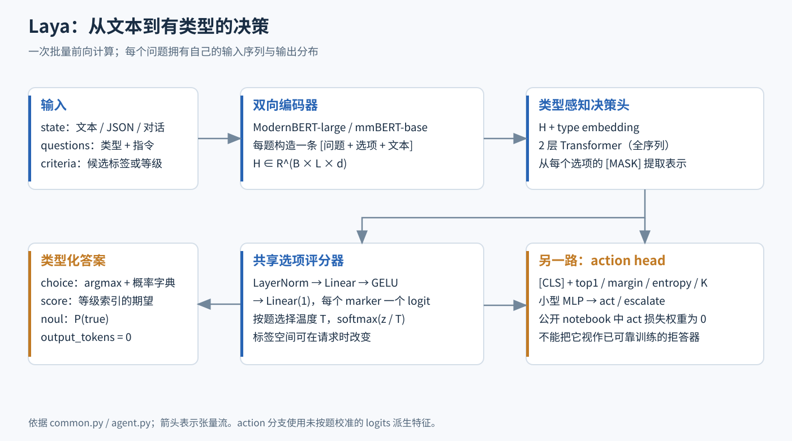
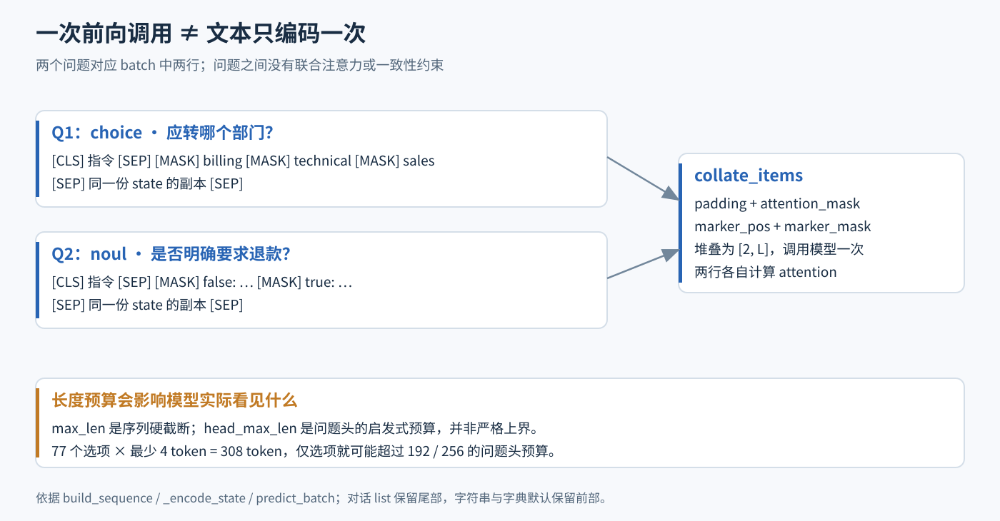
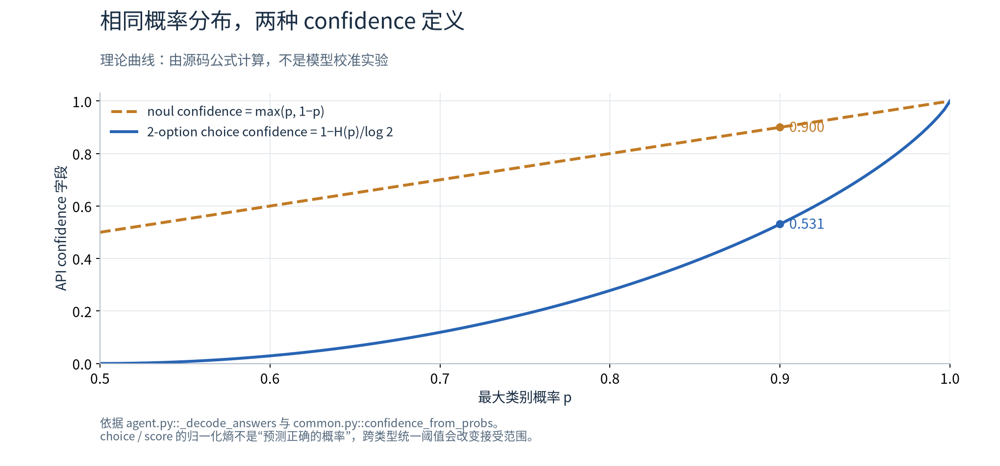
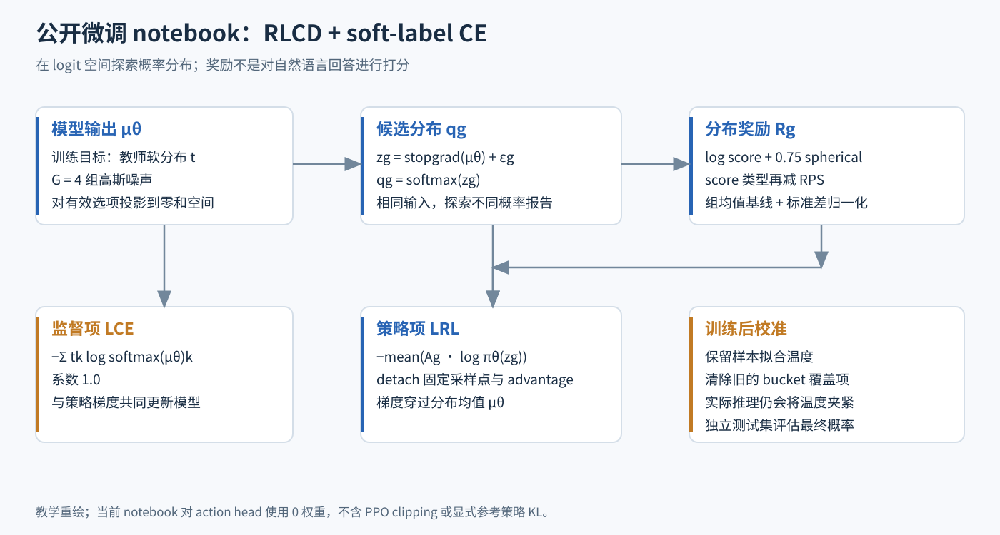
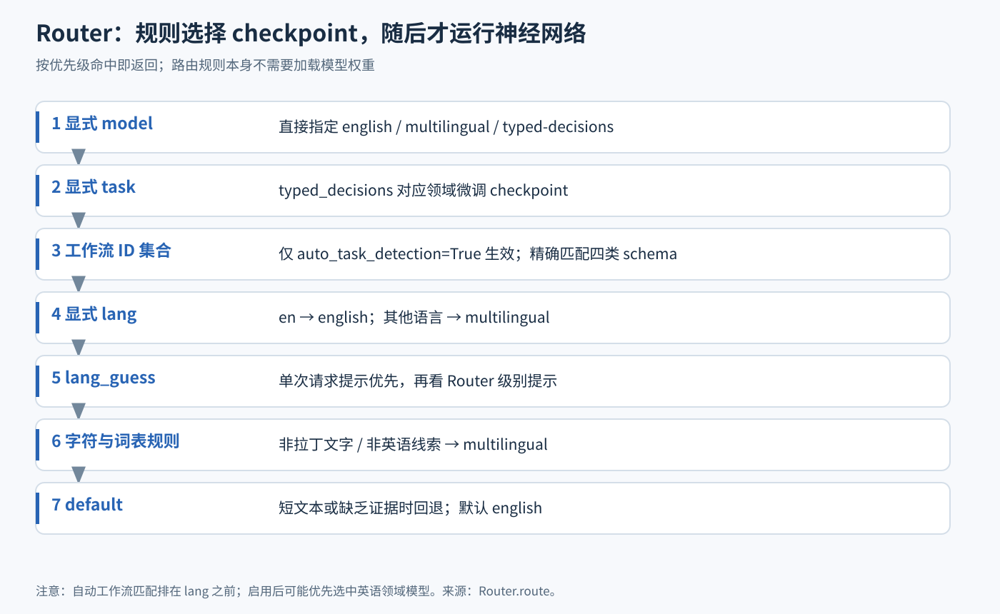
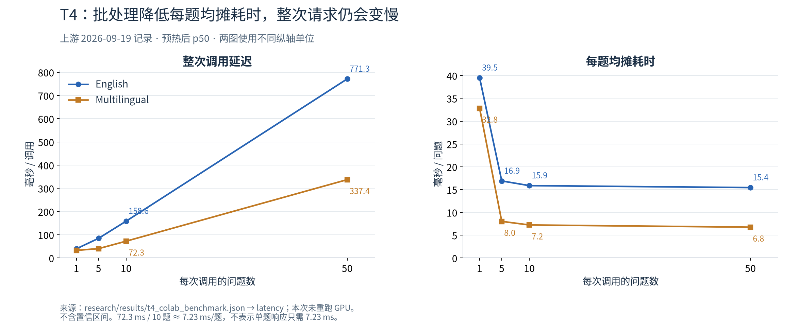
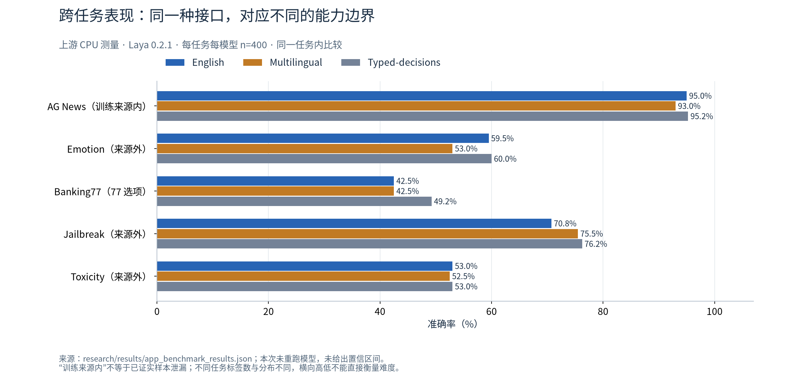

# Laya 设计与实现详解：用一次编码器前向计算完成有类型的决策



> **调研日期**：2026-09-23<br>
> **项目**：[NandhaKishorM/laya](https://github.com/NandhaKishorM/laya) · Apache-2.0<br>
> **源码基线**：[`3b000c87daf237729aa66614c9f79b6609ee27e3`](https://github.com/NandhaKishorM/laya/tree/3b000c87daf237729aa66614c9f79b6609ee27e3)，包内版本 `0.3.7`。本文分析这一提交，不能把版本号相同理解为 PyPI 包与该提交完全一致。<br>
> **配套材料**：[零依赖数学实现](code/decision_math.py) · [真实 SDK 调用示例](code/sdk_demo.py) · [源码对照检查](code/verify_source.py) · [图表生成脚本](code/build_figures.py) · [数据摘录](data/benchmark_extract.json) · [来源与 SHA-256](data/sources.json)

给一条客服消息判断部门、紧急程度和退款意图，有必要先让大模型生成一段 JSON，再解析这段 JSON 吗？Laya 选择直接计算答案：调用者提供文本、问题和候选项，模型返回类别分布、序数分数或二元概率。

从大模型研究的角度看，Laya 值得研究的地方，是把**可编程的问题格式、双向编码器、动态候选项评分、分布奖励训练和低延迟部署**连接成了一个完整系统。它的主要用途是成为大模型应用中的快速判断模块，例如初步分流、规则化评分、候选动作选择和需要进一步推理的请求筛选。

读完源码后，我对这个项目的判断是：**Laya 是一个有明确任务边界、适合做领域适配的决策模型框架。接口的通用性已经具备，但跨领域能力和可靠概率仍需要数据验证。**“System 1”是对快速判断的产品定位；模型实际执行的仍是前馈神经网络计算，没有可见的逐步推理过程，也没有因为不生成文字就获得事实正确性保证。

本文区分三种证据：**源码事实**来自固定提交；**上游测量**来自仓库保存的实验记录，本次没有重跑模型；**研究判断**是基于前两者提出的解释或改进建议。本次实际执行了数学示例、源码纯函数检查和中文诊断记录审计，未下载完整权重、未执行 GPU 推理或训练。

## 阅读路线

1. [问题定义与整体设计](#1-laya-在解决什么问题)
2. [输入序列、决策头与输出语义](#3-沿着张量流读懂模型)
3. [RLCD 训练与校准](#6-rlcd-究竟怎样训练)
4. [Router、性能与工程实现](#8-router-如何选择模型)
5. [实验证据与能力边界](#10-公开实验究竟支持哪些结论)
6. [运行示例与研究建议](#12-实际接入从一个中文工单开始)

## 1. Laya 在解决什么问题

### 1.1 从生成答案，转向评估候选答案

典型生成式分类流程是：

```text
任务指令 + 输入文本 → decoder LLM → 逐 token 生成 → JSON 解析 → 业务判断
```

Laya 的流程是：

```text
任务指令 + 候选项 + 输入文本 → encoder + decision head → 概率向量 → 类型化答案
```

前者适合开放式回答和复杂推理；后者适合答案空间已知的判断。Laya 的一次推理没有输出 token 解码循环，因此 API 的 `output_tokens` 为零。不过它仍然要分词、运行 Transformer、处理候选项和构造响应，不能把“零输出 token”理解为“零计算成本”。

| 方案 | 答案空间 | 推理时主要计算 | 主要限制 |
|---|---|---|---|
| 固定标签分类器 | 训练时固定 | 编码器 + 固定分类矩阵 | 改标签通常要修改或重训分类头 |
| 生成式大模型 | 可开放生成 | prefill + 逐 token 解码 | 延迟、成本、格式和概率解释 |
| Laya | 请求时提供有限候选集 | 编码器 + 共享候选项评分器 | 文本预算、迁移能力、概率校准 |

动态候选集是关键区别：Laya 不把“财务部门”永久绑定到分类矩阵的第 3 行，而是把它写入输入序列，计算它在当前文本和问题下的相容程度。因此换一个 schema 可以直接调用现有模型。但**能接受新 schema 与能准确处理新任务是两件事**，后面的实验会说明这一点。[源码：选项构造与评分](https://github.com/NandhaKishorM/laya/blob/3b000c87daf237729aa66614c9f79b6609ee27e3/laya/common.py#L53)

### 1.2 三种原语

| 原语 | 用户提供什么 | 实际返回什么 | 示例 |
|---|---|---|---|
| `choice` | 标签到描述的字典，或标签列表 | 概率最大的标签与所有标签概率 | 分流到 billing / technical / sales |
| `score` | 按低到高排列的等级描述 | 等级索引的期望值与等级分布 | 0～2 的紧急程度 |
| `noul` | 一个二元问题，可选正反描述 | `P(true)` | 是否明确提出退款 |

`noul` 是项目使用的接口名称；理解实现只需要记住其内部选项顺序始终是 `[false, true]`。三个原语共用同一个架构，不是三个独立的基础模型。

## 2. 模型家族与代码地图

### 2.1 三个 checkpoint 的分工

| 路由名 | 编码器 | 总参数量 | 默认 `max_len` / `head_max_len` | 主要定位 |
|---|---|---:|---:|---|
| `english` | ModernBERT-large | 约 421M | 512 / 192 | 英语基础决策 |
| `multilingual` | mmBERT-base | 约 322M | 1024 / 256 | 多语言基础决策 |
| `typed-decisions` | ModernBERT-large | 约 421M | 1024 / 256 | 四类 typed-decisions 工作流适配 |

T4 实验记录给出的精确统计是：英文模型编码器约 394.78M、附加部分约 26.51M；多语言模型编码器约 306.94M、附加部分约 14.97M。英文 hidden size 为 1024，多语言为 768。两个基础 checkpoint 的元信息来自同一份原始记录；领域模型配置与定位由 notebook 和 Router 补充。[原始模型统计](https://github.com/NandhaKishorM/laya/blob/3b000c87daf237729aa66614c9f79b6609ee27e3/research/results/t4_colab_benchmark.json) · [模型注册表](https://github.com/NandhaKishorM/laya/blob/3b000c87daf237729aa66614c9f79b6609ee27e3/laya/router.py#L37)

ModernBERT 提供面向高效推理的双向编码器基础，包括长上下文设计和局部／全局注意力组合；mmBERT 将这一架构扩展到多语言预训练。基础编码器支持更长上下文，不代表 Laya 当前 checkpoint 已在同样长度、任务分布上充分训练。尤其要区分**编码器容量、checkpoint 默认配置、实际预处理长度**三个层次。[ModernBERT 论文](https://arxiv.org/abs/2412.13663) · [mmBERT 论文](https://arxiv.org/abs/2509.06888)

默认 Router 从同一个 Hub 仓库的根目录、`multilingual` 和 `typed-decisions` 子目录按需加载。这三个模型也有独立仓库名，但不是在每次请求中共同运行的集成模型。

### 2.2 推荐源码阅读顺序

| 文件 | 核心职责 | 阅读时要回答的问题 |
|---|---|---|
| `laya/common.py` | 序列拼接、DecisionModel、奖励、校准辅助函数 | 选项如何变成可评分的向量？ |
| `laya/agent.py` | 权重加载、输入检查、批处理、答案解码 | 一个 API 请求执行了什么？ |
| `laya/router.py`、`lang.py` | checkpoint 选择与语言规则 | 什么时候选择多语言模型？ |
| `notebooks/laya_finetune_typed_decisions_2xT4_kaggle.ipynb` | DDP 训练、温度拟合、导出和评估 | RL 的动作、奖励、梯度分别是什么？ |
| `laya/shortlist.py` | 候选项检索与缩减 | 大候选集如何降低输入负担？ |
| `laya/fast.py`、`tl_kernels.py` | TileLang 快速路径 | 小请求为什么可以进一步提速？ |
| `laya/serve.py` | FastAPI 服务 | 并发请求如何调度？ |
| `research/results/`、`research/eval/` | 历史记录与评估脚本 | 指标的分母、采样和概率定义是什么？ |

完整路径及文件哈希保存在 [sources.json](data/sources.json)，便于以后核查本文是否仍适用于新版本。

## 3. 沿着张量流读懂模型

### 3.1 一个问题构成一条序列

`build_sequence` 把输入整理成下列结构：

```text
[CLS]
choice question: Which team should handle this ticket?
[SEP]
[MASK] billing: invoices, payments, refunds
[MASK] technical: bugs, outages, system errors
[MASK] sales: pricing, new contracts
[SEP]
{"body": "I was charged twice. Please refund."}
[SEP]
```

这里的 `[MASK]` 是**选项读取位置**。模型并不使用一个词表语言模型头，在这些位置预测被遮住的单词；它提取这些位置的隐藏表示，再交给一个标量评分器。

JSON 使用 `ensure_ascii=False` 序列化，中文不会被变成 `\uXXXX` 字符串。用户指令、选项描述和正文中原本出现的 mask token 字面量会被替换为空格，减少伪造选项标记的干扰。这只是输入格式处理，不构成对语义提示注入的完整防护。[源码：build_sequence](https://github.com/NandhaKishorM/laya/blob/3b000c87daf237729aa66614c9f79b6609ee27e3/laya/common.py#L78)

### 3.2 从编码器到选项 logit

设 batch 中有 $B$ 条问题序列，padding 后长度为 $L$，隐藏维度为 $d$，最多包含 $K$ 个选项。

首先运行双向编码器：

$$
H=\operatorname{Encoder}(X,M)\in\mathbb R^{B\times L\times d}.
$$

然后把问题类型嵌入加到每个 token：

$$
\widetilde H_{b,l}=H_{b,l}+E_{\mathrm{type}}[t_b],\qquad t_b\in\{0,1,2\}.
$$

类型既出现在输入文本中，也通过可学习嵌入进入决策头。注意这个嵌入加在**基础编码器输出之后**。

默认决策头是两层 `nn.TransformerEncoderLayer`，在整个序列上执行注意力，使用 `norm_first=True`、FFN 中间维度 $4d$、注意力头数 $d/64$。代码没有覆盖该层的默认 activation，因此这里的 FFN 使用 ReLU；后面的独立 scorer 才使用 GELU。不能把这两个模块混为一谈。

从第 $k$ 个选项的 marker 位置 $m_{b,k}$ 取出向量，再共享同一个 scorer：

$$
u_{b,k}=H'_{b,m_{b,k}},\qquad
z_{b,k}=W_2\operatorname{GELU}\bigl(W_1\operatorname{LN}(u_{b,k})+b_1\bigr)+b_2.
$$

padding 选项的 logit 被写成 $-10^4$。有效候选项之间做 softmax 得到分布。共享 scorer 的输出维度恒为 1，所以候选数 $K$ 可以改变，无须替换一个固定 $K$ 类线性层。[源码：DecisionModel](https://github.com/NandhaKishorM/laya/blob/3b000c87daf237729aa66614c9f79b6609ee27e3/laya/common.py#L120)

### 3.3 为什么“一次前向”仍随问题数量增长



当调用 `agent.predict(state, questions)` 时，Laya 对每个问题分别拼接一份 state，然后把这些序列放到 batch 的不同行。若有 $Q$ 个问题，编码器输入大致是 $[Q,L]$，而不是“编码一次 state，再用 $Q$ 个小头读取同一份缓存”。

这使一次 Python 模型调用可以回答多题，充分利用 GPU 并行性，但仍有三项成本：

1. 同一段 state 会被重复拼接与编码；
2. batch 内序列要 padding 到共同长度；
3. 默认决策头对整条序列做全注意力，长文本成本不可忽略。

问题之间也没有跨行注意力。因此“允许退款”和“不允许退款”两个独立问题可能产生不一致答案，系统没有自动施加互斥或逻辑约束。对互斥选项，通常更适合放在同一个 `choice` 中表达。

`predict_batch(states, questions)` 进一步将多个 state 的问题序列一起打包；`batch_size` 限制的是每个分块的 **state 数量**，每次前向实际行数约为 `batch_size × 问题数`。`usage.input_tokens` 会累计这些重复后的有效 token，排除 padding；空问题集合不执行分词或模型前向。[源码：predict_batch](https://github.com/NandhaKishorM/laya/blob/3b000c87daf237729aa66614c9f79b6609ee27e3/laya/agent.py#L515)

## 4. 输入预算：最容易被忽略的实现细节

### 4.1 `head_max_len` 不是一个严格上界

选项处理可以概括为以下步骤：

```python
# 解释性摘写，完整控制流见 common.py
option = [mask_id] + tokenize(option_text)[:48]
instruction_budget = head_max_len - sum(len(o) for o in options)
if instruction_budget < 16:
    per_option = max(4, (head_max_len - 16) // number_of_options)
    options = [o[:per_option] for o in options]
instruction_ids = instruction_ids[:max(8, remaining_budget)]
```

有两个容易遗漏的下限：每个候选项至少保留到 4 token 的截断预算，指令至少有 8 token 的预算。这意味着当选项数量很大时，总和可以超过 `head_max_len`。最后真正生效的是 `max_len` 的硬截断。

例如 77 个足够长的选项，每项缩到 4 token，**光选项块就占 308 token**，而且这 4 个 token 中有 1 个是 marker。由此不能简单地把正文预算写成固定的 `max_len - head_max_len`；那只是常见情况下的粗略估计。

本次使用字符级 toy tokenizer，直接执行上游 `build_sequence`，观察到 `max_len=512, head_max_len=192, K=77` 时，选项块占 308 token，正文只剩 192 token。这个结果验证的是预算控制流，**不是声称真实 BPE 对该文本一定产生相同 token 数**。[本次检查记录](data/source_checks.json)

如果某些选项 marker 最终被截断，`Agent._encode_state` 会因 marker 数与选项数不一致而报错。更隐蔽的情况是 marker 都在，但选项描述或关键正文已被大量截掉：接口可以正常返回，准确率却受损。

### 4.2 截断方向随 state 类型变化

当前运行时对列表形式的对话使用左截断，保留序列尾部的近期消息；字符串和字典默认保留前部。因此一个相同对话，若被封装成普通字符串，可能丢掉最新意图。

这项设计提醒我们：调用者传入的数据结构不仅影响序列化外观，还可能影响模型实际看到的内容。长会话最好明确构造相关窗口，而不是仅依靠最后一次硬截断。[源码：_encode_state](https://github.com/NandhaKishorM/laya/blob/3b000c87daf237729aa66614c9f79b6609ee27e3/laya/agent.py#L424)

### 4.3 候选很多时怎么办

可以增大问题头与整体上下文预算，也可以先做粗分类再细分类，或使用 `predict_shortlist`。后者先调用外部 `embed_fn`，按余弦相似度保留前 $k$ 项，再执行决策模型。`embed_fn_from_agent` 能复用已有编码器进行 mean pooling。[源码：shortlist](https://github.com/NandhaKishorM/laya/blob/3b000c87daf237729aa66614c9f79b6609ee27e3/laya/shortlist.py)

这个方案有明确代价：检索本身也需要计算，使用神经网络 embedding 时，整个流程通常已不止一次神经网络前向；最终概率只在保留下来的 $k$ 项之间归一化。若正确答案没有进入候选集，后续决策器无法找回它，所以应同时评估候选召回率和最终准确率。

## 5. 三类输出，以及三种不能混淆的“置信”

### 5.1 `choice`：概率最大的候选项

对温度缩放后的分布

$$
p_k=\frac{\exp(z_k/T)}{\sum_j\exp(z_j/T)},
$$

`choice` 返回 $\arg\max_k p_k$ 对应的标签，同时保留所有候选概率。字典的迭代顺序决定选项顺序，标签文本也会进入模型，因此键名不是与语义无关的元数据。

### 5.2 `score`：对整数等级求期望

假设等级描述为 `['低', '中', '高']`，概率是 $[0.2,0.3,0.5]$，返回：

$$
\operatorname{score}=\sum_{k=0}^{K-1} k p_k
=0\times0.2+1\times0.3+2\times0.5=1.3.
$$

它不是把“中高之间”的文字生成成 1.3，也不是一个独立连续回归头。它隐含等级间隔相等；如果业务等级对应成本 $[0,10,100]$，业务侧需要另算 $\sum_k p_kc_k$，不能直接把模型返回的索引期望当成本。

### 5.3 `noul`：`P(true)` 与“是否肯定”的置信度

`noul` 返回 $p_1$。可选的 `labels` 只改变展示给模型的标签词，例如 `false → B, true → A`，不会改变索引的语义顺序。

但 `confidence` 字段的定义存在类型差异：

$$
c_{\mathrm{choice/score}}
=1-\frac{H(p)}{\log K},\qquad
H(p)=-\sum_kp_k\log p_k;
$$

$$
c_{\mathrm{noul}}=\max(p_1,1-p_1).
$$



对同一个二元分布 $[0.1,0.9]$，`choice.confidence≈0.5310`，`noul.confidence=0.9000`。这是直接按源码公式计算的理论例子，不是校准实验。

因此，**给所有问题统一设置 `confidence >= 0.85` 并不代表统一接受“至少 85% 可能正确”的答案**。熵衡量分布集中程度；集中在错误答案上的分布也有很高的熵置信度。单选项问题的该字段固定为 1，更能说明它不是模型正确率。[源码：答案解码](https://github.com/NandhaKishorM/laya/blob/3b000c87daf237729aa66614c9f79b6609ee27e3/laya/agent.py#L469)

### 5.4 `action.act_probability` 是另一个预测分支

模型还把 `[CLS]` 表示与四个特征拼接：top-1 概率、top-1 与 top-2 间隔、归一化熵、$K/255$。这些概率特征来自 **detach 后、尚未按题温度缩放的 logits**，再经过 MLP 预测 act / escalate。

所以 `action.act_probability`、`confidence`、候选项概率是三个不同的量。当前公开微调 notebook 使用 `0.0 * act.sum()`，没有给 action head 提供有效的决策监督。上游也记录了该字段近乎恒为 1 的问题。它有架构上的接口，不等于已有可用的拒答或升级策略。[模型分支](https://github.com/NandhaKishorM/laya/blob/3b000c87daf237729aa66614c9f79b6609ee27e3/laya/common.py#L158) · [公开训练 notebook](https://github.com/NandhaKishorM/laya/blob/3b000c87daf237729aa66614c9f79b6609ee27e3/notebooks/laya_finetune_typed_decisions_2xT4_kaggle.ipynb)

## 6. RLCD 究竟怎样训练

项目把训练思路称为 **Reinforcement Learning for Calibrated Decisions，RLCD**。理解它要先回答：策略在选择什么？它选择的是一个**概率分布报告**，不是一段自然语言回答，也不是简单抽样一个离散标签。



### 6.1 用 proper scoring rule 奖励概率报告

令目标分布为 $t$，模型报告分布为 $q$。`proper_reward` 实现的核心形式是：

$$
R(q,t)=\sum_k t_k\log q_k
+\lambda_{\mathrm{sph}}\frac{\sum_k t_kq_k}{\sqrt{\sum_kq_k^2}}
-\mathbb 1[\mathrm{score}]\lambda_{\mathrm{rps}}\operatorname{RPS}(q,t).
$$

对有序等级，

$$
\operatorname{RPS}(q,t)=\frac1{K-1}
\sum_{j=0}^{K-1}\left(\sum_{k=0}^{j}q_k-\sum_{k=0}^{j}t_k\right)^2,
\quad K\ge2.
$$

最后一个累计概率差对合法分布为零。RPS 利用等级顺序：真实等级为最低时，把概率放在“中等”与放在“最高”应受到不同惩罚；普通无序分类损失不能完整表达这种距离。

`common.py` 默认球面奖励权重为 0.5，公开领域微调脚本明确传入 0.75，RPS 权重为 1.0。实现还把 log 项下限截为 `-9.21`，并对范数和概率加数值保护。[源码：proper_reward](https://github.com/NandhaKishorM/laya/blob/3b000c87daf237729aa66614c9f79b6609ee27e3/laya/common.py#L187)

严格适当评分规则的理想性质是：真实分布为 $t$ 时，报告 $q=t$ 唯一最大化期望评分。不过，这个性质以理想评分函数和优化条件为前提，不能直接推出有限数据训练得到的网络已经校准。特别是截断 log 项后，不能不加证明地把未截断函数的严格适当性照搬到整个实现。[Gneiting 与 Raftery：评分规则理论](https://sites.stat.washington.edu/people/raftery/Research/PDF/Gneiting2007jasa.pdf)

### 6.2 为什么在 logit 空间添加零和噪声

当前 notebook 对同一输入计算一次模型 logits $\mu_\theta$，然后抽取 $G=4$ 组噪声。对每组噪声减去有效选项上的均值：

$$
\epsilon_g\sim\mathcal N(0,\sigma^2I),\qquad
\epsilon'_g=\epsilon_g-\frac1K\sum_k\epsilon_{g,k}.
$$

接着构造

$$
z_g=\operatorname{stopgrad}(\mu_\theta)+\epsilon'_g,\qquad
q_g=\operatorname{softmax}(z_g).
$$

softmax 对所有 logits 同时加一个常数不敏感。零和投影移除了这个无效探索方向，让噪声主要改变候选项之间的相对关系。$G$ 组探索只是对已算出的 logits 做小张量运算，不需要重新运行 $G$ 次编码器。

### 6.3 策略梯度与组内基线

先计算每组奖励 $R_g$，再减去同一输入的组均值：

$$
\widetilde A_g=R_g-\frac1G\sum_hR_h.
$$

脚本随后用 `adv.std()` 做标准化；这里标准差作用于整个 advantage 张量，而不只是逐个输入的一组。用于策略梯度的 log-density 计算保留与均值有关的二次项：

$$
\log\pi_\theta(z_g)
\doteq-\frac{\lVert z_g-\mu_\theta\rVert_2^2}{2\sigma^2},
\qquad
\mathcal L_{\mathrm{RL}}=-\operatorname{mean}_g A_g\log\pi_\theta(z_g).
$$

这里 $\doteq$ 表示忽略与均值梯度无关的常数。噪声位于有效选项的零和子空间；将其写成完整独立高斯密度只是计算梯度的简写，不应忽略投影条件。`z_g` 与 advantage 被固定后，梯度通过 $\mu_\theta$ 回到决策头和编码器。

这与 GRPO 的联系在于“组内相对奖励与基线”。公开脚本没有 PPO clipping，也没有显式参考模型 KL 项，因此更准确的说法是 **带组基线的 REINFORCE 风格更新**，而不是完整复制某个大模型 GRPO 训练框架。

### 6.4 当前实现同时使用监督学习

notebook 文字仍有“pure policy gradients”的描述，但实际损失是：

$$
\mathcal L
=\mathcal L_{\mathrm{RL}}
+1.0\cdot\mathcal L_{\mathrm{softCE}},\qquad
\mathcal L_{\mathrm{softCE}}=-\sum_k t_k\log\operatorname{softmax}(\mu_\theta)_k.
$$

因此训练结果不能全部归因于 RLCD。软标签交叉熵本身就提供了直接而强的学习信号。要证明策略项的额外价值，至少需要相同数据、初始化和预算下的 `CE-only`、`proper-reward 直接反传` 与 `RL+CE` 对照；本文未在已审查材料中看到足以完成这一因果归因的消融结果。

| 当前微调脚本参数 | 数值 |
|---|---:|
| Epochs | 4 |
| 每卡 micro batch | 8 条问题序列 |
| GPU 数 / 梯度累积 | 2 / 4 |
| 完整累积窗口的有效 batch | 64 条问题序列 |
| Encoder / Head 学习率 | `2.5e-5` / `1e-4` |
| 探索噪声标准差 | 按 epoch 从 0.4 降到 0.1 |
| 优化器 | AdamW，weight decay 0.01 |
| 显存策略 | FP16 autocast、GradScaler、编码器与 head 的梯度检查点 |

这是一套**全量编码器适配**流程，并非默认 LoRA。训练完成后保存整个模型的 `model.safetensors`、编码器配置、tokenizer 和 `rl_agent_config.json`。

### 6.5 复现 notebook 时还要修正两处口径

第一，预处理 cell 使用原始根 checkpoint 的长度配置构造并保存 `train_items.pt`；后面的训练脚本才把 `max_len/head_max_len` 改成 `1024/256`。已经截断并保存的 token 序列不会因此恢复。若要真正按 1024 长度训练，应在**预处理之前**统一修改配置并重建数据。

第二，当前脚本已经从训练 item 中保留最多 400 条作为校准集，较旧版的训练集内校准更合理；但切分单位是**问题 item**。同一个 case 的不同问题可能分别进入训练集与校准集。若要评估对未见文档的校准，应保留 case/document ID，按 case 分组切分。

源码还提供 `td_lambda_targets`，用后续预测与终局标签形成多轮轨迹目标；$\lambda=1$ 时回传终局结果。不过当前 typed-decisions 微调流程没有调用它，不能把“库中存在”写成“本次领域模型使用过”。[TD 辅助函数](https://github.com/NandhaKishorM/laya/blob/3b000c87daf237729aa66614c9f79b6609ee27e3/laya/common.py#L216)

## 7. 概率校准：理论目标与部署结果之间的距离

### 7.1 温度怎样生效

推理阶段先按题型与选项数寻找温度 bucket：

```text
choice:2 / choice:3-5 / choice:6-10 / choice:11+
score:…
noul:2
```

若没有对应 bucket，才使用每题型温度。当前加载器把有效数值限制到 `[0.5,5.0]`；非法或非有限值回退为 1，并保留 raw 值供检查。英文 checkpoint 曾携带 `choice:11+ ≈ 0.1006`，当前运行时会将它变为 0.5。[温度桶和限制](https://github.com/NandhaKishorM/laya/blob/3b000c87daf237729aa66614c9f79b6609ee27e3/laya/common.py#L255) · [加载逻辑](https://github.com/NandhaKishorM/laya/blob/3b000c87daf237729aa66614c9f79b6609ee27e3/laya/agent.py#L260)

温度拟合本质是在保留集上选一个标量，让缩放后的预测更符合标签。固定一条 logit 向量时，任意正温度都不改变 argmax；它改变的是概率分布、熵和阈值接受范围。[温度校准研究](https://arxiv.org/abs/1706.04599)

### 7.2 历史 ECE 不能直接当成当前 API 指标

上游针对 51 种语言、5,100 条 MASSIVE 样本的英文模型重测显示：

| 口径 | 宏平均准确率 | 宏平均 ECE |
|---|---:|---:|
| 旧的原始温度 | 0.2269 | 0.7331 |
| 当前温度夹紧 | 0.2269 | 0.5709 |

准确率不变符合温度缩放的数学性质。ECE 下降表明概率不像原来那样极端，但 0.5709 仍不能视为可用的跨语言校准。[原始重测记录](https://github.com/NandhaKishorM/laya/blob/3b000c87daf237729aa66614c9f79b6609ee27e3/research/results/cpu_51_language_sweep_clamped.json)

还有一个口径差异：评估脚本主要使用 `max(probabilities)` 计算 ECE，而 `choice/score` 的 API `confidence` 是归一化熵。因此表中 ECE 不能直接证明 API 熵分数“已对应经验正确率”。[评估脚本](https://github.com/NandhaKishorM/laya/blob/3b000c87daf237729aa66614c9f79b6609ee27e3/research/eval/laya_eval.py#L243)

上游宣传过温度重拟合后平均 ECE 从 0.466 降到约 0.081。原始记录中，这是多个 suite 各自保留数据拟合后的汇总，并且部分最优温度超过运行时上限 5。它不是一个对所有领域生效的全局校准承诺，也不能自动等同于当前部署限制下的结果。应按实际加载后的温度重测自己的任务。[校准修复原始记录](https://github.com/NandhaKishorM/laya/blob/3b000c87daf237729aa66614c9f79b6609ee27e3/research/results/t4_colab_benchmark.json)

### 7.3 如何做有意义的决策阈值

对于只在高把握时自动执行的系统，应在独立验证集画出 risk–coverage 曲线：接受越多请求，错误风险如何变化？同时分语言、题型、候选数和文档长度检查结果。

一个简化的成本模型是：若自动动作错误成本为 $C_w$、升级成本为 $C_e$、正确动作成本视为零，并假设升级能正确解决问题，则当

$$
(1-p_{\mathrm{correct}})C_w<C_e
$$

时选择自动动作。这里需要的 $p_{\mathrm{correct}}$ 是经过验证的正确概率估计，不能直接用熵集中度替代。如果升级也会出错或延迟有成本，就要把这些项加入决策模型。这比在示例里随手设一个 0.85 更接近实际部署问题。

## 8. Router 如何选择模型



Laya 的 `Router` 是一套轻量规则和模型生命周期管理代码，不是一个训练出来的 MoE gating network。当前优先级为：

```text
显式 model
  > 显式 task
  > 自动工作流匹配（需显式开启）
  > 显式 lang
  > 请求级 lang_guess / Router 级 lang_guess
  > 内建字符脚本与语言启发式
  > default
```

内建检测主要回答“英语 checkpoint 是否适合读取这个 state”，而不是完成精确的全语言识别。非拉丁文字、拉丁文字中的非英语词表线索、附加符号等都会参与判断；很短且无足够证据的文本回到 `default`。

`typed-decisions` 默认不会因为输入“像客服消息”就被自动选择。只有显式设置 `model/task`，或者打开 `auto_task_detection` 且问题 ID 集合精确匹配预设工作流，才会进入该模型。工作流检测匹配的是 ID 集合，而不是深入理解问题语义。[Router.route](https://github.com/NandhaKishorM/laya/blob/3b000c87daf237729aa66614c9f79b6609ee27e3/laya/router.py#L336)

一个实际边界是：开启自动工作流识别后，它的优先级高于 `lang`。所以匹配到工作流时，即使正文是中文，也可能先进入基于英文编码器的领域 checkpoint。中文业务若需要领域适配，更合理的研究方向是从多语言模型继续训练，而不是仅凭工作流名字切到英语模型。

运行时默认 `max_loaded=2`，按 LRU 管理常驻模型；`preload=True` 会预加载所有已配置模型，并提高容量以容纳它们。`route()` 只返回路由决定，不加载权重；`predict()` 才真正加载并调用相应 Agent。服务侧还提供 `attach` 以复用已加载实例，避免重复占用内存。

需要区分两个“路由”：`Router` 选择 Laya checkpoint；`router_questions()` 是一个问题预设，用 Laya 判断外部请求该交给何种下游模型。两者不是同一层功能。

## 9. 性能来自哪里，还能怎样加速

### 9.1 基础性能：去掉生成循环，再利用批处理



| 每次调用问题数 | English p50 | Multilingual p50 | Multilingual 均摊每题 |
|---:|---:|---:|---:|
| 1 | 39.5 ms | 32.8 ms | 32.83 ms |
| 5 | 84.5 ms | 40.1 ms | 8.02 ms |
| 10 | 158.6 ms | 72.3 ms | 7.23 ms |
| 50 | 771.3 ms | 337.4 ms | 6.75 ms |

以上是上游 2026-09-19 的 Tesla T4 历史记录，环境记录为 PyTorch `2.11.0+cu128`、Transformers `5.17.0`。多语言模型在 50 题时 p95 为 693.7 ms，明显高于 p50，因此生产容量规划不能只看中位数。[原始延迟记录](https://github.com/NandhaKishorM/laya/blob/3b000c87daf237729aa66614c9f79b6609ee27e3/research/results/t4_colab_benchmark.json)

“7.2 ms/题”表示一个批次的总耗时除以题数；单题调用在该测量中仍约为 32.8 ms。批处理改善吞吐和均摊成本，不会把批次中每题的用户可见响应时间都变成 7.2 ms。

Laya 的优势来自较小的编码器、没有逐 token 输出循环，以及候选项并行评分。它没有消除长序列和大 batch 的计算成本，模型冷启动、网络下载和 CPU 线程配置也会显著影响实际延迟。

### 9.2 TileLang 快速路径

当前仓库还有 `fast=True` 路径，它替换 encoder/head 的前向实现，主要包括：

- 融合 GEMM 与 epilogue、GEGLU、残差加法和 LayerNorm；
- 对 RoPE 和局部窗口 attention 使用专用 kernel；
- 保留 BF16 权重副本，部分残差计算保持 FP32；
- 为 batch/长度 bucket 捕获并重放 CUDA Graph，减少 Python 调度与 kernel launch 开销。

短请求往往受启动开销限制，减少调用数量会有明显收益；大 batch 更受矩阵计算限制，收益相对缩小。上游 RTX 4070 Ti SUPER 记录中，72-token 单题英文调用从 17.7 ms 降到 4.6 ms，多语言从 14.1 ms 降到 2.8 ms。这些数字来自不同于 T4 的硬件与运行路径，不能拼成一个统一延迟承诺。[fast 实现](https://github.com/NandhaKishorM/laya/blob/3b000c87daf237729aa66614c9f79b6609ee27e3/laya/fast.py) · [kernel 实现](https://github.com/NandhaKishorM/laya/blob/3b000c87daf237729aa66614c9f79b6609ee27e3/laya/tl_kernels.py) · [fast 实验报告](https://github.com/NandhaKishorM/laya/blob/3b000c87daf237729aa66614c9f79b6609ee27e3/BENCHMARKS.md#gpu-fast-path)

快速路径也不是逐 bit 相同：公开 parity 表中，英文 `choice` 有 47/48 个 argmax 一致，`score` 有 59/60 个一致。这要求依赖概率阈值的应用做专门回归检查。首次遇到新 bucket 还可能触发 kernel 编译或图捕获，应与稳态延迟分开测量。

## 10. 公开实验究竟支持哪些结论

### 10.1 领域微调有价值，但不能据此声称强零样本能力

上游报告在 400 个 typed-decisions case、共 2,000 个问题上：

| 模型或基线 | Accuracy | Soft accuracy | Brier vs soft target | ECE | Score MAE |
|---|---:|---:|---:|---:|---:|
| 英文基础版 | 约 0.362 | 0.332 | 0.316 | 0.175 | 0.694 |
| 多语言基础版 | 约 0.342 | 0.326 | 0.439 | 0.285 | 0.687 |
| typed-decisions 微调版 | 0.766 | 0.471 | 约 0.061～0.062 | 0.213 | 0.242 |
| 每问题多数类基线 | 0.461 | — | — | — | — |
| 随机基线 | 约 0.318 | — | — | — | — |

这是同一任务定义下很有价值的证据：基础模型甚至没有超过多数类基线，而专门微调带来了显著的描述性增益。它支持把 Laya 当作快速领域适配底座，不支持把领域微调结果写成基础模型的零样本结果。[固定版本报告](https://github.com/NandhaKishorM/laya/blob/3b000c87daf237729aa66614c9f79b6609ee27e3/BENCHMARKS.md#typed-decisions--400-cases-2000-decisions)

表中 `soft accuracy` 指 $p^\top t$，`Brier vs soft target` 是 $\sum_k(p_k-t_k)^2$。前者不是普通分类准确率；当 $t$ 不是 one-hot 时，最大化 $p^\top t$ 本身也不要求 $p=t$。比较“完整分布匹配”应同时看 proper scoring loss、Brier 或 KL。不同脚本还有对 one-hot 标签计算的 Brier，不能与 soft-target Brier 混用。[指标实现](https://github.com/NandhaKishorM/laya/blob/3b000c87daf237729aa66614c9f79b6609ee27e3/research/scripts/bench_local.py#L258)

报告提到微调版超过约 0.735 的“teacher self-agreement ceiling”。这一数字只是特定教师采样／重复评估协议下的一致性参考，不是任务不可突破的数学上界；超过它不代表学生已在一般推理能力上超过教师。

### 10.2 多语言路由有依据，但覆盖不是逐语言质量保证

同一份 T4 测试中：

| 任务子集 | 英文基础版 | 多语言基础版 |
|---|---:|---:|
| MASSIVE intent，英语 | 0.7833 | 0.6567 |
| MASSIVE intent，其余 13 种语言平均 | 0.3064 | 0.4513 |
| XNLI，英语 | 0.8600 | 0.8433 |
| XNLI，其余 14 种语言平均 | 0.5210 | 0.7310 |

这些结果解释了按语言选择模型的动机。它们并不能给出路由器在真实混合流量上的整体收益：实际系统还需要测语言误判、短文本、代码混杂和多语言同句。也不能把“按真实语言理想选择 checkpoint 的分数”直接称为已实测的完整 Router 准确率。[T4 分组结果](https://github.com/NandhaKishorM/laya/blob/3b000c87daf237729aa66614c9f79b6609ee27e3/research/results/t4_colab_benchmark.json)

MASSIVE 的该评估不是原始完整标签空间：每题从真实标签加随机负标签组成 20 个选项，随机准确率为 0.05。理解这个协议非常重要，否则会把候选集已经包含正确标签的评估，误当成大规模真实标签检索任务。[采样实现](https://github.com/NandhaKishorM/laya/blob/3b000c87daf237729aa66614c9f79b6609ee27e3/research/eval/laya_eval.py#L64)

### 10.3 跨任务能力差异很大



这张图直接从仓库的 CPU 历史结果重绘，每项任务每模型 400 条；没有使用展示页面上经过不同舍入、不同 checkpoint 选择的汇总数字。图中 AG News 较强，Banking77 和来源外 Toxicity 明显较弱。英文模型在 Toxicity 上 accuracy 为 0.53、macro-F1 约 0.4003，不能因为项目提供了 moderation preset 就认为其足够承担实际审核。

AG News 位于训练来源中，只能提供相应范围的能力保留证据；“来源进入训练”也不自动等于测试样本泄漏，需要进一步追踪样本 ID。Banking77 的预算瓶颈有源码依据，但不能只凭两个模型恰好同分就断言全部误差都由预算造成，还需要控制长度的消融。[应用任务原始结果](https://github.com/NandhaKishorM/laya/blob/3b000c87daf237729aa66614c9f79b6609ee27e3/research/results/app_benchmark_results.json)

### 10.4 中文工作流提供了一个更贴近应用的反例

仓库收录的 Feishu 风格中文消息诊断包含 **64 个 AI 辅助编写的合成场景、4 个均衡标签**。2026-09-21 的首次固定结果为：

| 任务形式 | Laya 多语言版 | Jev 1.13.0 |
|---|---:|---:|
| 直接四选一 | 20/64（31.25%） | 64/64 |
| 四个 `noul` 再组合分类 | 18/64（28.125%） | 63/64 |

这组材料保留了原始请求和响应，支持记录审计，但样本少且为合成数据，不能推导通用中文排名。它还是历史代码与权重快照，不能说当前 main 重测仍为同样结果。Laya 使用 M4 MPS，Jev 包含网络服务路径，两者延迟也不能作同硬件比较。[中文诊断说明](https://github.com/NandhaKishorM/laya/blob/3b000c87daf237729aa66614c9f79b6609ee27e3/research/benchmarks/feishu_zh/README.zh-CN.md) · [固定结果](https://github.com/NandhaKishorM/laya/blob/3b000c87daf237729aa66614c9f79b6609ee27e3/research/benchmarks/feishu_zh/results/v1/summary.json)

它的重要启示是：**一般中文意图分类成绩，不能代替“这条消息是不是分配给我的任务”这样的关系判断评估。** 模型需要处理角色、引用、群组、对象和执行状态，这比识别主题关键词更复杂。

### 10.5 与 Jev 的比较要逐项看协议

主报告里的多项 Jev 数字来自第三方发表结果，Laya 项目并未在同一实验中调用 Jev，数据量、选项数、提示和服务环境存在差异；例如 Banking77 的 72 与 77 标签口径不同。因此这部分应视为背景参考。

上面的中文诊断则是另一个保存了双方调用记录的小实验，证据类型不同。它仍有样本与环境限制，但不能笼统地说“仓库内所有 Jev 结果都未实测”。专业的比较应按实验文件逐项区分来源，而不是沿用一个覆盖所有表格的声明。

## 11. 工程实现：从 checkpoint 到服务

### 11.1 加载路径

`Agent.__init__` 的主要步骤是：

1. 区分本地目录与 Hub 仓库，按指定子目录下载配置、tokenizer 和权重；
2. 修正已知 tokenizer 配置兼容问题，复用进程内 tokenizer 缓存；
3. 根据 encoder config 构建结构，使用 `no_init_weights()` 避免先随机初始化再覆盖；
4. 检查必要配置、权重前缀和 tensor shape，再严格加载 state dict；
5. 设置设备、推理 autocast dtype 和温度，进入 eval 模式。

这解释了近期启动优化主要节省在哪里：权重已经存在，随机初始化不是必要工作。普通路径在 CPU 等设备使用 FP32，CUDA 使用 autocast；不能仅根据 checkpoint 文件以半精度保存，就推算进程只需“参数量 × 2 字节”的总内存。

设备可用性、显存不足等情况可能触发 CPU 回退。生产监控应记录实际 device 与延迟，不只记录调用时传入的 `device='cuda'`。`fast=True` 还涉及额外权重副本、kernel 和图缓存，内存也应实际测量。[加载与设备处理](https://github.com/NandhaKishorM/laya/blob/3b000c87daf237729aa66614c9f79b6609ee27e3/laya/agent.py#L138)

### 11.2 HTTP 服务不是动态批处理服务器

`laya-serve` 提供 `/v1/systemone` 和健康检查。当前实现使用单工作线程执行同步推理，并通过异步锁串行化推理请求，避免阻塞事件循环；它没有把多个 HTTP 请求自动合并成 `predict_batch`。

因此 SDK 中支持 batch，不意味着 HTTP 服务已经具备动态批处理、高并发调度或多 GPU 负载均衡。队列等待时间可能成为用户可见延迟的主要部分。若要高吞吐服务，需要在外部设计请求合并、长度分桶、背压与超时策略。[HTTP 调度实现](https://github.com/NandhaKishorM/laya/blob/3b000c87daf237729aa66614c9f79b6609ee27e3/laya/serve.py#L111)

### 11.3 最新提交中的集成层

本次固定提交还包含 LangChain / LangGraph 适配类：`LayaRouter`、`LayaGuardrail`、`LayaTriage`、`LayaEvaluator`。它们把已有 typed questions 包成工作流组件，并支持本地实例或远程 HTTP 调用。除此之外，仓库还有 MCP、ONNX 导出及 TypeScript 相关实现。[集成源码](https://github.com/NandhaKishorM/laya/blob/3b000c87daf237729aa66614c9f79b6609ee27e3/laya/integrations/langchain.py)

这些集成扩大的是工程可接入性，不会自动改善底层 checkpoint 的任务准确率。本文逐行分析以 Python 主推理与训练路径为中心，没有对所有导出后端做数值一致性认证。

## 12. 实际接入：从一个中文工单开始

### 12.1 固定源码再安装

以下命令由读者在需要真实推理时执行。安装和首次模型下载需要网络与相应磁盘／内存空间。

```bash
python3 -m venv .venv-laya
.venv-laya/bin/python -m pip install \
  'git+https://github.com/NandhaKishorM/laya.git@3b000c87daf237729aa66614c9f79b6609ee27e3'

# 从本博客所在仓库根目录运行
.venv-laya/bin/python project/laya/code/sdk_demo.py --run --device cpu
```

`pyproject.toml` 声明 Python `>=3.10`，主要依赖下限包括 `torch>=2.0.0`、`transformers>=4.48.0`、`safetensors>=0.4.0`、`huggingface_hub>=0.20.0`、`numpy>=1.20.0`。这些是包的依赖声明，不能据此保证任何组合均已测试；正式复现还应锁定实际安装版本。[包元数据](https://github.com/NandhaKishorM/laya/blob/3b000c87daf237729aa66614c9f79b6609ee27e3/pyproject.toml)

### 12.2 一个请求同时表达三类判断

```python
from laya import Router

state = {"body": "本月被重复扣费两次，请今天退款，否则我会取消订阅。"}
questions = {
    "department": {
        "type": "choice",
        "instructions": "Which team should handle this ticket?",
        "criteria": {
            "billing": "invoices, duplicate charges, refunds",
            "technical": "bugs, outages, errors",
            "sales": "pricing, new contracts",
        },
    },
    "urgency": {
        "type": "score",
        "instructions": "How urgent is this request?",
        "criteria": ["no time constraint", "needs attention soon", "same-day deadline"],
    },
    "refund_requested": {
        "type": "noul",
        "instructions": "Does the customer explicitly request a refund?",
        "criteria": {"false": "No refund is requested", "true": "Refund explicitly requested"},
        "labels": {"false": "B", "true": "A"},
    },
}

with Router(device="cpu", default="multilingual") as router:
    print(router.route(state, questions, lang="zh-CN"))  # 只检查路由
    result = router.predict(state, questions, lang="zh-CN")
    print(result["answers"])
```

这里使用英文问题、中文正文，只是明确的一种实验条件；正式评估还应比较中文问题版本。中性标签 A/B 是用来检查标签词偏置的可选做法，并非保证更准确的通用修复。上游公开记录了 `noul` 标签敏感性以及多语言 `score` 选项位置偏置，必须在实际状态分布上验证。

本博客不预填这段代码的“预测结果”，因为本次未运行模型。可以先运行无参数示例查看准确请求体：

```bash
python3 project/laya/code/sdk_demo.py
```

### 12.3 连权重版本也固定

固定 Git commit 只能固定推理代码；默认 Hub 下载仍可能读取之后更新的权重。严格复现时，应通过 `huggingface_hub.snapshot_download(repo_id=..., revision='<HF commit>')` 下载指定模型 revision，记录模型文件哈希，再传本地目录：

```bash
.venv-laya/bin/python project/laya/code/sdk_demo.py \
  --run --device cpu --local-checkpoint /path/to/pinned/multilingual
```

`Agent` 当前没有在公开构造参数中暴露 `revision`，因此先固定下载、再读本地目录比较直接。本次没有把远端模型权重 revision 记录为“已验证”，[sources.json](data/sources.json) 只锁定实际检查过的 Git 文件。

## 13. 配套实现：不用下载权重也能检查关键机制

### 13.1 数学核心

[decision_math.py](code/decision_math.py) 使用标准库实现了：

- 稳定 softmax 和温度缩放；
- 三类答案解码与两种 confidence 定义；
- log、spherical 和 RPS 组合奖励；
- 零和噪声、组均值 advantage、策略梯度与 soft CE 的一小步更新。

```bash
python3 project/laya/code/decision_math.py
python3 project/laya/code/decision_math.py --self-test
```

人工输入 $[\log0.1,\log0.9]$ 得到：

```json
{
  "choice_confidence": 0.5310,
  "noul_probability_true": 0.9000,
  "noul_confidence": 0.9000
}
```

它省略了预训练编码器、神经网络参数优化器与分布式训练，用于理解和核查数学。RL 小步演示是在一个人工 logit 向量上计算解析梯度，没有把随机数字包装成模型训练结果。[完整实际输出](data/toy_output.json)

### 13.2 与真实源码对照

`verify_source.py` 先检查 16 个来源文件的 SHA-256，再从固定源码中提取纯函数和 `_decode_answers` 执行，与教学实现逐项比对。它不导入 torch，不运行权重，但实际执行了解码和预算相关的上游代码。

```bash
git clone https://github.com/NandhaKishorM/laya.git /tmp/laya-source
git -C /tmp/laya-source checkout 3b000c87daf237729aa66614c9f79b6609ee27e3

# 使用已安装 numpy 的 Python 环境
python project/laya/code/verify_source.py --source /tmp/laya-source
```

本次完成的检查包括：5 项数学测试、36 组不同题型／候选数／温度的解码对照、选项预算越界示例、左右截断方向和温度夹紧。策略梯度测试使用有限差分验证解析梯度，而不是仅检查输出形状。[本次源码检查结果](data/source_checks.json)

另对中文诊断执行了上游 `audit.py` 和其 6 项审计测试，检查已保存记录的一致性并重新计分。[记录重算结果](data/feishu_audit.txt) · [审计测试输出](data/feishu_tests.txt)

这能支持本文对数学和控制流的说明，不能替代完整 checkpoint 的准确率、速度和内存测试。

### 13.3 重建插图

```bash
python -m pip install -r project/laya/code/requirements-figures.txt
MPLCONFIGDIR=/tmp/laya-mpl python project/laya/code/build_figures.py
```

四张架构图为手工绘制的 SVG，三张定量或理论图同时提供 PNG 和 SVG。图表只读取本地数据摘录或公式，原始实验来源、统计口径和未重测说明保留在正文及图注中；中文字体缺失时需安装或配置 Noto Sans CJK。

## 14. 作为研究项目，下一步最值得验证什么

### 14.1 先分离架构贡献与训练贡献

建议建立一个相同 encoder、输入格式和数据切分的实验矩阵：固定分类头、共享 marker scorer、额外两层决策头分别贡献多少？训练时再比较 soft CE、直接优化 proper reward、RL-only 和 RL+CE。

所有方案应使用相同的领域数据、初始化、训练步数或计算预算，并报告多随机种子、Accuracy、NLL、Brier、ECE 和 risk–coverage。只有这种设计才能回答“收益来自 RL、额外参数，还是软标签领域训练”。

### 14.2 系统性测量标签和顺序偏置

对相同样本改变选项顺序、标签键名、描述长度和候选数，记录预测翻转率。对序数问题保留等级语义映射再打乱展示顺序，避免把“调换顺序”误变成“改变任务定义”。

训练阶段可以研究选项随机置换、语义等价的标签重命名和一致性约束；推理阶段若使用多次置换集成，则需要把额外计算纳入延迟比较。不能只报告准确率改善而继续沿用单次前向的成本数字。

### 14.3 中文适配应按工作流采集数据

从多语言底座出发，覆盖任务归属、引用消息、跨群信息、已完成状态、否定与条件句、隐含截止时间等实际失败模式。按文档、用户、对话线程和模板簇切分，防止同一内容的轻微改写跨越训练与测试。

除 Accuracy 外，分别报告“把别人的任务分给我”和“漏掉我的任务”的错误率。对工作流系统而言，这两种错误的成本和可接受程度通常不同，宏平均分数不应掩盖它们。

### 14.4 优化多题重复编码，同时承认表达能力取舍

当前 cross-encoder 形式允许问题、选项和正文充分交互，但多题会重复编码正文。可研究先编码共享 state，再让问题与选项通过 cross-attention 读取它，或缓存部分状态表示。

这种改动可能降低重复计算，却会改变问题对正文编码的影响方式，不能假设精度不变。应对不同问题数、文档长度和任务依赖性画出准确率—延迟—内存曲线。

### 14.5 让升级策略接受独立训练与验证

若希望 action head 真正决定是否升级，可以用模型错误、分布外输入、业务成本和升级结果建立标签或奖励；与简单的最大概率阈值、熵阈值、独立 correctness predictor 比较。

一个可用的升级策略需要在新文档、新语言和新 schema 上保持风险控制，不能只在训练任务上输出很高的 act 概率。它应作为一个独立研究问题，而不是因为模型架构里已有该分支就宣告完成。

## 15. 我会怎样定位 Laya

Laya 展示了一条值得重视的工程路线：把大模型应用中大量答案空间有限的判断，交给较小的双向编码器和动态决策头；让生成式模型集中处理开放式回答、复杂推理和不确定样本。

它已经实现了有类型的接口、按候选项评分、分布奖励与领域适配、语言路由和多种服务入口。研究上最需要继续补齐的，是 RL 增益的独立消融、跨 schema 泛化、分布外校准和真正可用的升级策略。

如果准备把它放进中文 Agent 或业务工作流，我会先选定一个窄任务，固定 checkpoint 与标签格式，建立独立测试集，再决定是否微调和设置接受阈值。项目最有价值的承诺是让这种迭代足够轻量、可检查、可部署；具体业务是否能可靠自动化，最终仍要由该业务的数据回答。

## 参考资料与证据入口

- [Laya 固定源码快照](https://github.com/NandhaKishorM/laya/tree/3b000c87daf237729aa66614c9f79b6609ee27e3)：本文主证据；各章节直接链接对应实现。
- [Laya 模型主页](https://huggingface.co/convaiinnovations/laya)：checkpoint 家族与项目定位，属于作者文档。
- [微调 notebook](https://github.com/NandhaKishorM/laya/blob/3b000c87daf237729aa66614c9f79b6609ee27e3/notebooks/laya_finetune_typed_decisions_2xT4_kaggle.ipynb)：实际损失、DDP 参数和导出流程。
- [T4 原始结果](https://github.com/NandhaKishorM/laya/blob/3b000c87daf237729aa66614c9f79b6609ee27e3/research/results/t4_colab_benchmark.json)、[应用任务原始结果](https://github.com/NandhaKishorM/laya/blob/3b000c87daf237729aa66614c9f79b6609ee27e3/research/results/app_benchmark_results.json)：性能和任务图表的数据来源。
- [typed-decisions 数据集](https://huggingface.co/datasets/LocalLLaMA/typed-decisions)：领域适配任务与软目标的数据入口。
- [ModernBERT，2024](https://arxiv.org/abs/2412.13663)、[mmBERT，2025](https://arxiv.org/abs/2509.06888)：基础编码器论文，不能替代 Laya 的具体实验。
- [Gneiting & Raftery，2007](https://sites.stat.washington.edu/people/raftery/Research/PDF/Gneiting2007jasa.pdf)：严格适当评分规则。
- [Guo et al.，2017](https://arxiv.org/abs/1706.04599)：神经网络校准与温度缩放。

**版本说明。** README、模型卡、notebook 文字和源码存在更新不同步的情况。本文对运行行为以固定源码为准，对数字优先采用相应原始记录；例如不同实验出现的 0.342、0.3495、0.3515 不能混成一个多语言准确率。本文的图表与教学代码可独立重建，模型性能只引用已标明范围的上游实验。
